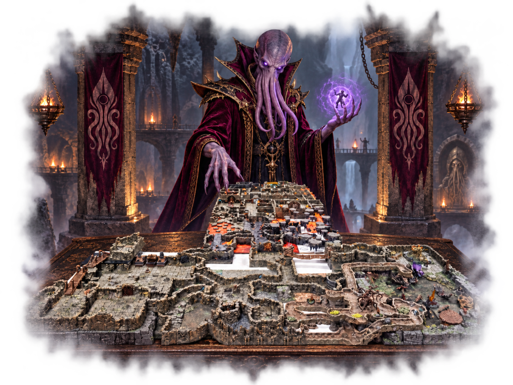

# The Vault of the Starving Mind

A lethal D&D one-shot grinder built around survival, exploration, greed, and player choice.

## Overview

You wake up with nothing useful. No armor. No weapons. No coin. The dungeon is run by **Xhal’theris, the Velvet Maw**, a Mind Flayer who has taken the your characters prisoner and placed them inside his private death game!

This is a lethal D&D 5e 2024 one-shot dungeon grinder for 8 to 12 players, built on 42 square feet of Dwarven Forge terrain across two tables. Level 3 pregenerated characters, dice, and miniatures are provided, so you do not need to bring or build anything. Everyone starts at level 3. Find the others, arm yourself with gear from the dungeon, and race for the exit.

Death is final. If your character dies, you are out.

To escape, the survivors must find all 8 Crystal Shards and place them in the final puzzle in the correct order. More than $500 worth of real-world prizes are also on the line. The top prize is a Dungeons & Dragons 2024 Core Rulebook Set + GM Screen.

## Event Details

**Event:** 10/10/2026, 12:00 PM to 8:00 PM EST, at the Open Workshops.

Show up ready to play. Claim a seat if you want to see how far you get.

