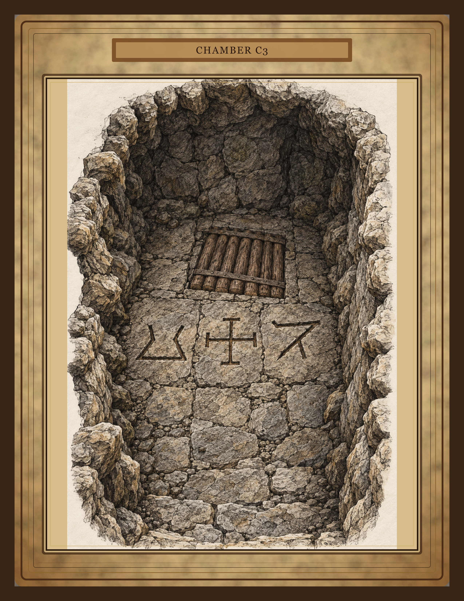

# C3 Pit Handout

## What is it

A player handout for the Caverns C3 chamber.

## When the DM hands it out

Give this to the players when they can see the stone pit chamber in C3.

## Printing notes

- **File:** `images/rooms/C3-handout.png`
- **Paper:** Letter size parchment cardstock or matte cardstock.
- **Print:** Color, actual size, portrait.
- **Quantity:** One table copy is enough. Print a spare if players will pass it around.
