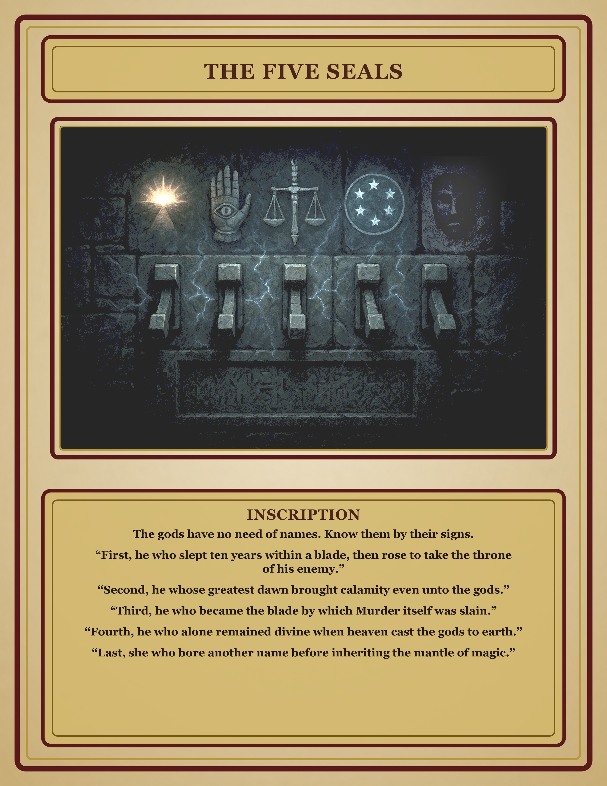

# Five Seals Handout

## What is it

A player handout for The Five Seals switch wall in the Gauntlet.

## When the DM hands it out

Give this to the players when they reach the switch wall in the Gauntlet and can read The Five Seals inscription.

## Printing notes

- **File:** `images/rooms/FiveSeals-handout.png`
- **Paper:** Letter size parchment cardstock or matte cardstock.
- **Print:** Color, actual size, portrait.
- **Quantity:** One table copy is enough. Print a spare if players will pass it around.
