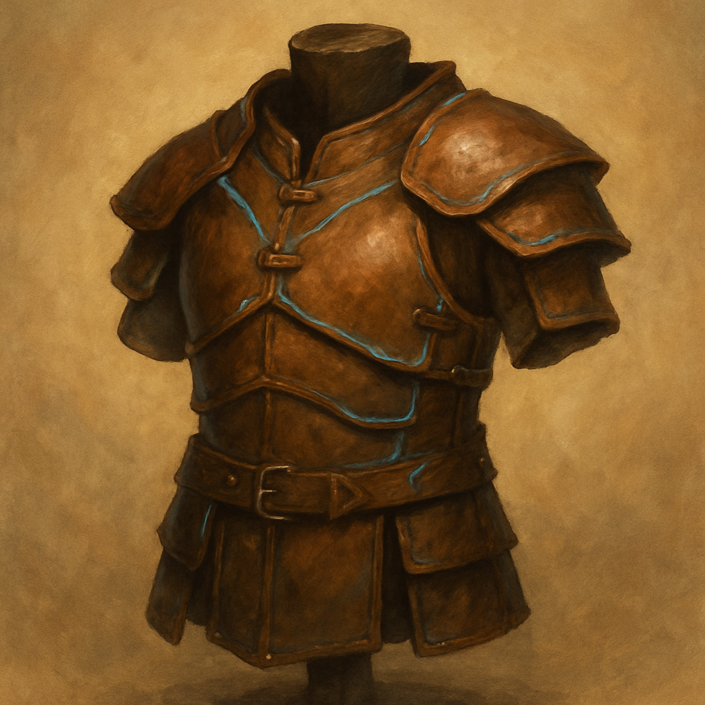

# Leather, +1

Armor (leather), rare 
 
 
You have a +1 bonus to AC while wearing this armor.

The breastplate and shoulder protectors of this armor are made of leather that has been stiffened by being boiled in oil. The rest of the armor is made of softer and more flexible materials.

Dungeon Master’s Guide
