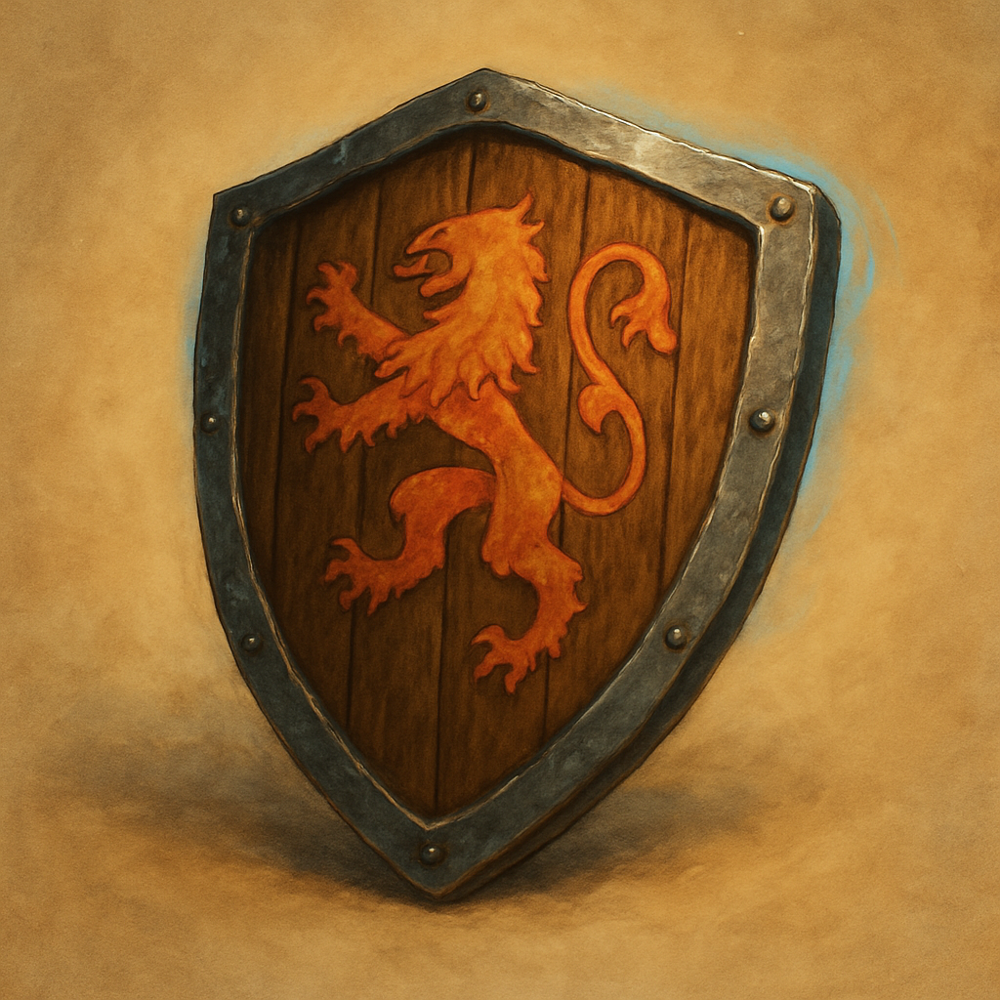

# Shield, +1

Armor (shield), uncommon 
 
 
While holding this Shield, you have a bonus to Armor Class determined by the Shield’s rarity, in addition to the Shield’s normal bonus to AC.

Shields require the Utilize action to Don or Doff. You gain the Armor Class benefit of a Shield only if you have training with it.

Dungeon Master’s Guide, pg. 200
