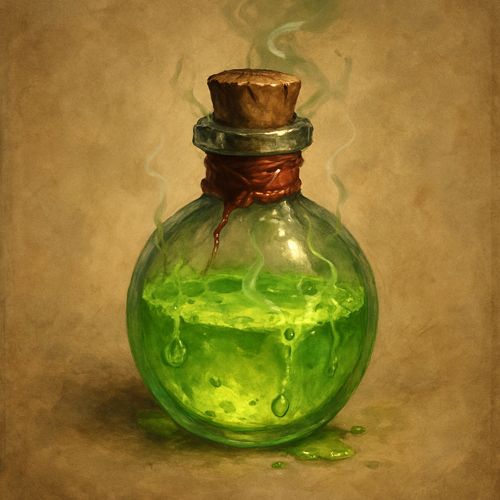

# Flask of Acid

Consumable

As an Action you can throw this flask at a target within 20 feet, making a ranged attack. On a hit, the target takes 2d6 Acid damage. You can instead pour it out to eat through rope, wood, or a light chain over 1 minute.

Sold by Treasure Goblin vendors for 25 GP.
