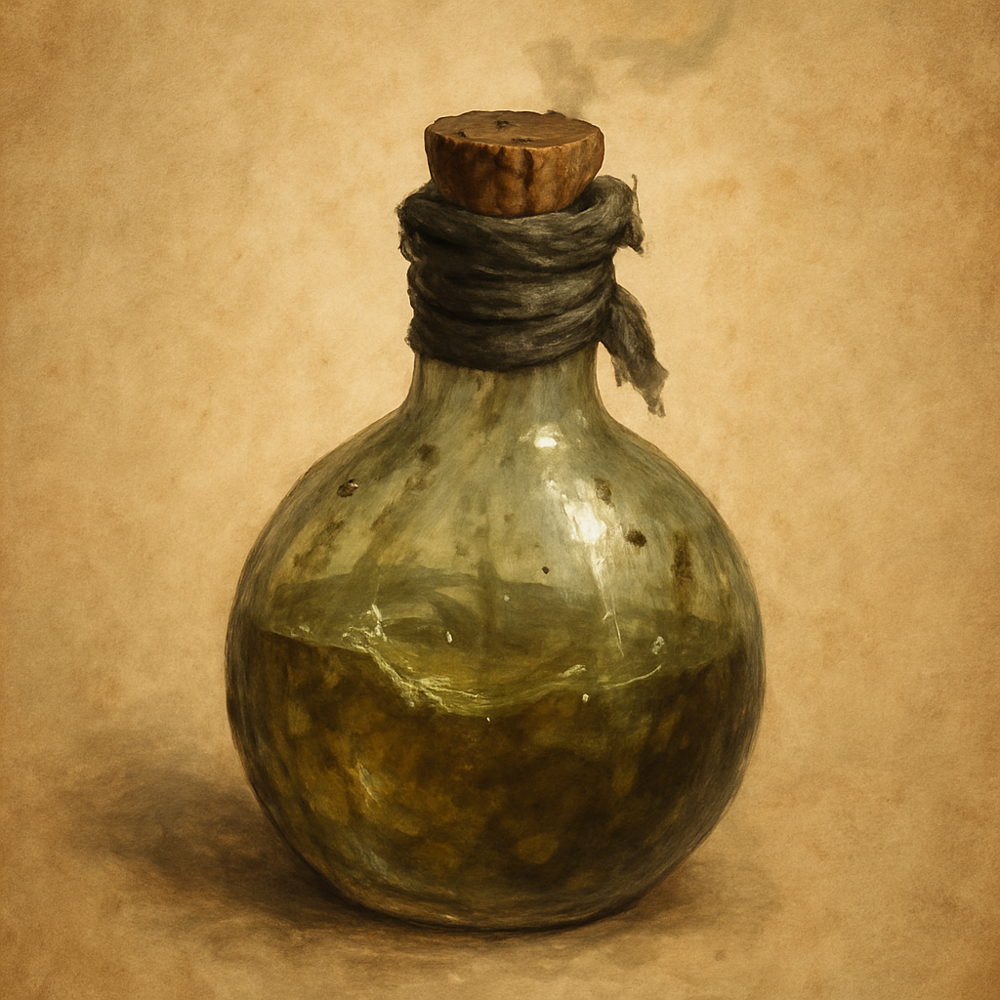

# Goblin Juice

Consumable (goblin-brewed fuel)

A grimy flask of reeking gasoline the goblins distill somewhere down in the dark. As an Action you can throw it up to 20 feet, making a ranged attack against a target. On a hit, the target takes 2d6 Fire damage and catches fire, taking 1d6 Fire damage at the start of each of its turns until it or a creature within 5 feet uses an Action to douse the flames. On a miss, the flask shatters across a 5-foot square. If any flame touches that square within 1 minute, it ignites into burning, difficult terrain that deals 1d6 Fire damage to a creature that enters it or starts its turn there.

Sold by Treasure Goblin vendors for 25 GP.
