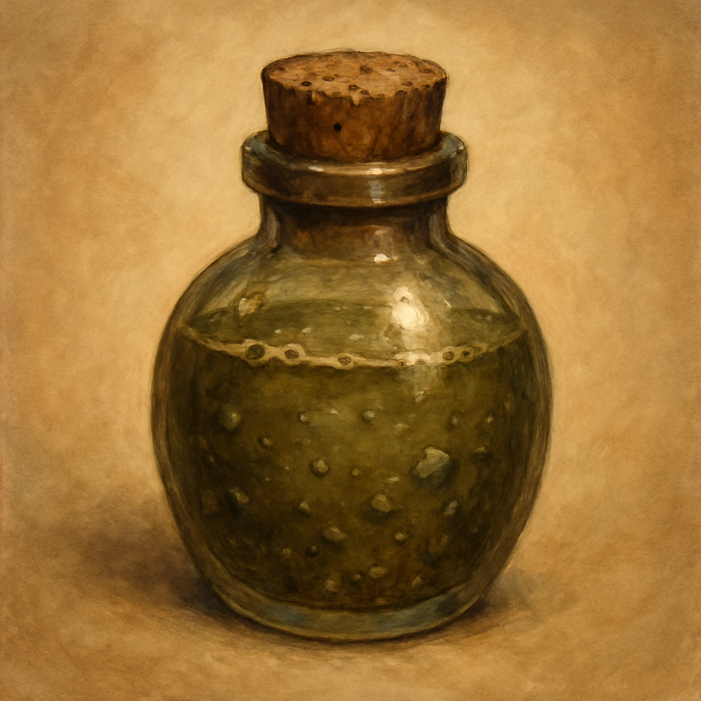

# Potion of Climbing

Potion, common 
 
 
When you drink this potion, you gain a Climb Speed equal to your Speed for 1 hour. During this time, you have Advantage on Strength (Athletics) checks to climb.
 

This potion is separated into brown, silver, and gray layers resembling bands of stone. Shaking the bottle fails to mix the colors.

Dungeon Master’s Guide, pg. 187
