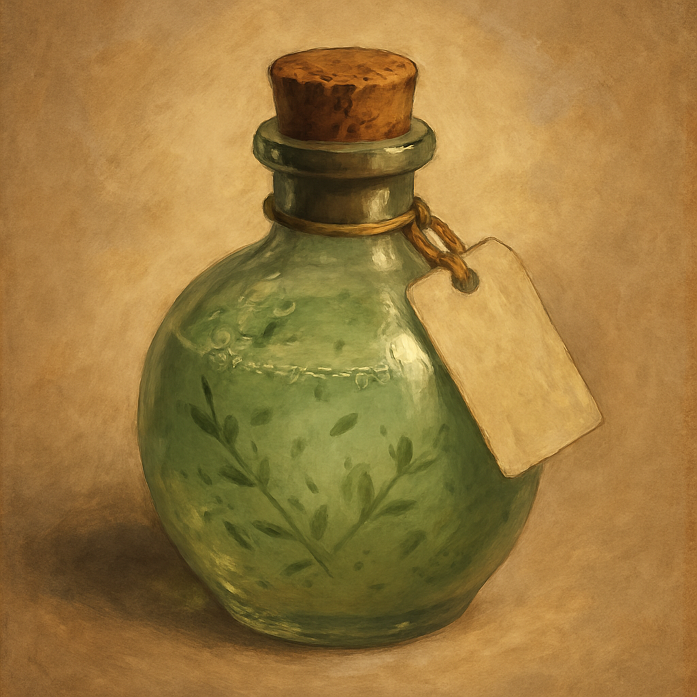

# Potion of Cure Disease

Potion, uncommon

As a Bonus Action you can drink this cloudy green tonic or administer it to a creature within 5 feet. The creature is cured of every disease affecting it. It has no effect on poison or other conditions.

Sold by Treasure Goblin vendors for 50 GP.
