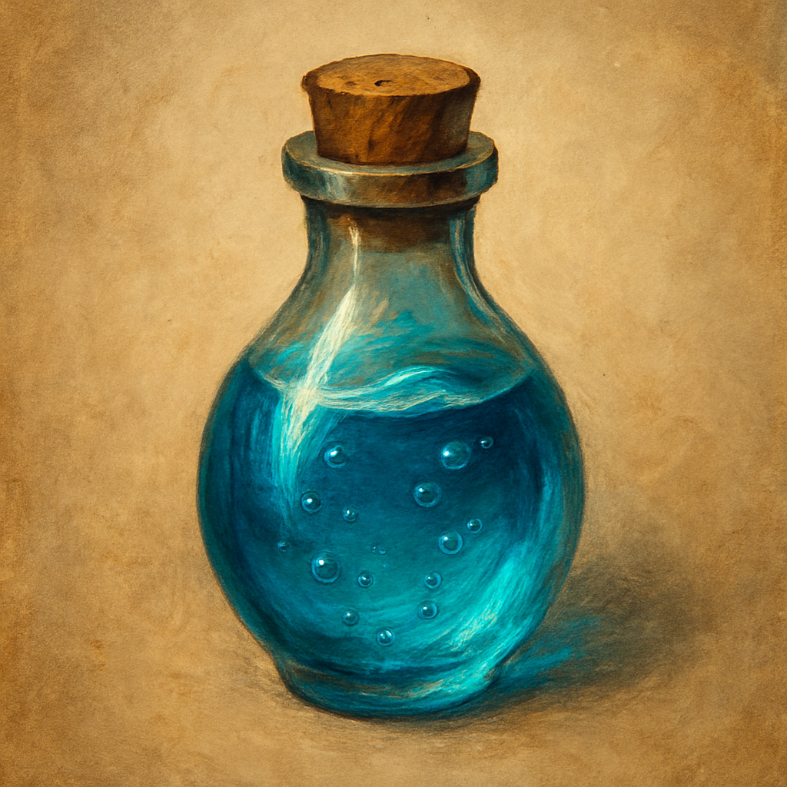

# Potion of Water Breathing

Potion, uncommon 
 
 
You can breathe underwater for 24 hours after drinking this potion.
 

This potion’s cloudy green fluid smells of the sea and has a jellyfish-like bubble floating in it.

Dungeon Master’s Guide, pg. 289
