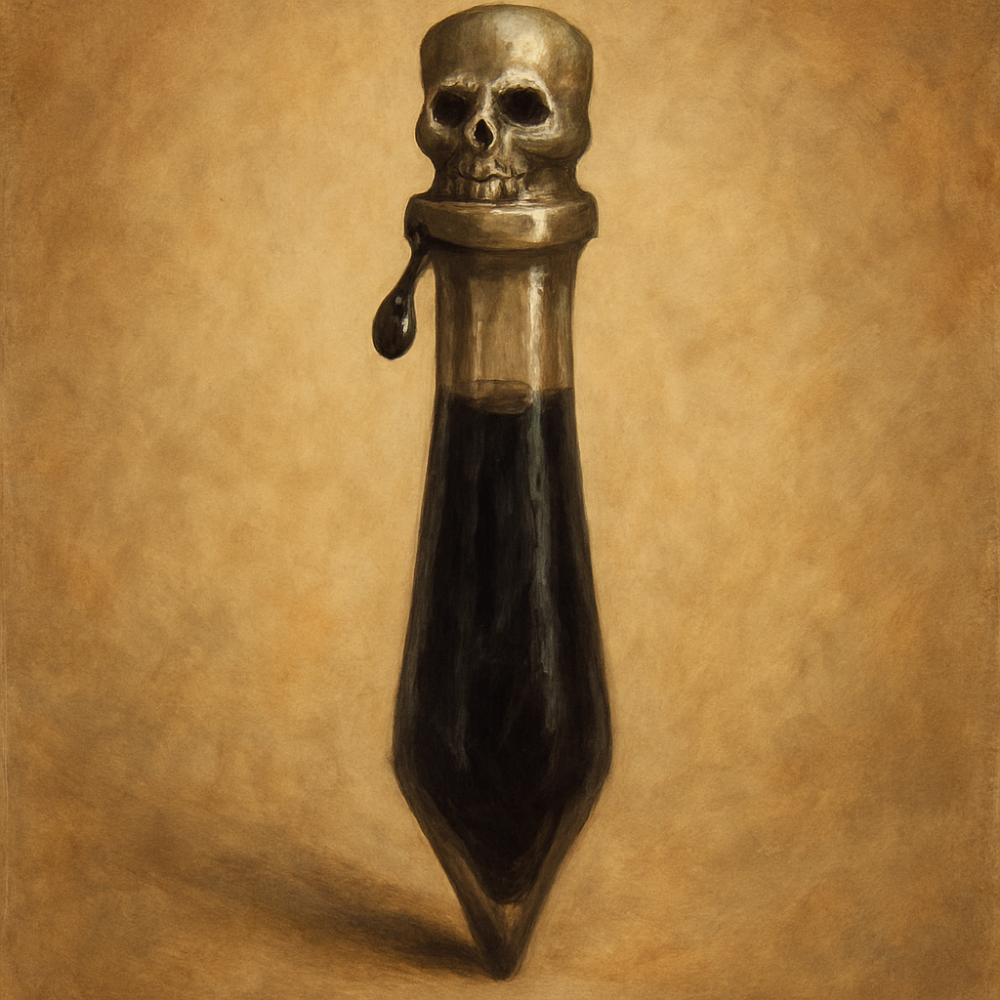

# Vial of Poison

Poison (injury)

As an Action you can coat one weapon or up to three pieces of ammunition with this oily black venom. For 1 minute, the first creature struck by the coated weapon takes an extra 2d4 Poison damage and must succeed on a DC 12 Constitution saving throw or have the Poisoned condition for 1 minute. Once applied, the poison keeps its potency for 1 minute or until it is delivered.

Sold by Treasure Goblin vendors for 40 GP.
