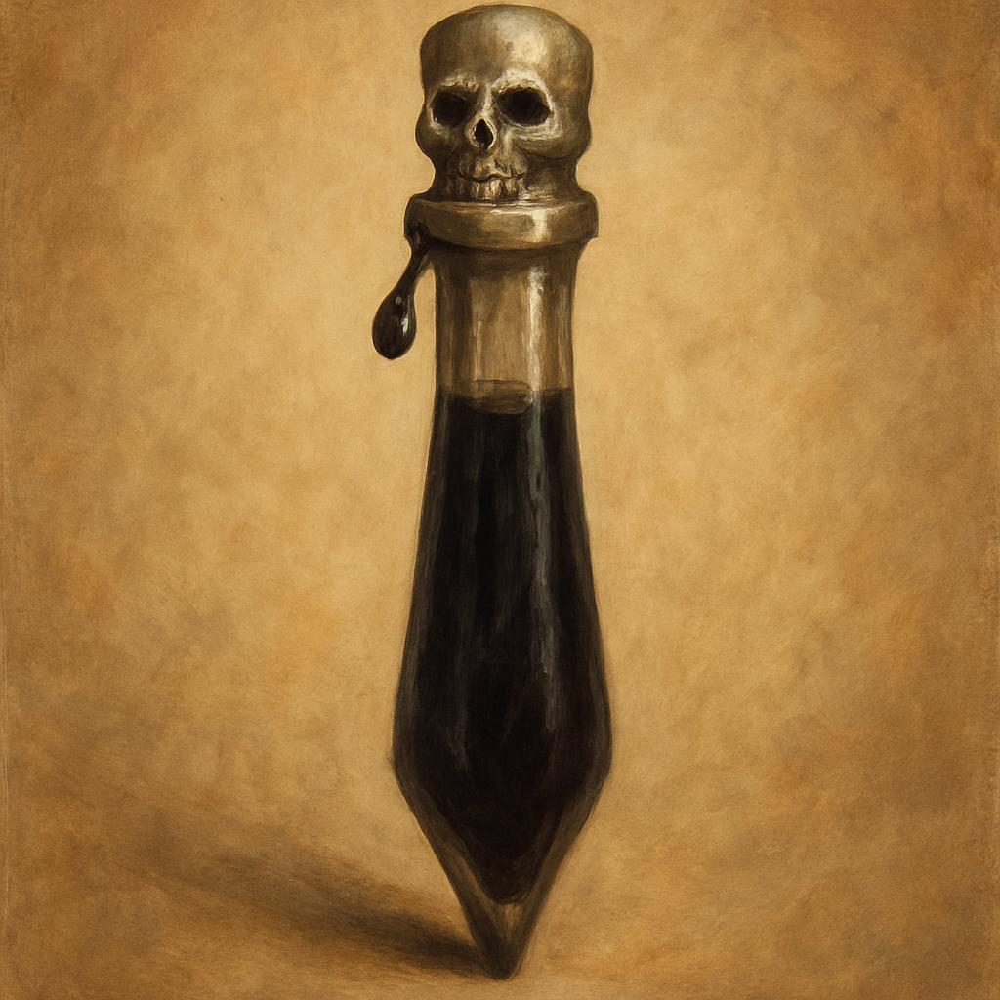

# Vial of Poison

Poison (injury)

As an Action, you can coat one weapon or up to three pieces of ammunition with this oily black venom. A vial holds one application. Once applied, the coating lasts for 1 minute.

For that minute, each creature that takes damage from the coated weapon takes an extra 2d4 Poison damage on that hit. A creature that takes this extra Poison damage then takes 1d4 Poison damage at the start of each of its turns. At the end of each of its turns, the creature can make a DC 12 Constitution saving throw, ending the ongoing Poison damage on a success. Once a creature succeeds on this saving throw, it can't be affected by this poison again.

Sold by Treasure Goblin vendors for 40 GP.
