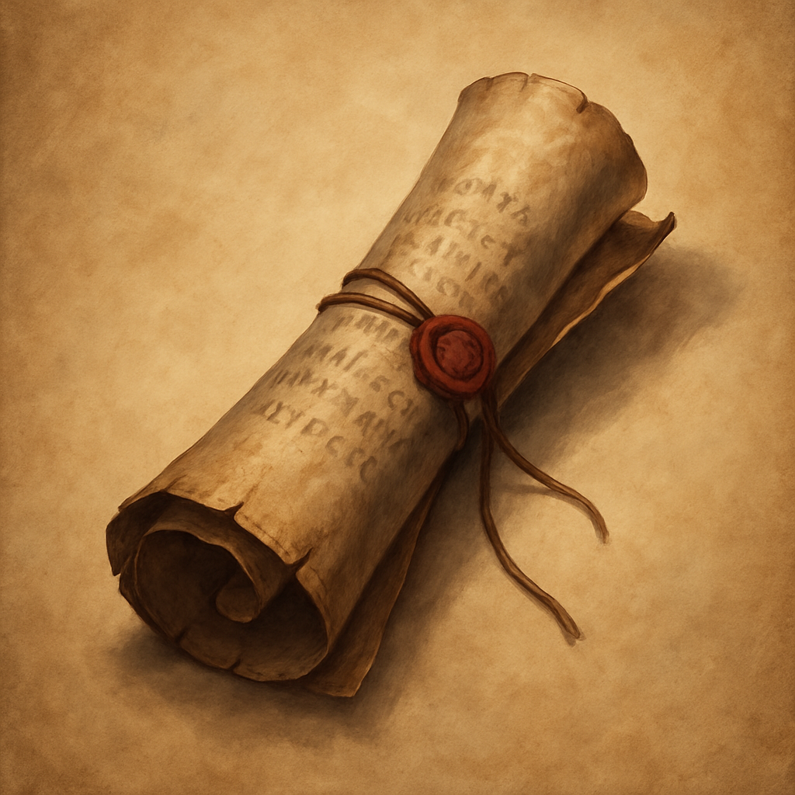

# Spell Scroll (Level 1)

Scroll, common 
 
 
A Spell Scroll is a magic item that bears the words of a level 1 spell, respectively, determined by the scroll’s creator. If the spell is on your class’s spell list, you can read the scroll and cast the spell using its normal casting time and without providing any Material components.
 

If the spell requires a saving throw or an attack roll, the spell save DC is 13, and the attack bonus is +5. The scroll disintegrates when the casting is completed.

Dungeon Master’s Guide, pg. 228
