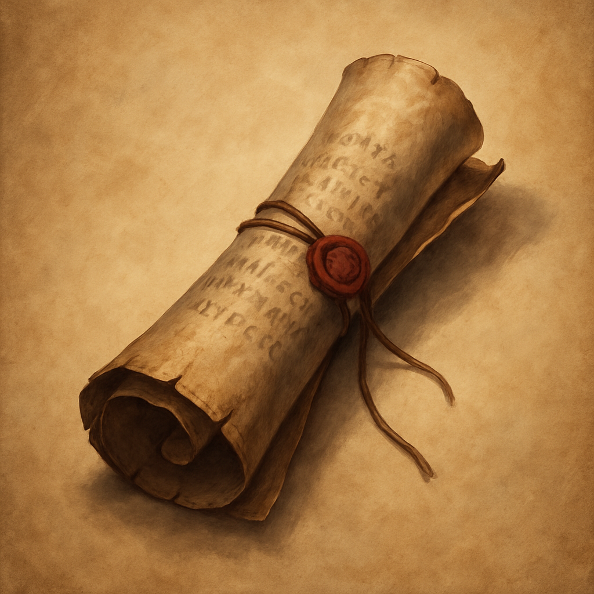

# Spell Scroll: Cure Wounds

Scroll, common

A Spell Scroll can be cast only if the spell is on your class's spell list. Casting from a scroll needs no material components, and the scroll crumbles to dust once the cast completes.

- **Level / School:** 1st, Abjuration
- **Casting Time:** Action
- **Range:** Touch
- **Components:** V, S
- **Duration:** Instantaneous

**Effect:** A creature you touch regains 2d8 plus your spellcasting ability modifier Hit Points. This spell has no effect on Undead or Constructs.
