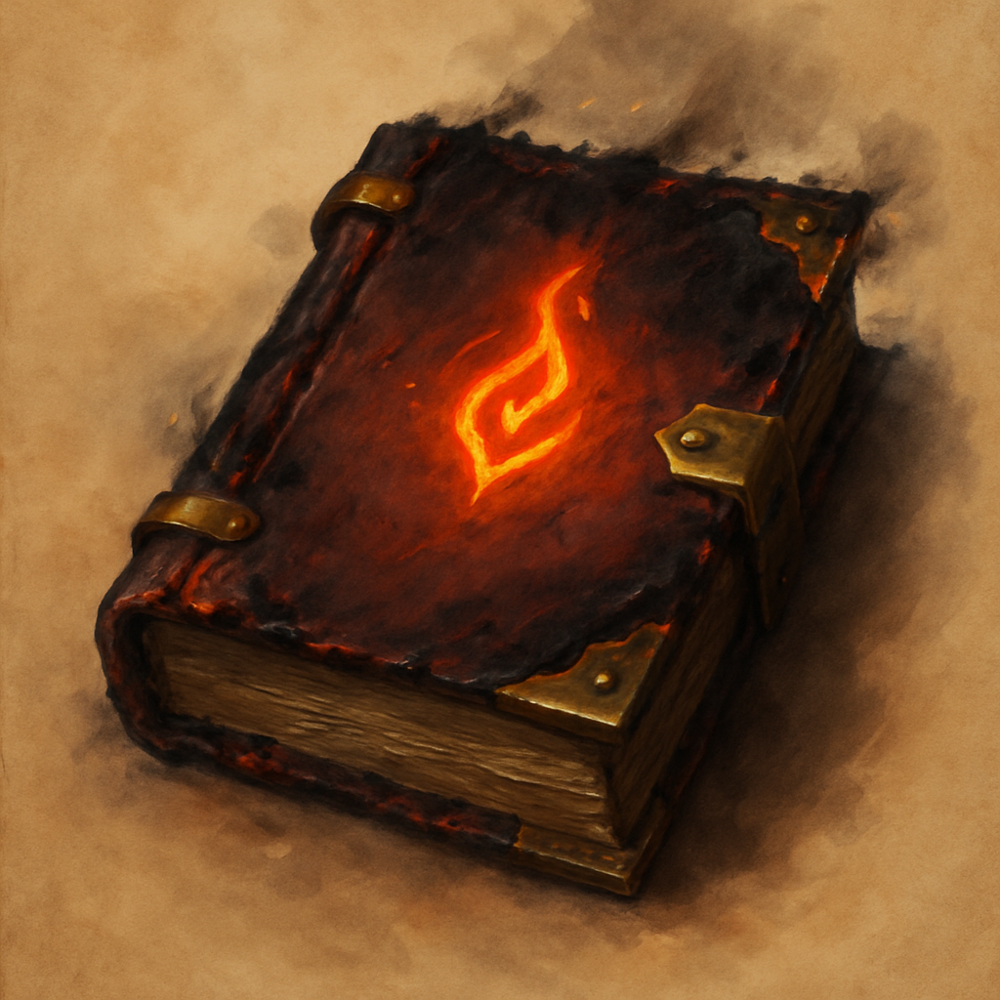

# The Artificer's Arsenal

*Evocation. A scorched leather tome for burning down whatever the dungeon throws at you.*

This tome is a bundle of five spell scrolls, one spell per page. A creature can take an action to cast one of the inscribed spells, using it like a spell scroll. If the spell is on your class's spell list you cast it with no check. Otherwise make a spellcasting ability check (DC 10 + the spell's level); on a failure the page is spent with no effect. Casting a spell uses up that page. When all five pages are spent, the tome becomes mundane.

| Spell | Level | Effect |
| --- | --- | --- |
| Fire Bolt | Cantrip | Ranged spell attack, 1d10 fire |
| Burning Hands | 1st | 15-ft cone, Dex save, 3d6 fire |
| Scorching Ray | 2nd | Three rays, spell attack each, 2d6 fire per ray |
| Shatter | 2nd | 10-ft radius, Con save, 3d8 thunder |
| Fireball | 3rd | 20-ft radius, Dex save, 8d6 fire |

**Vendor price:** 210 GP. **Scroll-weight:** 8.5. Sold by Treasure Goblin vendors.
