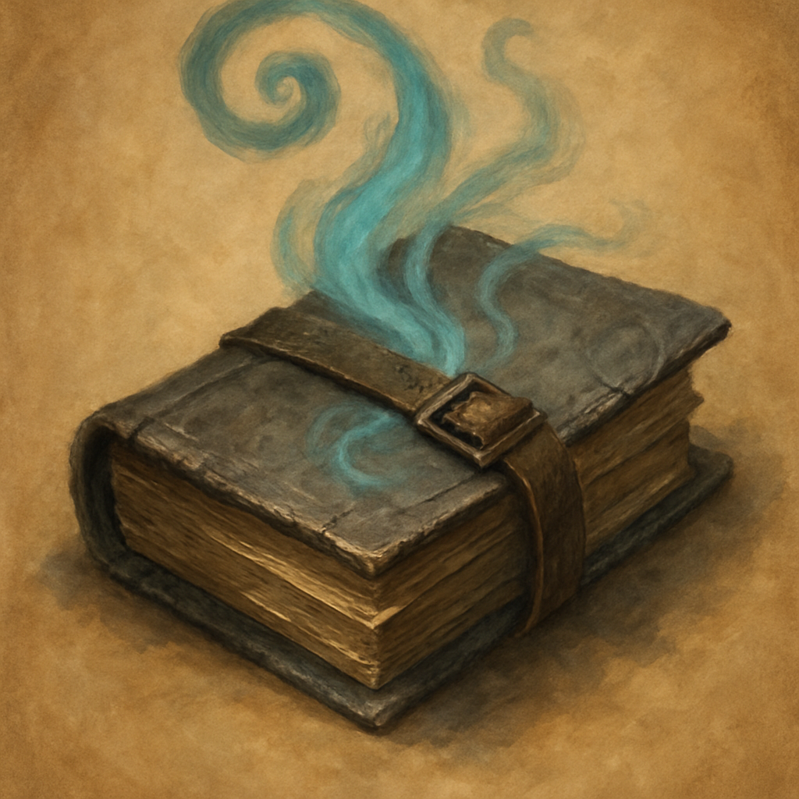

# The Escape Route

*Control. Buy space, break a grapple, and live to fight in the next room.*

This tome is a bundle of five spell scrolls, one spell per page. A creature can take an action to cast one of the inscribed spells, using it like a spell scroll. If the spell is on your class's spell list you cast it with no check. Otherwise make a spellcasting ability check (DC 10 + the spell's level); on a failure the page is spent with no effect. Casting a spell uses up that page. When all five pages are spent, the tome becomes mundane.

| Spell | Level | Effect |
| --- | --- | --- |
| Grease | 1st | 10-ft square of difficult terrain, Dex save or fall prone |
| Feather Fall | 1st | Reaction, up to five creatures take no falling damage |
| Longstrider | 1st | +10 ft speed for 1 hour |
| Web | 2nd | 20-ft cube of webbing, Dex save or restrained |
| Misty Step | 2nd | Bonus action, teleport 30 ft to a space you can see |

**Vendor price:** 160 GP. **Scroll-weight:** 7. Sold by Treasure Goblin vendors. Misty Step is a 30-foot line-of-sight hop, so this book does not skip the crystal-gated layout.
