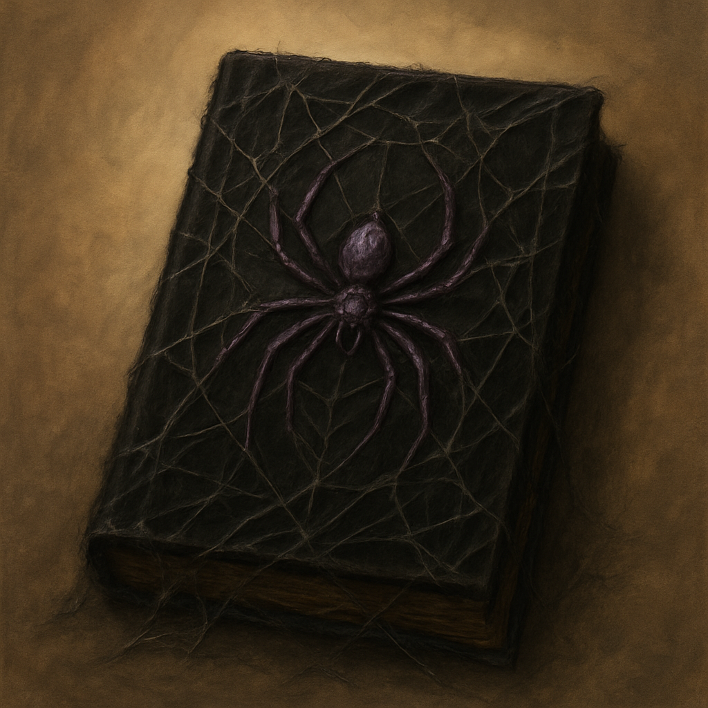

# Handbook of Lloth

*Prayers to Lloth. A black silk handbook stitched with silver webbing and venom-dark prayers.*

This tome is a bundle of five spell scrolls, one spell per page. A creature can take an action to cast one of the inscribed spells, using it like a spell scroll. If the spell is on your class's spell list you cast it with no check. Otherwise make a spellcasting ability check (DC 10 + the spell's level); on a failure the page is spent with no effect. Casting a spell uses up that page. When all five pages are spent, the tome becomes mundane.

| Spell | Level | Effect |
| --- | --- | --- |
| Thorn Whip | Cantrip | 30 ft. melee spell attack, 1d6 Piercing, pull a Large or smaller target up to 10 ft. |
| Darkness | 2nd | 60 ft. range, 15 ft. radius magical darkness, concentration up to 10 minutes |
| Spider Climb | 2nd | Touch, willing creature gains a climb speed equal to its Speed and can climb walls and ceilings, concentration up to 1 hour |
| Web | 2nd | 60 ft. range, 20 ft. cube, DEX save or Restrained, difficult terrain, concentration up to 1 hour |
| Fear | 3rd | 30 ft. cone, WIS save or Frightened and forced to drop what it holds and flee, concentration up to 1 minute |

**Vendor price:** 210 GP. **Scroll-weight:** 8.5. Sold by Treasure Goblin vendors.
