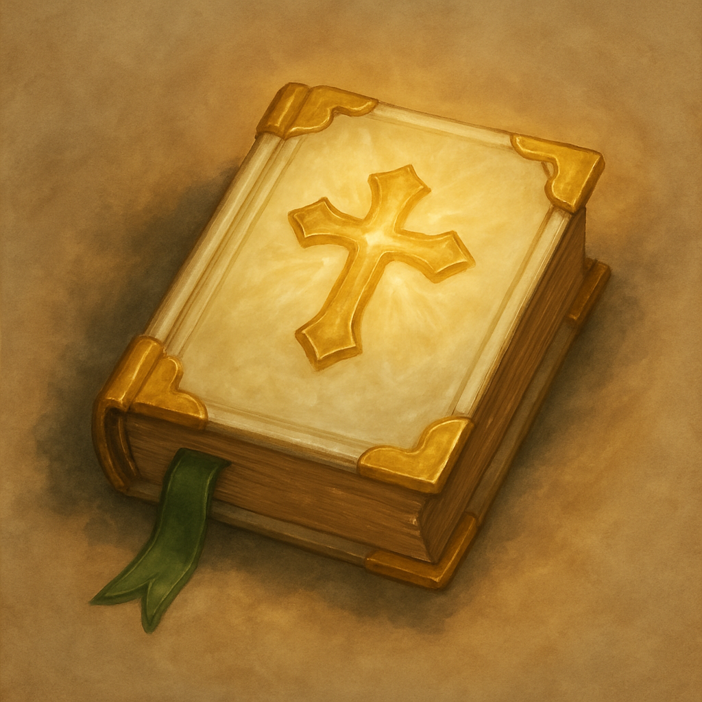

# The Healer's Gift

*Restoration. There are no long rests down here, so every page counts.*

This tome is a bundle of five spell scrolls, one spell per page. A creature can take an action to cast one of the inscribed spells, using it like a spell scroll. If the spell is on your class's spell list you cast it with no check. Otherwise make a spellcasting ability check (DC 10 + the spell's level); on a failure the page is spent with no effect. Casting a spell uses up that page. When all five pages are spent, the tome becomes mundane.

| Spell | Level | Effect |
| --- | --- | --- |
| Spare the Dying | Cantrip | Touch, stabilize a dying creature |
| Healing Word | 1st | Bonus action, 60 ft, 2d4 + mod healing |
| Cure Wounds | 1st | Touch, 2d8 + mod healing |
| Lesser Restoration | 2nd | End a disease or one condition (blinded, paralyzed, poisoned, and the like) |
| Revivify | 3rd | Touch, return a creature dead less than 1 minute to life with 1 HP |

**Vendor price:** 190 GP. **Scroll-weight:** 7.5. Sold by Treasure Goblin vendors.
