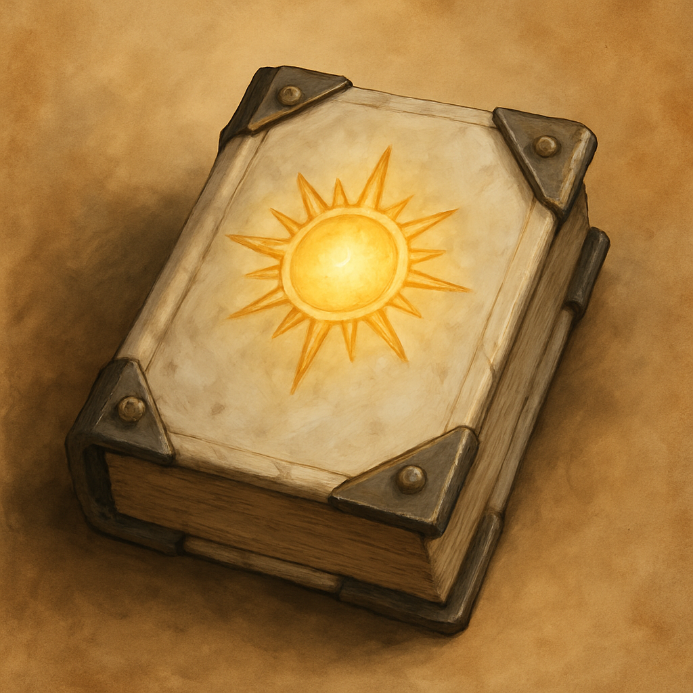

# The Tomb Warden

*Radiant. Light to burn the restless dead and hold the line while allies swing.*

This tome is a bundle of five spell scrolls, one spell per page. A creature can take an action to cast one of the inscribed spells, using it like a spell scroll. If the spell is on your class's spell list you cast it with no check. Otherwise make a spellcasting ability check (DC 10 + the spell's level); on a failure the page is spent with no effect. Casting a spell uses up that page. When all five pages are spent, the tome becomes mundane.

| Spell | Level | Effect |
| --- | --- | --- |
| Sacred Flame | Cantrip | Dex save, 1d8 radiant, ignores cover |
| Guiding Bolt | 1st | Ranged spell attack, 4d6 radiant, next attacker has advantage |
| Bless | 1st | Three creatures add 1d4 to attack rolls and saves (concentration) |
| Aid | 2nd | Raise three creatures' current and maximum HP by 5 |
| Spirit Guardians | 3rd | 15-ft radiant aura, 3d8, enemy speed halved (concentration) |

**Vendor price:** 190 GP. **Scroll-weight:** 7.5. Sold by Treasure Goblin vendors.
