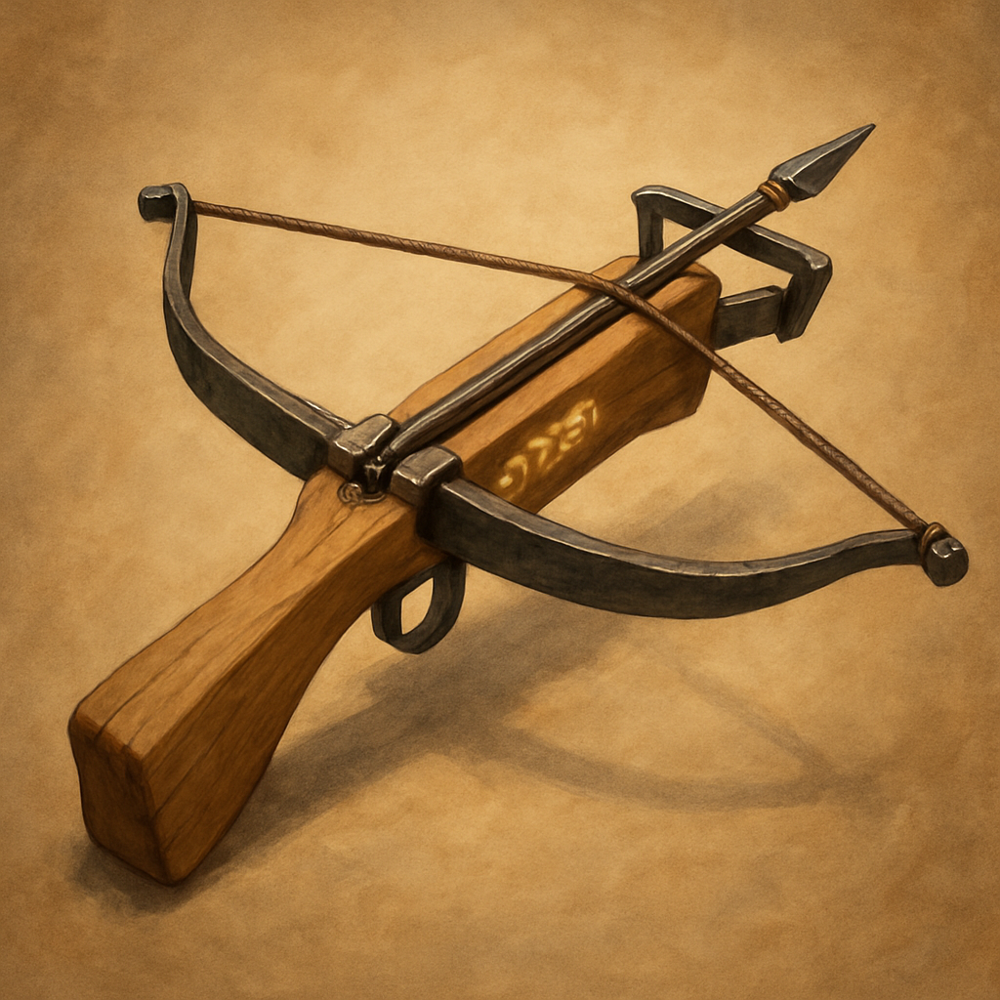

# Crossbow, Light, +1

Weapon (crossbow, light), uncommon 
 
 
You have a +1 bonus to attack and damage rolls made with this magic weapon.

Proficiency with a Light Crossbow allows you to add your proficiency bonus to the attack roll for any attack you make with it.
 

 

This weapon has the following mastery property. To use this property, you must have a feature that lets you use it.
 

Slow. If you hit a creature with this weapon and deal damage to it, you can reduce its Speed by 10 feet until the start of your next turn. If the creature is hit more than once by weapons that have this property, the Speed reduction doesn’t exceed 10 feet.
 

Dungeon Master’s Guide
