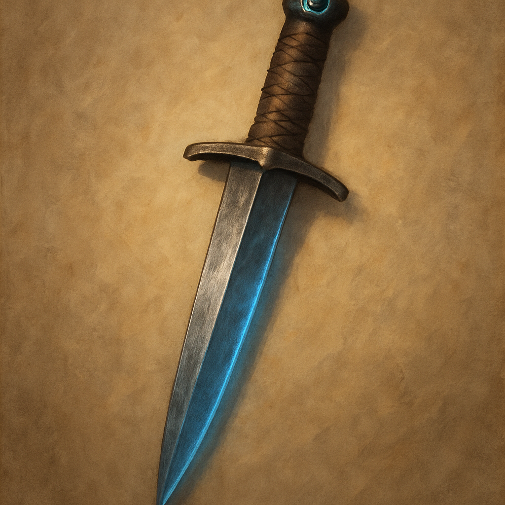

# Dagger, +1

Weapon (dagger), uncommon 
 
 
You have a +1 bonus to attack and damage rolls made with this magic weapon.

Proficiency with a Dagger allows you to add your proficiency bonus to the attack roll for any attack you make with it.
 

 

This weapon has the following mastery property. To use this property, you must have a feature that lets you use it.
 

Nick. When you make the extra attack of the Light property, you can make it as part of the Attack action instead of as a Bonus Action. You can make this extra attack only once per turn.
 

Dungeon Master’s Guide
