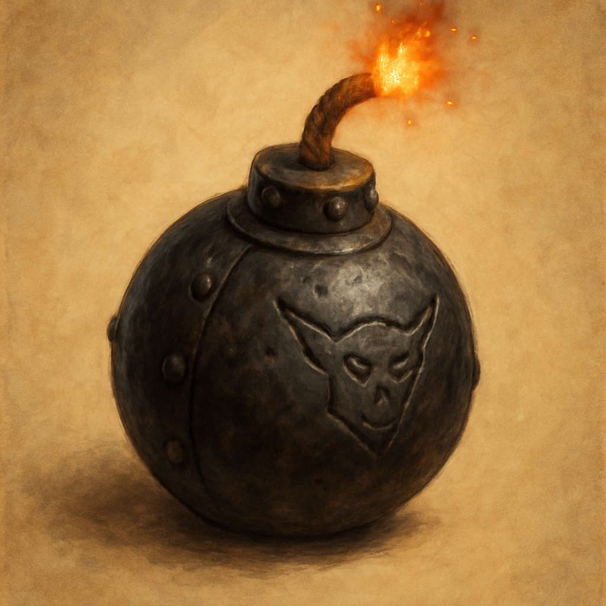

# Gob Stopper

Grenade, thrown

A cast-iron ball the size of a fist, packed with goblin blasting powder and capped with a stubby fuse. The goblins of the Vault light these, lob them around corners, and cackle. As an Action you light the fuse and throw the Gob Stopper up to 30 feet. It explodes on impact.

When it explodes, each creature in range makes a DC 13 Dexterity saving throw:

- A creature within 10 feet takes 2d6 Fire damage on a failed save.
- A creature more than 10 feet but within 15 feet takes 1d6 Fire damage on a failed save.
- A creature takes half as much damage on a successful save.

A Gob Stopper that lands in Goblin Juice or open flame detonates instantly. Sold by Treasure Goblin vendors for 25 GP each.
