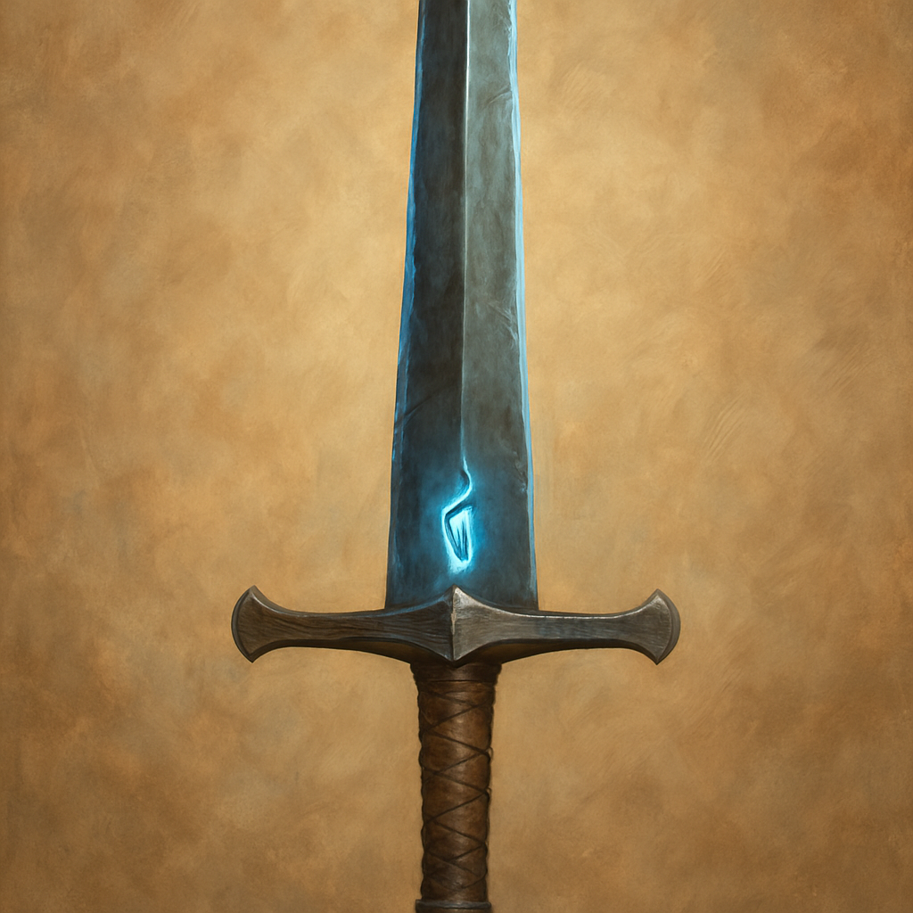

# Greatsword, +1

Weapon (greatsword), uncommon 
 
 
You have a +1 bonus to attack and damage rolls made with this magic weapon.

Proficiency with a Greatsword allows you to add your proficiency bonus to the attack roll for any attack you make with it.
 

 

This weapon has the following mastery property. To use this property, you must have a feature that lets you use it.
 

Graze. If your attack roll with this weapon misses a creature, you can deal damage to that creature equal to the ability modifier you used to make the attack roll. This damage is the same type dealt by the weapon, and the damage can be increased only by increasing the ability modifier.
 

Dungeon Master’s Guide
