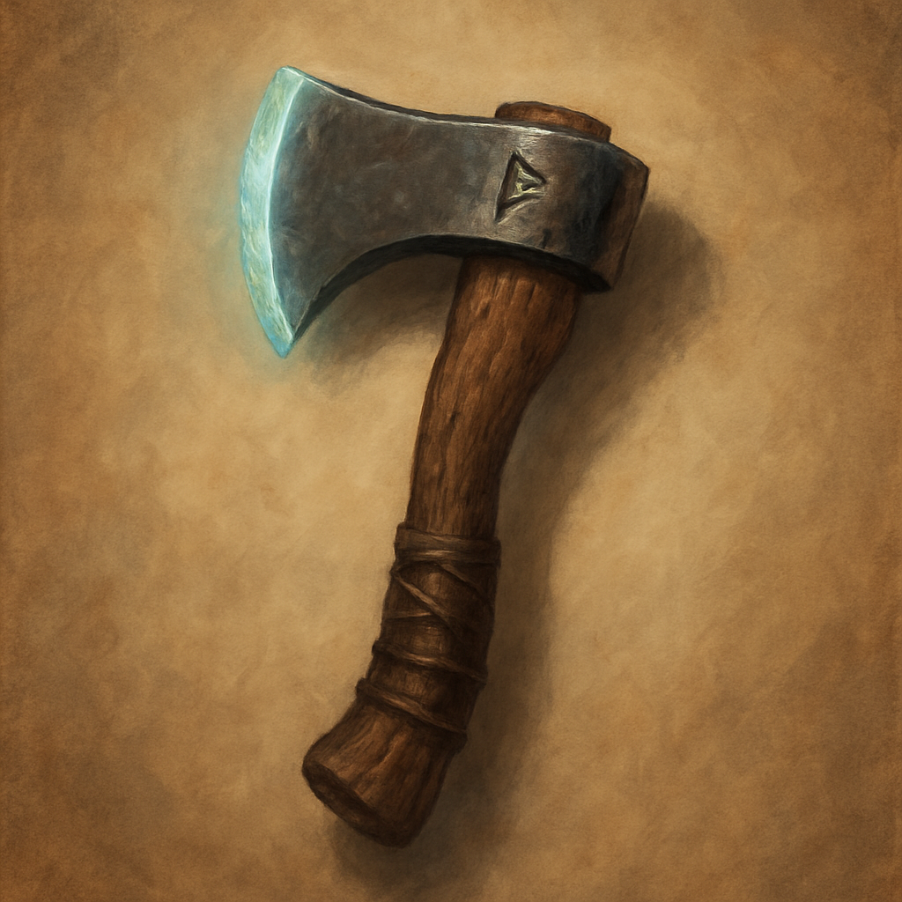

# Handaxe, +1

Weapon (handaxe), uncommon 
 
 
You have a +1 bonus to attack and damage rolls made with this magic weapon.

Proficiency with a Handaxe allows you to add your proficiency bonus to the attack roll for any attack you make with it.
 

 

This weapon has the following mastery property. To use this property, you must have a feature that lets you use it.
 

Vex. If you hit a creature with this weapon and deal damage to the creature, you have Advantage on your next attack roll against that creature before the end of your next turn.
 

Dungeon Master’s Guide
