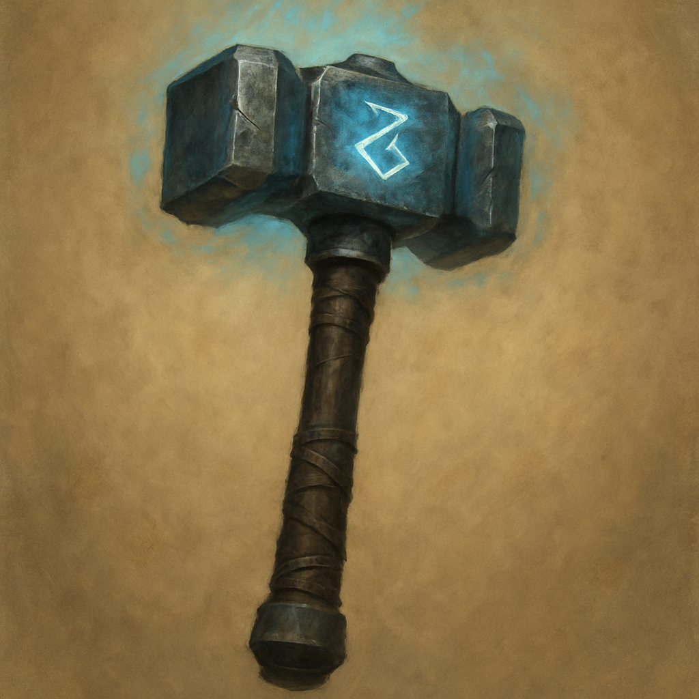

# Warhammer, +1

Weapon (warhammer), uncommon 
 
 
You have a +1 bonus to attack and damage rolls made with this magic weapon.

Proficiency with a Warhammer allows you to add your proficiency bonus to the attack roll for any attack you make with it.
 

 

This weapon has the following mastery property. To use this property, you must have a feature that lets you use it.
 

Push. If you hit a creature with this weapon, you can push the creature up to 10 feet straight away from yourself if it is Large or smaller.
 

Dungeon Master’s Guide
