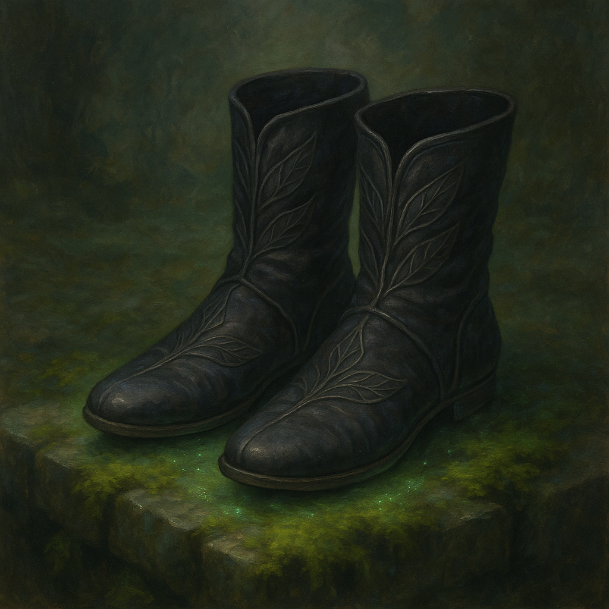

# Boots of Elvenkind

Wondrous Item, uncommon 
 
 
While you wear these boots, your steps make no sound, regardless of the surface you are moving across. You also have Advantage on Dexterity (Stealth) checks.

Dungeon Master’s Guide, pg. 155
