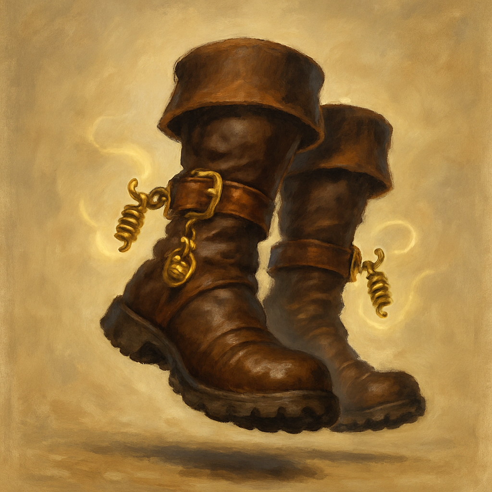

# Boots of Striding and Springing

Wondrous Item, uncommon (requires attunement)
 
 
While you wear these boots, your Speed becomes 30 feet unless your Speed is higher, and your Speed isn’t reduced by you carrying weight in excess of your carrying capacity or wearing Heavy Armor.
 

Once on each of your turns, you can jump up to 30 feet by spending only 10 feet of movement.

Dungeon Master’s Guide, pg. 240
