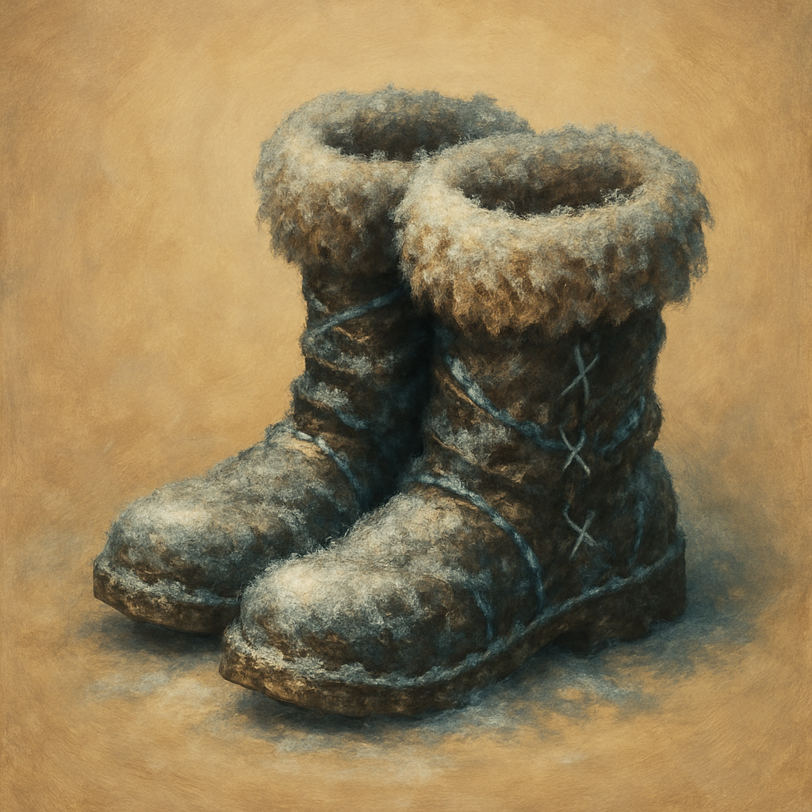

# Boots of the Winterlands

Wondrous Item, uncommon (requires attunement)
 
 
These furred boots are snug and feel warm. While wearing them, you gain the following benefits.
 

Cold Resistance. You have Resistance to Cold damage and can tolerate temperatures of 0 degrees Fahrenheit or lower without any additional protection.
 

Winter Strider. You ignore Difficult Terrain created by ice or snow.

Dungeon Master’s Guide, pg. 156
