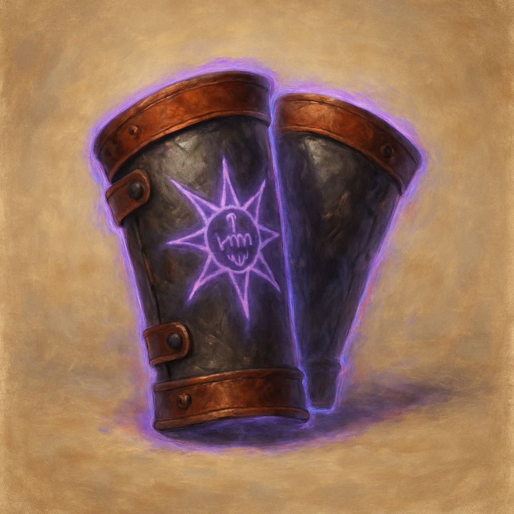

# Bracers of the Starving Ward

When you make a saving throw against being Charmed or Frightened, or against an effect that deals Psychic damage, you can add +1 to the roll after rolling but before the DM says whether it succeeds; once used, these bracers cannot be used again until you finish a short rest.
