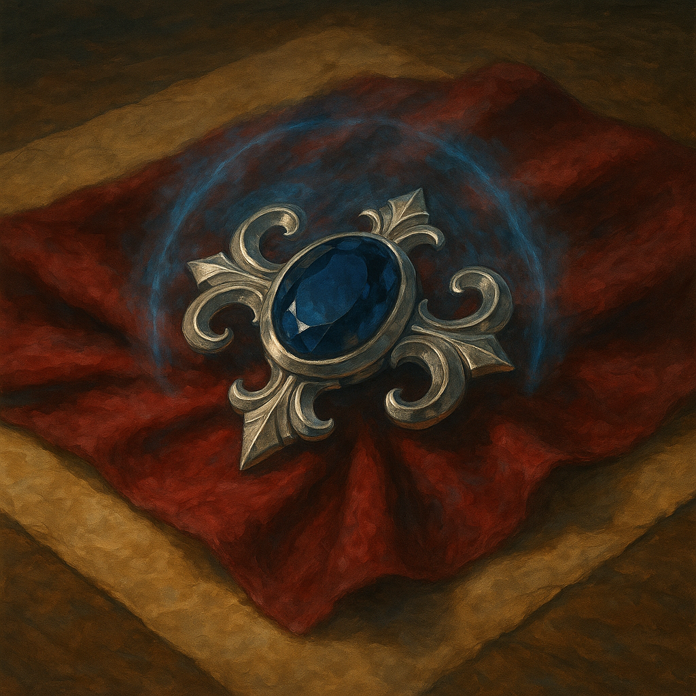

# Brooch of Shielding

Wondrous Item, uncommon (requires attunement)
 
 
While wearing this brooch, you have Resistance to Force damage, and you have Immunity to damage from the Magic Missile spell.

Dungeon Master’s Guide, pg. 156
