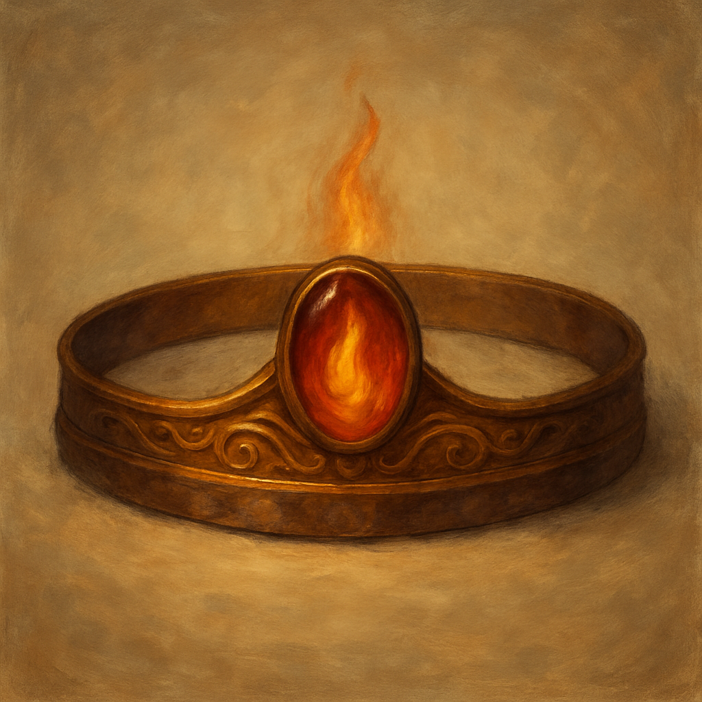

# Circlet of Blasting

Wondrous Item, uncommon 
 
 
While wearing this circlet, you can cast Scorching Ray with it (+5 to hit). The circlet can’t cast this spell again until the next dawn.

Dungeon Master’s Guide, pg. 158
