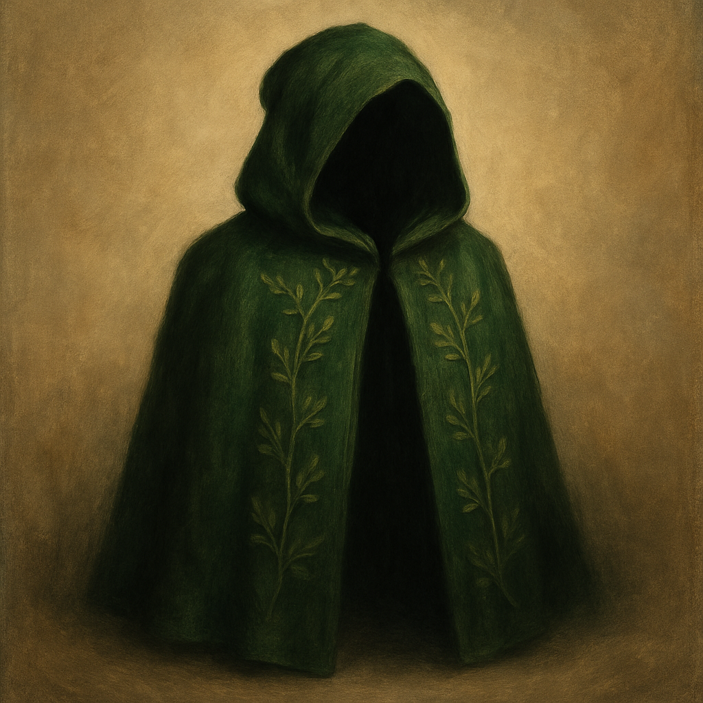

# Cloak of Elvenkind

Wondrous Item, uncommon (requires attunement)
 
 
While you wear this cloak, Wisdom (Perception) checks made to perceive you have Disadvantage, and you have Advantage on Dexterity (Stealth) checks.

Dungeon Master’s Guide, pg. 244
