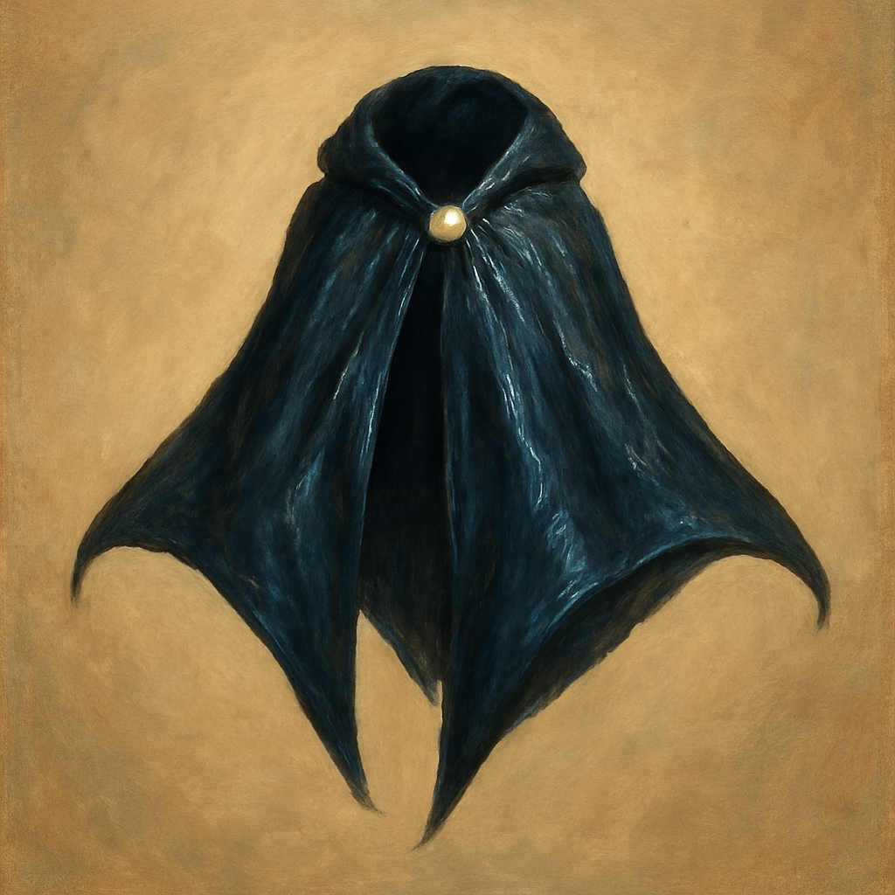

# Cloak of the Manta Ray

Wondrous Item, uncommon (requires attunement)
 
 
While wearing this cloak, you can breathe underwater, and you have a Swim Speed of 60 feet.

Dungeon Master’s Guide, pg. 245
