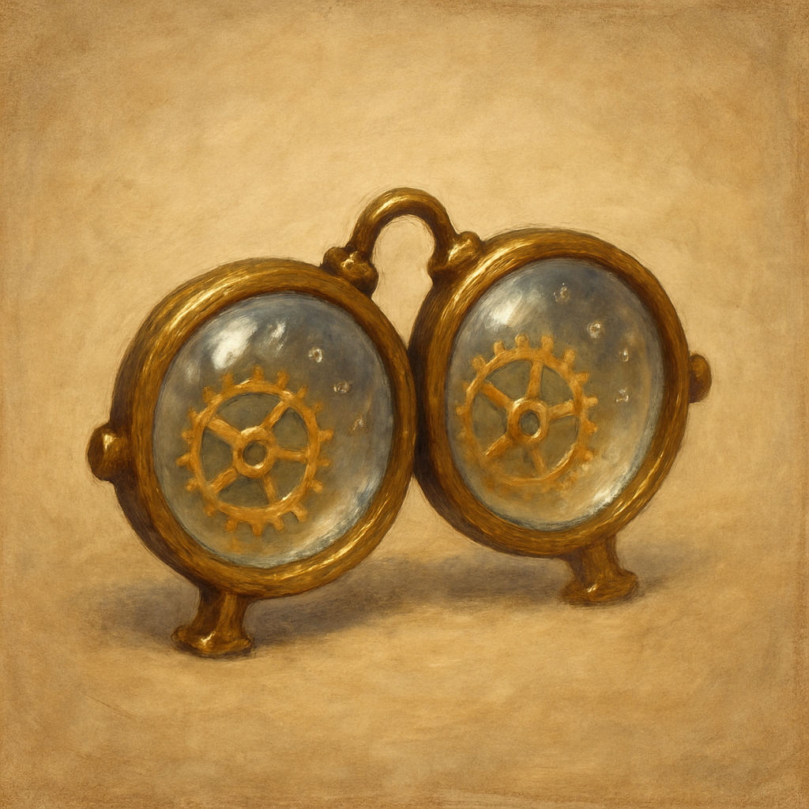

# Eyes of Minute Seeing

Wondrous Item, uncommon 
 
 
These crystal lenses fit over the eyes. While wearing them, your vision improves significantly out to a range of 1 foot, granting you Darkvision within that range and Advantage on Intelligence (Investigation) checks made to examine something within that range.

Dungeon Master’s Guide, pg. 261
