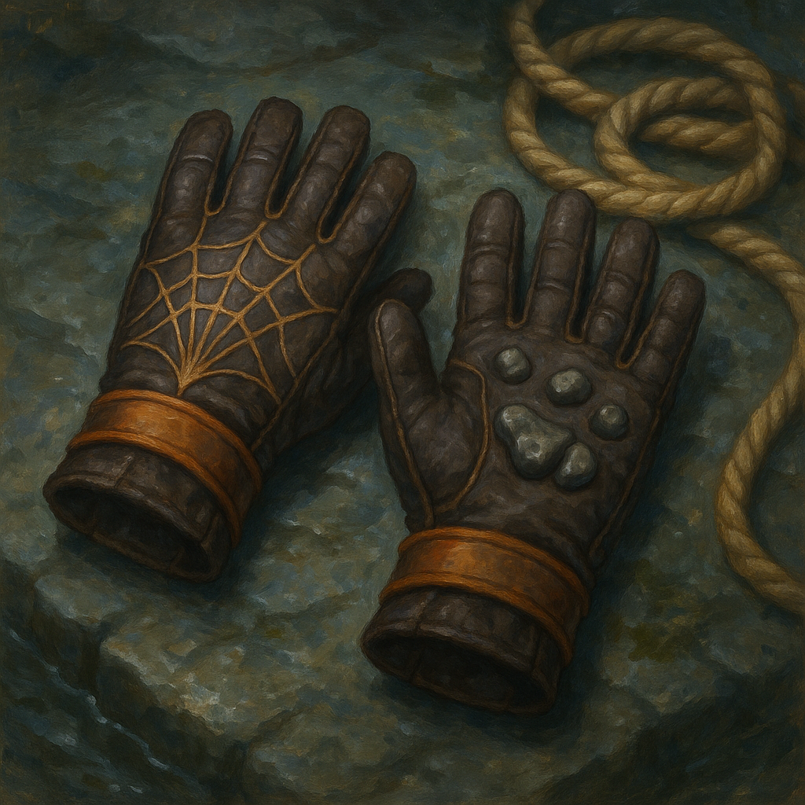

# Gloves of Swimming and Climbing

Wondrous Item, uncommon (requires attunement)
 
 
While wearing these gloves, climbing and swimming don't cost you extra movement, and you gain a +5 bonus to Strength (Athletics) checks made to climb or swim.

Dungeon Master’s Guide, pg. 172
