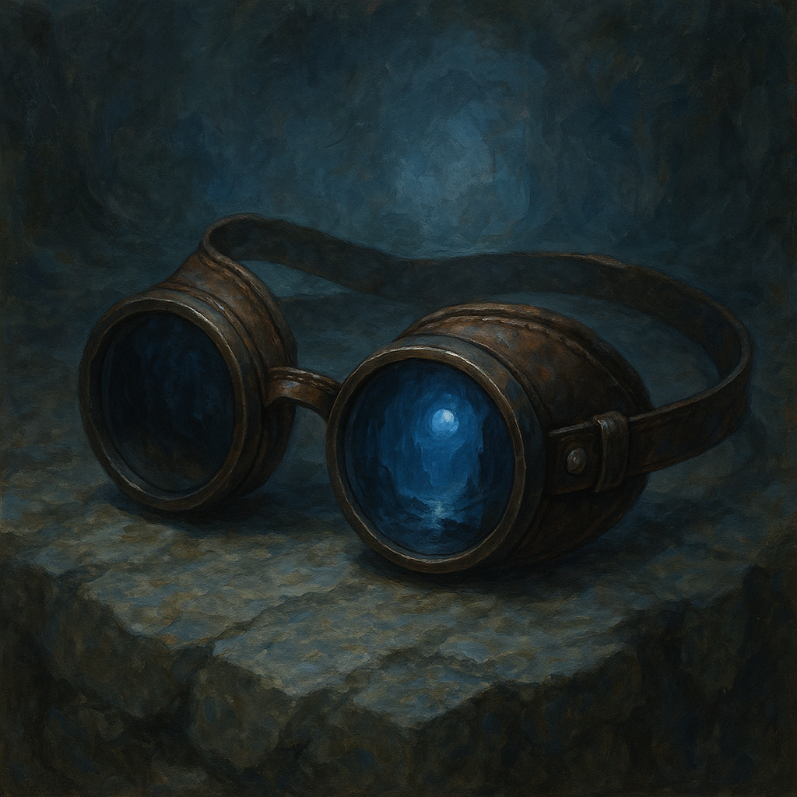

# Goggles of Night

Wondrous Item, uncommon 
 
 
While wearing these dark lenses, you have Darkvision out to 60 feet. If you already have Darkvision, wearing the goggles increases its range by 60 feet.

Dungeon Master’s Guide, pg. 172
