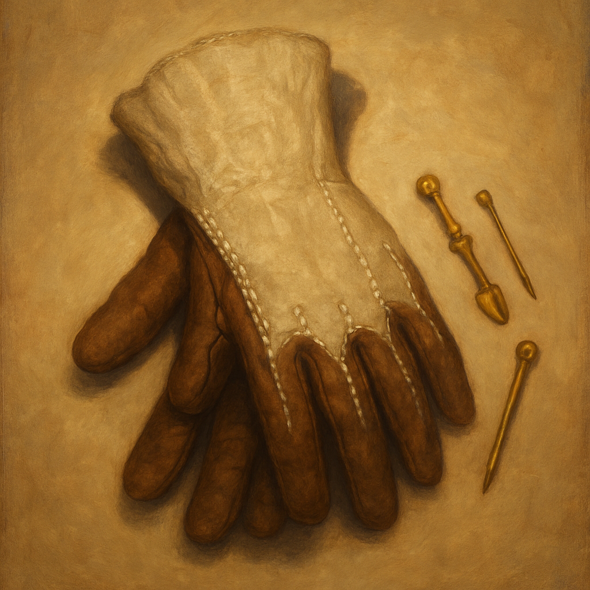

# Grave-Tender Gloves

Once per numbered room, when you make a Wisdom (Medicine) check to identify a cause of death or a Dexterity check to recover visible dropped gear from a dead character's body, you can add +1 to the roll; the gloves cannot restore hit points or prevent death.
