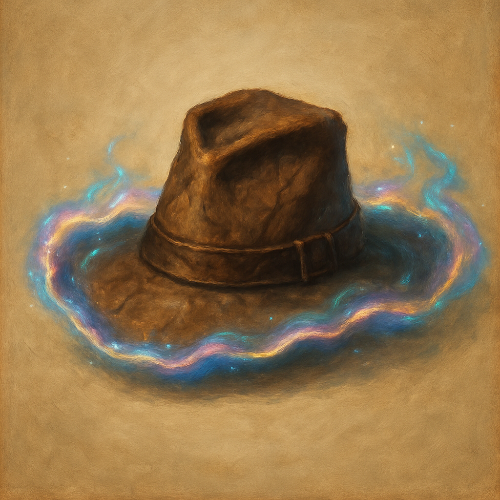

# Hat of Disguise

Wondrous Item, uncommon (requires attunement)
 
 
While wearing this hat, you can cast the Disguise Self spell. The spell ends if the hat is removed.

Dungeon Master’s Guide, pg. 173
