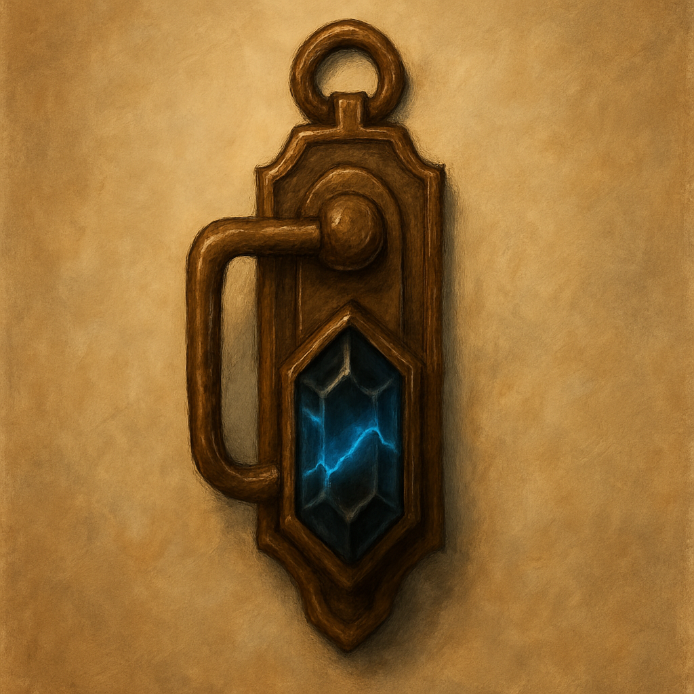

# Netherese Latch Charm

When you spend 1 minute touching a lock, latch, hinge, or door seam, the charm hums if that object has an active mechanical or magical opening mechanism; it does not identify the mechanism or open it.
