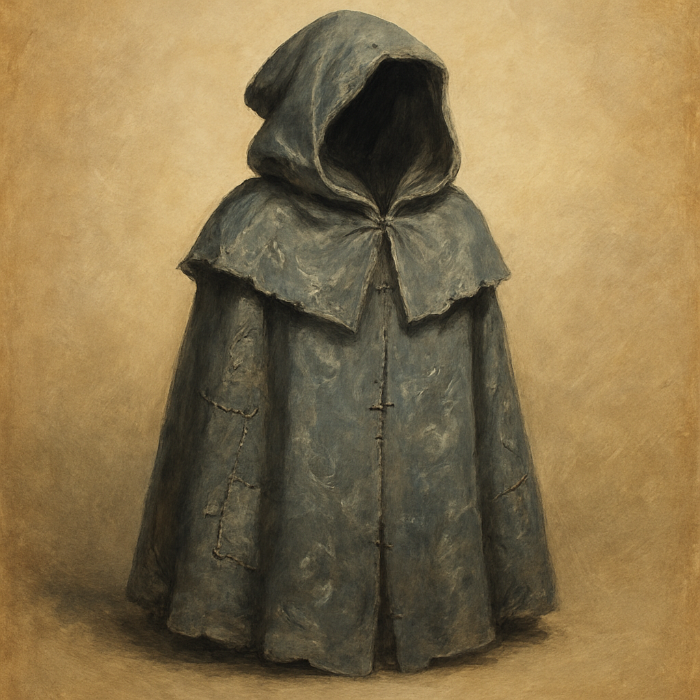

# Shroud of the Failed Apprentice

Once per numbered room, when you make an Intelligence (Arcana) check to identify Netherese marks, magical residue, or a visible spell effect in that room, you can add +1 to the roll.
