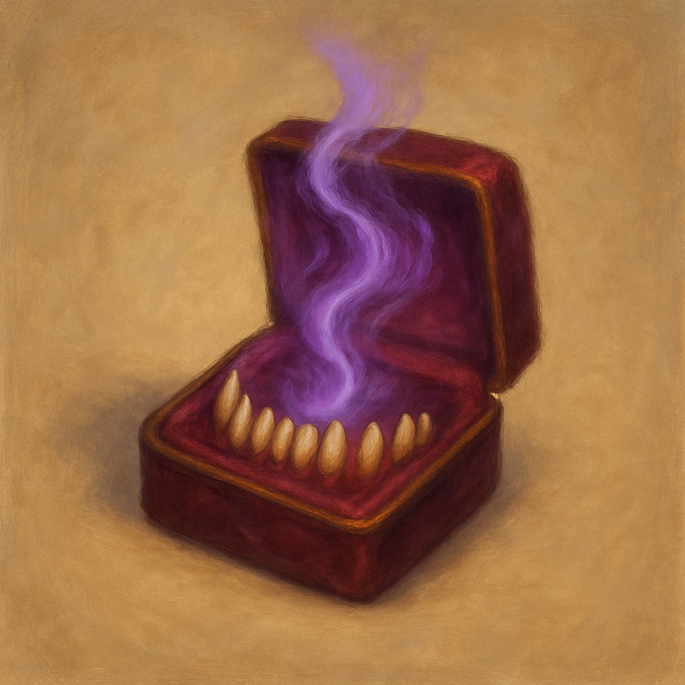

# Velvet Maw's Patient Charm

When you fail a saving throw against being Charmed or Frightened, or against an effect that deals Psychic damage, you can add +1 to the roll, potentially turning it into a success; once used, this charm cannot be used again until you finish a short rest.
