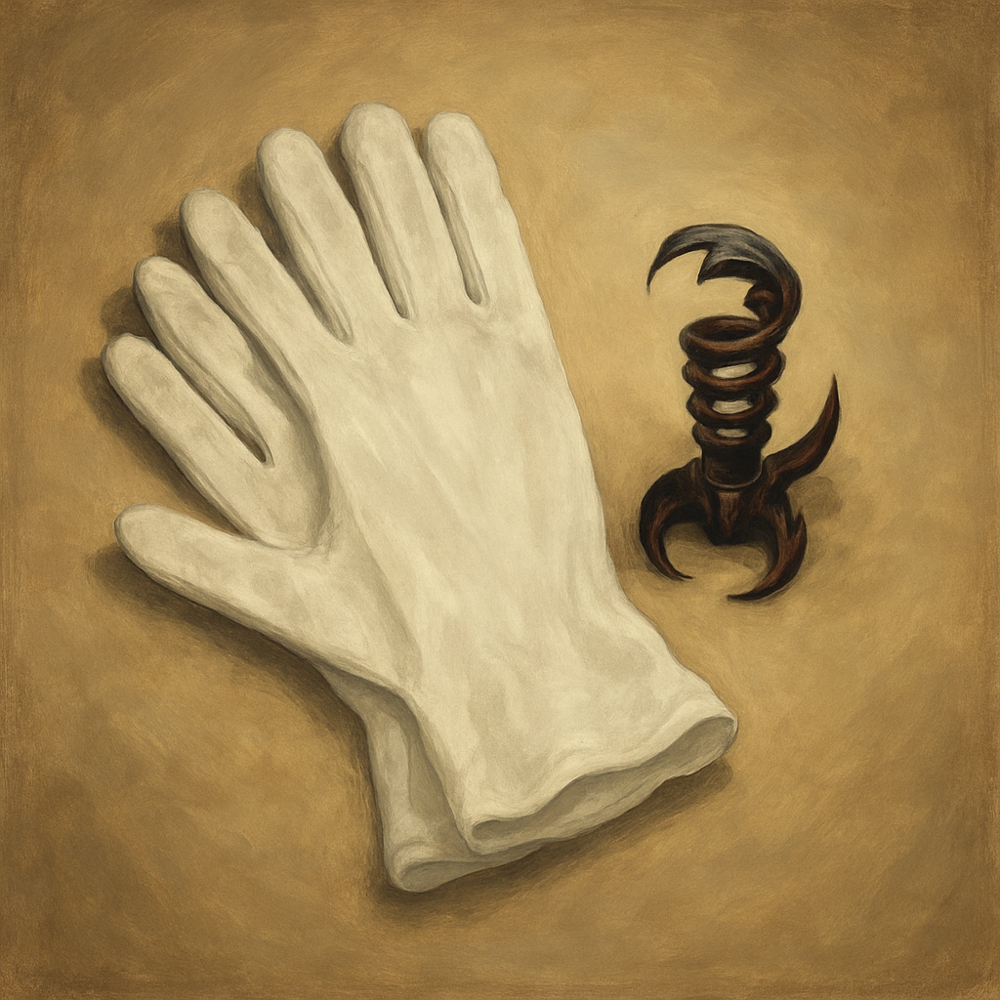

# Xhal'theris's White Handling Gloves

Once per numbered room, when you make a Dexterity check using thieves' tools or an Intelligence (Investigation) check to handle, test, or disable a trap component by hand, you can add +1 to the roll.
