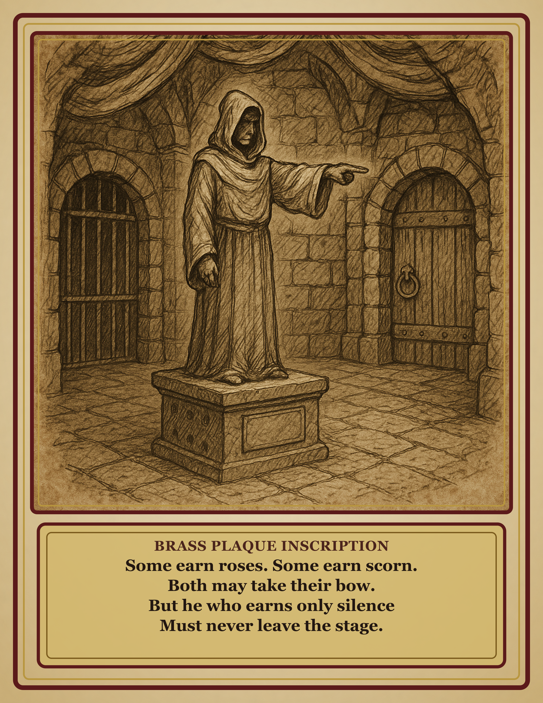

# Grovlikk's Last Laugh Plaque

*(Player handout. Pass to the players when they read the brass plaque in Artificer's Lair Room 2.)*

---

> Some earn roses. Some earn scorn.
> Both may take their bow.
> But he who earns only silence
> Must never leave the stage.
