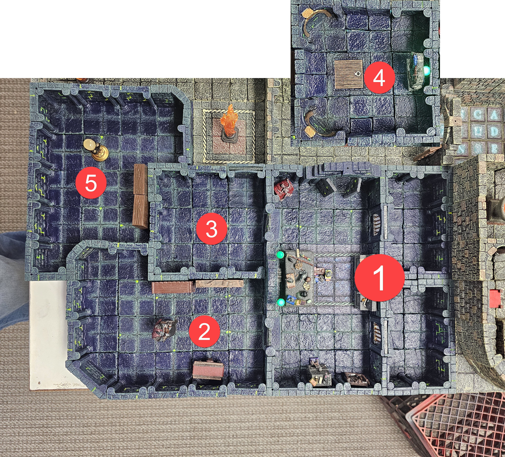

# Artificers Lair

## Room 1 "The Cells" 

**Description**
> Two cells about 15' x 15' where players wake up on slick stone floors, with no memory of how they got there.. Each cell has a single cell door.. Through the door hanging just over 30' away are keys hanging on a hook. Just outside the cells, below the keys is a pile of supplies and equipment.  
  - If Players search the cell DC12 Perception to notice deep scrapes in all the stone walls. The scrapes appear to go from ceiling to floor. 
  - DC16 Percepetion to have players notice what appears to be old dried blood traped in the spaces between the tiles on the floor. 

**Trap**: If the keys are lifted from the hook. Players hear an audible *click*, followed by grinding stone as the ceiling in both cells begins to lower. 

**Treasure**:
- 2 Daggers
- Short Sword
- Short Bow + Quiver (12 arrows)
- 2 Clubs
- Quarterstaff/Spear
- Sling + 20 bullets
- Leather Armor
- Padded Armor
- 1 Shield
- 50 ft Rope + Grappling Hook
- 6 Torches + Tinderbox
- Healer's Kit (stabilize only)
- Waterskins + Rations
- Crowbar, Hammer, and Iron Spikes
- Component Pouch
- Arcane Focus
- Holy Symbol

> [!NOTE] GM NOTE
> Hand these out as equipment-deck Item Cards. Character sheets start empty, so this pile is how the party arms itself.

### TRAP
**Read Aloud (when triggered)**
> The keys come free, and somewhere above the cells, a faint *click,* then a long low grinding noise as old gears begin to turn. Dust drifts down from the seams in the ceiling. The stones are moving.

- **Type**: Mechanical, timed area trap (the two cells; the central corridor and the rest of the room are safe)
- **Trigger**: Lifting the key ring off the hook without first detecting and bypassing the wire
- **Detection**:
  - Perception DC 16: spot the fine wire running from the back of the hook into the wall
  - Investigation DC 14 if a character specifically examines the hook
- **Deactivate**:
    - **Combined Brace (cinematic option)** - One character plants themselves directly under the descending ceiling and pushes up with everything they have. **DC 25 Strength save.** Any number of adjacent allies can use their action to brace alongside, and **each one adds their own Strength modifier** to the lead character's total. Roll once per round.
    - **Escalation** - Each subsequent round the bracers hold, the DC rises by **+2** (DC 25 → 27 → 29 → 31…). A new save is required at the start of each round to maintain the hold. Muscles tire, the mechanism keeps pushing, and the cost of holding goes up every time.
    - **Success** - The ceiling halts for that round. The brace must be maintained. Every braced character is locked into the action and can do nothing else. If even one helper drops out, re-roll next round with the reduced total against the higher DC.
    - **Failure** - The brace collapses and the ceiling resumes its descent from wherever it was being held. **The failed save itself deals no damage.** Damage is taken only when (and if) the ceiling reaches a height that hurts the characters still under it, per the round-by-round table below. If the brace was holding the ceiling at floor-level when it fails, the result is exactly what you'd expect.
    - **Natural 20 on the lead's roll** - The mechanism jams. The ceiling stops entirely until the bracers release it, at which point the timer resumes from where it stopped (giving the rest of the party time to find the reset lever, clip the wire from below, or get everyone out).

**Movement under the descending ceiling**
The ceiling begins at **7 ft** above the cell floor and descends **1 ft per round**.

| Round | Ceiling Height | Effect |
|-------|----------------|--------|
| 1 | 6 ft | Tall PCs (6 ft+) must stoop. Everyone else moves normally. No damage. |
| 2 | 5 ft | All Medium creatures must duck. Movement at half. No damage. |
| 3 | 4 ft | Hunched walk or crouch. Movement at half. No damage. |
| 4 | 3 ft | Must crawl. Movement at **1/4 speed.** No damage. |
| 5 | 2 ft | Prone crawl only. Movement at **1/4 speed.** No damage. |
| 6 | 1 ft | **4d6 bludgeoning** to anyone still in the cells. Dex save DC 14 for half. A creature reduced to 0 HP is pinned and dying, but can still be saved or pulled out by a teammate next round. |
| 7+ | Floor-level | **Everyone still in the cells is dead.** No saves, no rolls, no recovery. Just crushed. Bodies cannot be recovered until the mechanism is reset or disabled. |

---

## Room 2 "Grovlikk's Last Laugh"

**Description**
> Standing in the center of the room is a statue of a tall man in flowing robes his right hand extended with a single finger pointing at the door to the Cells. The statue is carved of pure stone with every detailed perfectly captured. 

**Treasure**:
- 1 Potion of Poison Resistance (single-use), awarded when the party finishes the joke
- 2 Antitoxin
- About 30 gp mixed coin

> [!NOTE] GM NOTE
> The potion is a reward for playing along with Grovlikk. Do not hand it out if the party only breaks things and flees.

### TRAP

- **Type**: Mechanical, timed area trap (the two cells; the central corridor and the rest of the room are safe)
- **Trigger**: The trap triggers when a creature pulls, twists, breaks, or otherwise strongly manipulates the statue’s extended finger. The room begins filling with **Grovlikk’s Offensive Cloud**.
    - There is a sharp click.
    - All doors into the room slam shut and lock.
    - For one quiet second, nothing happens.
    - Then the statue’s stone eyes begin to water.
    - Its grin seems to widen.
    - A deep wet gurgle builds inside the pedestal.
    - Yellow-green vapor vents from the statue’s backside
- **Detection**:
  - Perception DC 18: Notice the pluggled/hidden small holes barely noticable that covers the bottom of the Statue. 
- **Deactivate**: The trap cannot be stopped by mechanical means.
    > [!NOTE] GM NOTE
    > The players may try to break the statue, jam the doors, block the vents, pick the locks, force the doors, or dispel the gas. These attempts may provide clues or minor temporary benefits, but they do not end the trap and do not open the doors.
    - Blocking vents gives advantage on the next Constitution save for creatures near that blocked vent.
    - Forcing a door creates a small air gap but does not open the door.
    - Breaking part of the statue causes another foul burst; creatures within 10 feet immediately make the cloud saving throw.
    - The only way to stop the trap is for someone to finish the joke. The players must laugh at the joke, applaud Grovlikk, heckle him, praise him, or otherwise play along with the performance.

####  Grovlikk’s Offensive Cloud

This cloud is a stronger, nastier version of *Stinking Cloud*. It burns the throat, eyes, and lungs while forcing victims to gag and retch.

**Save DC**: 13 Constitution

Cloud Expansion
| Initiative Count | Round | Notes |
| -:- | -:- | :-- |
| 20 | 1 | The cloud fills a 10-foot radius around the statue. Only creatures in that area are affected.|
| 18 | 2 | The cloud expands to fill half the room. |
| 15 | 3 | The cloud fills the entire room. Every creature in the room is affected at the start of its turn. The cloud remains until the players solve the room. |

##### Visibility
Once the cloud fills at least half the room:
- The room is heavily obscured.
- Perception checks relying on sight or smell are made at disadvantage.
- Ranged attacks beyond 5 feet are made at disadvantage.
- Open flames sputter and shed only dim light.

> Any creature that starts its turn inside the cloud must make a DC 13 Constitution saving throw.

On a Failure:
- The creature spends its action retching and reeling.
- The creature takes `1d4` poison damage every round they're in the cloud. They only get the initial save. 
- The creature’s movement is halved until the end of its turn.
- The effects last 1d4 rds after escaping the cloud. 

On a Success:
- The creature still retches, coughs, and gags, but does not lose its action.
- The creature takes half of `1d4` poison damage, minimum 1 poison damage. The effect compounds each turn the characters are in the Cloud. 
- The creature may move and act normally.

> Creatures that do not need to breathe have advantage on the saving throw.

> Creatures immune to poison automatically succeed against the retching effect but still take 1 poison damage if they remain in the cloud.

#### HISTORY
> [!NOTE] GM NOTE
> Grovlikk the once powerful Artificer of Xhal’theris, the Velvet Maw - always enjoyed comedy. Even fancied himself a bit of a comedian. When Grovlikk dared challenge his master, Xhal'theris turned the foolish Artificer to a statue. Seeing him standing there his finger extended, Xhal'theris took great pleasure in turning this fool into yet another trap in his dungeon.. Considerin'g Grovlikk's love of comedy - he thought this trap would would be appropriate. This room, once Grovlikk's personal experiment chamber, where so many of his subjects met their fate; is now his own prison.
> Roll initiative immediately when triggered! The trap acts on initiative count 20 each round.

---

## Room 3 "Artificers Library"

**Description**
> Shelves cover the walls of this room, with all manner of book and scroll lining the shelves.

**Treasure**:
- Spell Scroll (L1): Detect Magic
- Spell Scroll (L1): Feather Fall
- Spell Scroll (L2): Lesser Restoration
- Spell Scroll (L2): Find Traps
- Map case
- Ink
- Spare mundane component pouch
- Spare mundane arcane focus
- About 40 gp mixed coin

> [!NOTE] GM NOTE
> The library's permanent and themed spellbooks are Treasure Goblin vendor stock, not free room loot. The portal-instruction scroll is a handout gated on the crystal clue chain. That chain is still an open flag.

- Entire Section on Comedy of different Cultures and Species.
- DC 16 to find the portal-instruction scroll handout once the crystal clue chain is ready.
- DC 15 Perception to spot hidden door in the cieling that leads to the portal room. 
  - Will need rope or something to reach 15' high opening
  - If the players don't find it themselves, use the handout to give them a clue, and if that does not work then 

---

## Room 4 "Portal Room [DUNGEON EXIT]"

**Description**
> A large mirror stands against the far wall in front of it sits a large cyrstal sphere on a pedestal. The images on the mirror are blurry and change rapidly. The pedestal has 7 distinct round slots that ring the sphere.  

**Treasure**:
- None. The room holds the Crystal Sphere control prop and a blank 7-socket diagram players use to track the crystal order.

> [!NOTE] GM NOTE
> This room is deliberately bare. Do not place coin, magic items, or a crystal here.

- Crystal Sphere controls the Portal Mirror using the various Crystal Shards (Kyber Crystals) found through out this dungeon.. Once all the Crystals are gathered, they can be used to open a portal to safety - outside the Dungeon.. This is the only way to escape the dungeon! 

> [!NOTE] GM NOTE
> Anyone that Steps through the portal without using a Control Crystal is teleported to random places within the Dungeon.. The portal changes as every person steps through. 

- Players Roll > 1d8 (points in random direction) and number on die tells of 1 of 8 points in the dungeon + 1d12+4 5' distance from target.. 

---

## Room 5 "Artificers Workshop" 

**Description**
> This large room contains the remains of several of Grovlikk's followers, long sense dead. 

**Treasure**:
- About 140 gp mixed coin
- 2 Alchemist's Fire (Flask)
- 2 Acid (Vial)
- 2 Oil (Flask)
- 1 Poison, Basic (Vial)
- 1 Potion of Healing (single-use)

> [!NOTE] GM NOTE
> The skeletons guard this stash. Any permanent magic items for this area, such as a +1 weapon, Bag of Holding, or Rope of Climbing, are Treasure Goblin vendor stock, not chest loot.

- Monsters: Skeletons attack players as they enter the room. 

