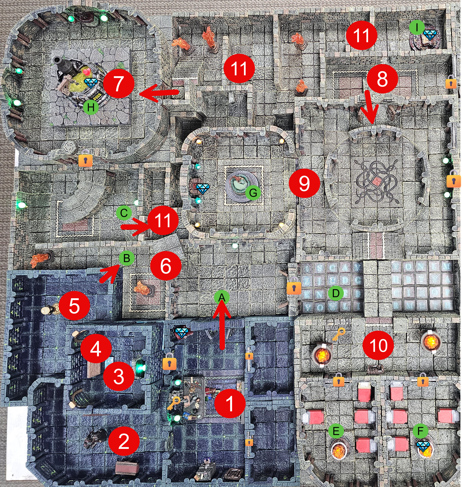

# Dungeon - Left



---

## Artificers Workshop


### D1 "The Cells"

**Description**

> Two cells about 15' x 15' where players wake up on slick stone floors, with no memory of how they got there.. Each cell has a single cell door.. Through the door hanging just under 30' away are keys hanging on a hook. Just outside the cells, below the keys is a pile of supplies and equipment.

- If Players search the cell DC12 Perception to notice deep scrapes in all the stone walls. The scrapes appear to go from ceiling to floor.
- DC16 Percepetion to have players notice what appears to be old dried blood traped in the spaces between the tiles on the floor.

**Trap**: If the keys are lifted from the hook. Players hear an audible *click*, followed by grinding stone as the ceiling in both cells begins to lower.

- Portal room doors are locked (lock pick or find keys on jailer)
- The main exit door is Trapped (axe trap)

**Treasure**:

- See Cards

> [!NOTE] ✏️ GM NOTE
> Hand these out as equipment-deck Item Cards. Character sheets start empty, so this pile is how the party arms itself.

#### TRAP

**Read Aloud (when triggered)**

> The keys come free, and somewhere above the cells, a faint *click,* then a long low grinding noise as old gears begin to turn. Dust drifts down from the seams in the ceiling. The stones are moving.

- **Type**: Mechanical, timed area trap (the two cells; the central corridor and the rest of the room are safe)
- **Trigger**: Lifting the key ring off the hook without first detecting and bypassing the wire
- **Detection**:
  - Perception DC 16: spot the fine wire running from the back of the hook into the wall
  - Investigation DC 14 if a character specifically examines the hook
- **Deactivate**:
  - **Combined Brace (cinematic option)** - One character plants themselves directly under the descending ceiling and pushes up with everything they have. **DC 25 Strength save.** Any number of adjacent allies can use their action to brace alongside, and **each one adds their own Strength modifier** to the lead character's total. Roll once per round.
  - **Escalation** - Each subsequent round the bracers hold, the DC rises by **+2** (DC 25 → 27 → 29 → 31…). A new save is required at the start of each round to maintain the hold. Muscles tire, the mechanism keeps pushing, and the cost of holding goes up every time.
  - **Success** - The ceiling halts for that round. The brace must be maintained. Every braced character is locked into the action and can do nothing else. If even one helper drops out, re-roll next round with the reduced total against the higher DC.
  - **Failure** - The brace collapses and the ceiling resumes its descent from wherever it was being held. **The failed save itself deals no damage.** Damage is taken only when (and if) the ceiling reaches a height that hurts the characters still under it, per the round-by-round table below. If the brace was holding the ceiling at floor-level when it fails, the result is exactly what you'd expect.
  - **Natural 20 on the lead's roll** - The mechanism jams. The ceiling stops entirely until the bracers release it, at which point the timer resumes from where it stopped (giving the rest of the party time to find the reset lever, clip the wire from below, or get everyone out).

**Movement under the descending ceiling**
The ceiling begins at **7 ft** above the cell floor and descends **1 ft per round**.

| Round | Ceiling Height | Effect                                                                                                                                                                                          |
| ----- | -------------- | ----------------------------------------------------------------------------------------------------------------------------------------------------------------------------------------------- |
| 1     | 6 ft           | Tall PCs (6 ft+) must stoop. Everyone else moves normally. No damage.                                                                                                                           |
| 2     | 5 ft           | All Medium creatures must duck. Movement at half. No damage.                                                                                                                                    |
| 3     | 4 ft           | Hunched walk or crouch. Movement at half. No damage.                                                                                                                                            |
| 4     | 3 ft           | Must crawl. Movement at**1/4 speed.** No damage.                                                                                                                                          |
| 5     | 2 ft           | Prone crawl only. Movement at**1/4 speed.** No damage.                                                                                                                                    |
| 6     | 1 ft           | **4d6 bludgeoning** to anyone still in the cells. Dex save DC 14 for half. A creature reduced to 0 HP is pinned and dying, but can still be saved or pulled out by a teammate next round. |
| 7+    | Floor-level    | **Everyone still in the cells is dead.** No saves, no rolls, no recovery. Just crushed. Bodies cannot be recovered until the mechanism is reset or disabled.                              |

---

### D2 "Grovlikk's Last Laugh"

**Description**

> Standing in the center of the room is a statue of a tall man in flowing robes, his right hand extended with a single finger pointing at the door to the Cells. The statue is carved of pure stone, with every detail carefully captured. A brass plaque is set into the pedestal.

- DC 13 Investigation to read the brass plaque on the pedestal:
  > Some earn roses. Some earn scorn.
  > Both may take their bow.
  > But he who earns only silence
  > Must never leave the stage.
  >

> [!NOTE] GM NOTE
> Hand the players the plaque handout so they can read the verse. The verse means any audience reaction, even scorn or a bad review, can end the performance. The party does not need to laugh or applaud.

**Treasure**:

- 1 Potion of Poison Resistance (single-use), awarded when the party finishes the joke
- 2 Antitoxin
- About 30 gp mixed coin

> [!NOTE] ✏️ GM NOTE
> The potion is a reward for playing along with Grovlikk. Do not hand it out if the party only breaks things and flees.

#### TRAP

- **Type**: Mechanical, timed area trap (the two cells; the central corridor and the rest of the room are safe)
- **Trigger**: The trap triggers when a creature pulls, twists, breaks, or otherwise strongly manipulates the statue’s extended finger. The room begins filling with **Grovlikk’s Offensive Cloud**.

**Read Aloud (when triggered)**
> There is a sharp click, and every door into the room slams shut and locks. For a second nothing happens. Then the statue’s stone eyes begin to water, its grin seems to widen, and a deep wet gurgle builds inside the pedestal. Yellow-green vapor vents from the statue’s backside and spreads across the floor toward you.

- **Detection**:

  - Perception DC 18: Notice the pluggled/hidden small holes barely noticable that covers the bottom of the Statue.
- **Deactivate**: The trap cannot be stopped by mechanical means.

  > [!NOTE] ✏️ GM NOTE
  > The players may try to break the statue, jam the doors, block the vents, pick the locks, force the doors, or dispel the gas. These attempts may provide clues or minor temporary benefits, but they do not end the trap and do not open the doors.
  >

  - Blocking vents gives advantage on the next Constitution save for creatures near that blocked vent.
  - Forcing a door creates a small air gap but does not open the door.
  - Breaking part of the statue causes another foul burst; creatures within 10 feet immediately make the cloud saving throw.
  - The only way to stop the trap is for someone to finish the joke. The players must laugh at the joke, applaud Grovlikk, heckle him, praise him, or otherwise play along with the performance.

##### Grovlikk’s Offensive Cloud

This cloud is a stronger, nastier version of *Stinking Cloud*. It burns the throat, eyes, and lungs while forcing victims to gag and retch.

**Save DC**: 13 Constitution

Cloud Expansion

| Initiative Count | Round | Notes                                                                                                                                                 |
| ---------------- | ----- | ----------------------------------------------------------------------------------------------------------------------------------------------------- |
| 20               | 1     | The cloud fills a 10-foot radius around the statue. Only creatures in that area are affected.                                                         |
| 18               | 2     | The cloud expands to fill half the room.                                                                                                              |
| 15               | 3     | The cloud fills the entire room. Every creature in the room is affected at the start of its turn. The cloud remains until the players solve the room. |

##### Visibility

Once the cloud fills at least half the room:

- The room is heavily obscured.
- Perception checks relying on sight or smell are made at disadvantage.
- Ranged attacks beyond 5 feet are made at disadvantage.
- Open flames sputter and shed only dim light.

> Any creature that starts its turn inside the cloud must make a DC 13 Constitution saving throw.

On a Failure:

- The creature spends its action retching and reeling.
- The creature takes `1d4+1` poison damage every round they're in the cloud.
- The creature’s movement is halved until the end of its turn and can only make one action (move, action, bonus action)
- The effects last 1d4 rds after escaping the cloud.

On a Success:

- The creature still retches, coughs, and gags, but does not lose its action.
- The creature takes half of `1d4+1` poison damage, minimum 1 poison damage.
- The creature may move and act normally.

> Creatures that do not need to breathe have advantage on the saving throw.

> Creatures immune to poison automatically succeed against the retching effect but still take 1 poison damage if they remain in the cloud.

#### HISTORY

> [!NOTE] ✏️ GM NOTE
> Grovlikk the once powerful Artificer of Xhal’theris, the Velvet Maw - always enjoyed comedy. Even fancied himself a bit of a comedian. When Grovlikk dared challenge his master, Xhal'theris turned the foolish Artificer to a statue. Seeing him standing there his finger extended, Xhal'theris took great pleasure in turning this fool into yet another trap in his dungeon.. Considerin'g Grovlikk's love of comedy - he thought this trap would would be appropriate. This room, once Grovlikk's personal experiment chamber, where so many of his subjects met their fate; is now his own prison.
> Roll initiative immediately when triggered! The trap acts on initiative count 20 each round 1, then moves to Initiative 18, then 15.. It reduces by 2 places each subsequent turn.

### D3 "Artificers Library"

**Description**

> Shelves cover the walls of this room, with all manner of book and scroll lining the shelves.

**Treasure**:

See Prop..

> [!NOTE] ✏️ GM NOTE
> The library's permanent and themed spellbooks are Treasure Goblin vendor stock, not free room loot. The portal-instruction scroll is a handout gated on the crystal clue chain.

- Entire Section on Comedy of different Cultures and Species.
- DC 16 to find the portal-instruction scroll handout once the crystal clue chain is ready.
- DC 15 Perception to spot hidden door in the cieling that leads to the portal room.
  - Will need rope or something to reach 15' high opening
  - If the players don't find it themselves, use the handout to give them a clue, and if that does not work then

### D4 "Portal Room [DUNGEON EXIT]"

**Description**

> A large mirror stands against the far wall in front of it sits a large cyrstal sphere on a pedestal. The images on the mirror are blurry and change rapidly. The pedestal has 8 distinct round slots that ring the sphere.

**Treasure**:

- None. The room holds the Crystal Sphere control prop and the eight empty sockets that ring it.

> [!NOTE] ✏️ GM NOTE
> This room is deliberately bare. Do not place coin, magic items, or a crystal here.

- Crystal Sphere controls the Portal Mirror using the various Crystal Shards (Kyber Crystals) found through out this dungeon.. Once all the Crystals are gathered, they can be used to open a portal to safety - outside the Dungeon.. This is the only way to escape the dungeon!

> [!NOTE] ✏️ GM NOTE
> Anyone that Steps through the portal without using a Control Crystal is teleported to random places within the Dungeon.. The portal changes as every person steps through.

- Players Roll > 1d8 (points in random direction) and number on die tells of 1 of 8 points in the dungeon + 1d12+4 5' distance from target..

#### PUZZLE: The Eight-Crystal Exit

This is the win condition for the whole one-shot.

**What the players see**

> The mirror's images never settle. In front of it the crystal sphere sits on its pedestal, and eight round sockets ring the sphere. The sockets are empty and waiting.

**Intended solution**

Gather all eight Key crystals, Green, White, Yellow, Blue, Purple, Red, Magenta, and Black, and set them into the eight sockets. There is no order to solve. The moment all eight Key crystals are seated, they force the exit Portal open. Any order works, so the whole challenge is finding and recovering all eight shards, not arranging them.

**Clues and where they live**

- The Scrying Stone, the first one here in the Portal Room and a second on the table in D6-A, reveals clues for the color-locked doors and points the party toward the shards they still need. It does not hold an exit order, because there is no order to learn.
- The Prisoner's Letter confirms the rule: eight crystals, eight sockets, and the gate does not open until all eight are seated.

**Fail state**

Stepping through without setting the sphere teleports the character to a random spot in the dungeon, per the random-teleport roll above (1d8 for the point, 1d12+4 for distance in five-foot increments). The portal reshuffles with every person who steps through, so rushing it scatters the party.

**Hint ladder**

1. "All eight sockets must be filled. You are missing crystals. Find the rest before this does anything."
2. "There is no order to work out. Bring all eight shards here, seat them, and the portal opens."
3. "Stepping through without setting the sphere just throws you back into the dungeon at random."

> [!NOTE] ✏️ GM NOTE
> The exit needs all eight Key crystals and nothing more. Placing all eight forces the Portal open in any order. There is no star-lock sequence, no correct placement order, and no Scrying Stone answer key for an order. The eight shards, the eight sockets, and the random-teleport penalty are fixed in `crystals.md`, this file, and `props/scryingstone.md`.

### D5 "Artificers Workshop"

**Description**

> This large room contains the remains of several of Grovlikk's followers, long sense dead.

**Treasure**:

See bag

> [!NOTE] ✏️ GM NOTE
> The skeletons guard this stash. Any permanent magic items for this area, such as a +1 weapon, Bag of Holding, or Rope of Climbing, are Treasure Goblin vendor stock, not chest loot.

- Monsters: Skeletons attack players as they enter the room.

**Read Aloud (when the skeletons rise)**
> Among the long-dead bodies, bones begin to stir. Several skeletons drag themselves upright, armed with rusted blades, and come straight at you the moment you cross the threshold.

#### Skeleton

*Medium Undead, Lawful Evil* | **AC** 13 (armor scraps) | **HP** 13 (2d8 + 4) | **Speed** 30 ft.

| STR | DEX | CON | INT | WIS | CHA |
| --- | --- | --- | --- | --- | --- |
| 10 (+0) | 16 (+3) | 15 (+2) | 6 (-2) | 8 (-1) | 5 (-3) |

**Damage Vulnerabilities** Bludgeoning | **Damage Immunities** Poison | **Condition Immunities** Exhaustion, Poisoned | **Senses** darkvision 60 ft., passive Perception 9 | **Languages** understands what it knew in life, cannot speak | **Challenge** 1/4 (50 XP) **PB** +2

***Shortsword.*** *Melee Attack Roll:* +5, reach 5 ft. *Hit:* 6 (1d6 + 3) Piercing.

***Shortbow.*** *Ranged Attack Roll:* +5, range 80/320 ft. *Hit:* 6 (1d6 + 3) Piercing.

---

### D6: Hallway - Left

#### D6-A: Entering the the halls of the Dungeon.

**Read Aloud (entering)**
> You step out into a dungeon hallway. Two dead bodies lie against the walls. Under a hanging light there is a table, and on it sits a smooth, dark stone.

The main door is trapped.. The door to the left is Locked.. There is a scrying stone sitting on the table in this room just below the light.

Dead Bodies x2

##### Trap

**Read Aloud (when the frame drops)**
> A click, and a heavy metal frame bristling with spikes drops out of the ceiling and slams down across the doorway at the first person stepping through.

- When the doors open and the first person steps out, ***click*** | a large metal frame drops for the ceiling covered in spikes that will slam into the player..

> DEX save DC13 for half damage DC18 No Damage..
> 4d6+4 Piercing Damage

#### D6-B/C: West Hall

There is a door existing Artificers [D5] and the hall swings around the corner to a large set of stairs the goes up to to a large double door (locked).. This door leads to Alchemists Lab [Area D7]. There is another smaller door on the East wall that is unlocked that leads to the Gauntlet [C].

Dead Bodies x3

#### D6-D: Wizards Floor Puzzle

**Description**

> The floor is paved end to end with lettered tiles, and every tile glows and crackles with arcane energy. High above you a stone arch bridge runs across the chamber, from Area D9 over to D10. There is no obvious safe lane across the floor.

**Intended solution**

Cross by stepping on the tiles that spell **KNOWLEDGEISTHYONLYTRUTH** ("knowledge is thy only truth"), letter to letter, in order. The PuzzleFloor and PuzzleFloorSolution art show the grid and the correct winding path through it.

**Clues and where they live**

- A Scrying Stone clue spells out the puzzle, but it only unlocks with the Green Crystal on the board.
- The room is the Artificer's and Wizard's wing. The scholarly, arcane dressing points at a knowledge theme.

**Fail state**

Harsh. Stepping on a wrong tile deals **2d4+4 with no save**. There is no cap on attempts, so a party that brute-forces it bleeds out fast.

**Hint ladder**

1. "The tiles are letters. The safe path is not random, it spells something."
2. "Put the Green Crystal on the Scrying Stone. There is a clue waiting for it."
3. "The phrase is about knowledge and truth. Start with the K."
4. If the table is desperate, show them the solution art or trace the first several letters so they can finish it.

> [!NOTE] ✏️ GM NOTE
> KNOWLEDGEISTHYONLYTRUTH is the fixed solution. The 2d4+4 no-save tile damage and the Green Crystal gate on the Scrying Stone clue are unchanged.

## D7: Alchemists Lab

**Read Aloud (entering)**
> A cramped alchemy lab, the air sharp with chemical stink. In the center a large vat of foul-smelling liquid bubbles away, and through a window in its side you can just make out a small green crystal resting at the bottom. A workbench along the wall is crowded with unlabeled jars and ingredients.

This room has two doors - one in the South is locked from the inside.. The smaller door on the East wall is unlocked and leads to D11.

There is a large vat of some chemical that smells aweful. Through the window the players can see a small green crystal sitting at the bottom of the vat.

There are **20 unlabeled ingredients** on the bench. Ten potion recipes can be produced from them. Several ingredients deliberately appear in multiple recipes, so players cannot solve the puzzle by simple elimination. The players must read the recipe book and use the descriptions and clues to create the potion of Invulnerability so they can survive going into the large chemical vat in the center of the room and retrieve the treasure there.

The room contains a mortar and pestle, brass measuring spoon, glass stirring rod, iron stirring rod, burner, cooling bowl, ten empty potion bottles, and a small silver cauldron. Not all ingredients need to be available in sufficient quantity to create every recipe. The DM should place only the quantities intended for this run.

### D8: Entrance to Serpents Lair

**Read Aloud (once the hidden door opens)**
> A concealed door grinds open onto a stairway. One flight climbs toward dry heat and the sound of something coiling above. Another runs down to a gated hall, where you can make out a dozen or more bodies strewn across the floor.

This area only opens up after triggering the treasure trap in Area D11-I.. When the trap is triggered, the hidden door opens up. There is a set of stairs that leads up to the serpent lair Area D9, and another that leads through a gated door that is currently locked. Inside that large hall you can see about a dozen dead bodies all over the ground..

Dead Bodies x2

### D9: Serpents Lair

**Read Aloud (entering)**
> The air up here is hot and dry. The chamber opens out ahead of you, with a chest set against the back wall.

This area is much hotter than below. There is a chest sitting against the back wall of D9-G. The Trap in this area will trigger whenever a player comes into line of sight..

#### Treasure

See handout

#### Monster

- Vos'sykriss, the Serpentfolk (stat block below)

**Read Aloud (when Vos'sykriss reveals himself)**
> A serpentfolk uncoils into the open, a long snake's body beneath a scaled, humanlike torso, a scimitar held low in one hand. His eyes lock onto yours and hold them, and you feel your skin start to tighten and harden where his gaze falls.

#### BOSS: Vos'sykriss, the Serpentfolk

*Medium Monstrosity (Serpentfolk), typically Chaotic Evil*

**Armor Class** 15
**Hit Points** 85 (10d8 + 40)
**Speed** 30 ft., climb 20 ft.

| STR | DEX | CON | INT | WIS | CHA |
| --- | --- | --- | --- | --- | --- |
| 16 (+3) | 16 (+3) | 18 (+4) | 11 (+0) | 14 (+2) | 15 (+2) |

**Saving Throws** Dex +6, Con +7, Wis +5
**Skills** Perception +5, Stealth +6
**Damage Resistances** poison
**Condition Immunities** poisoned
**Senses** darkvision 60 ft., passive Perception 15
**Languages** Common, Draconic
**Challenge** 5 (1,800 XP) **Proficiency Bonus** +3

**Traits**

***Coiled Vigilance.*** Advantage on Wisdom (Perception) checks and on saves against Blinded, Charmed, Deafened, Frightened, Stunned, and Unconscious.

***Serpentine Awareness.*** Cannot be surprised while conscious.

***Weaving Coils.*** Opportunity attacks against Vos'sykriss have Disadvantage.

***Invisible Doubles.*** Vos'sykriss is accompanied by two identical duplicates using this same stat block, each Invisible until it attacks or is revealed. Duplicates cannot use Petrifying Gaze, only the true Vos'sykriss can petrify. Destroying a duplicate does not reveal the others. Identifying the real one, as the only serpentfolk whose gaze petrifies or via See Invisibility, is the encounter puzzle.

***Petrifying Gaze.*** When a creature that can see his eyes starts its turn within 30 ft, Vos'sykriss can force a DC 14 CON save if he is not Incapacitated and can see it. On a fail, the creature is Restrained as it begins to petrify. At the end of its next turn it repeats the save, ending the effect on a success or becoming Petrified on a failure. A creature can avert its eyes at the start of its turn to avoid the save, but then it cannot see Vos'sykriss until its next turn.

**Actions**

***Multiattack.*** Two attacks from Scimitar and Bite.

***Scimitar.*** *Melee Attack Roll:* +6, reach 5 ft. *Hit:* 8 (1d10 + 3) Slashing plus 3 (1d6) Poison.

***Bite.*** *Melee Attack Roll:* +6, reach 5 ft. *Hit:* 7 (1d8 + 3) Piercing plus 7 (2d6) Poison.

***Constrict.*** *Melee Attack Roll:* +6, reach 10 ft., one Medium or smaller creature. *Hit:* 10 (2d6 + 3) Bludgeoning, and the target is Grappled (escape DC 14) and Restrained until the grapple ends. He can constrict only one target at a time.

**Tactics.** The fight is a shell game. All three serpentfolk read identically, and only the true Vos'sykriss petrifies. He hangs back and uses Petrifying Gaze on anyone who starts a turn looking at him within 30 ft, while the two invisible duplicates flank and open with melee. The party either spreads See Invisibility and area reveals, or they deduce which snake is petrifying people and focus it. Averting eyes shuts down the gaze but blinds the averter to him for a turn, which the duplicates punish. He constricts and drags isolated characters away from support. Three bodies at CR 5 each already answers a big party's action economy, so this scales as written for 10 to 12. Petrified is effectively a kill in a permadeath one-shot unless the party has Greater Restoration, so treat the gaze as a telegraphed save-or-die and make sure the Serpents Lair clue chain warns them.

> [!NOTE] GM NOTE
> The Snake-Head Beam Weapon below is a separate trap object, not Vos'sykriss himself. Run the beam as destructible room furniture (100 HP, mirror countermeasure) and Vos'sykriss as the living boss.

#### TRAP:

Snake Head Beam Weapon.. The snake will shoot a 30' been whenever a player is LoS.

**Read Aloud (when the beam fires)**
> A carved snake head set into the wall swivels toward whoever stepped into the open and spits a thirty-foot lance of fire across the room.

> The beam does 4d6 Fire Damage. DEX Save DC13 to dodge (no damage).

- The trick is to use a mirror to reflect the beam back at the device causing it to be destroyed.
- Or you can slam it with Spells or Gob Stoppers.. It has 100hp

### D10: The Old Cells

**Read Aloud (entering)**
> A short block of old cells. A dead guard is slumped here with a heavy ring of keys still on his belt, and two cell doors stand locked in front of you.

This room has a dead guard who still has a large key chain and two locked Cells.

#### D10-E: Left Cell

Inside this room are 2 corpses laying dead on the bed. The smell is pretty bad.. Percerption check DC 12 to spot large scrapes in the floor near the riser in the middle.

STR DC 17 to push the riser.. Beneath this riser is a small bag of coin

#### D10-F: Right Cell

Inside this room are 3 corpses laying dead on the bed. The smell is pretty bad.. Percerption check DC 12 to spot large scrapes in the floor near the riser in the middle.

##### TRAP

**Read Aloud (when the riser is pushed back)**
> As the riser grinds back into place, a pulse of cold energy blasts out of it and rolls through the whole dungeon. Everywhere it washes over, the dead begin to twitch and drag themselves back to their feet.

STR DC 17 to push the riser.. As the players push this one back.. there is a pulse of energy that blasts out.. Everyone in the entire dungeon needs to make the save.. If a caster is damaged they must make their Consatration Save..

> CON Save for 1/2 dmg. 2d4+2 Necrotic Damage.

As soon as the necrotic pulse passes over an area, all the dead begin to rise as mindless zombies. This includes players that have fallen.

#### Zombie

*Medium Undead, Neutral Evil* | **AC** 8 | **HP** 15 (2d8 + 6) | **Speed** 20 ft.

| STR | DEX | CON | INT | WIS | CHA |
| --- | --- | --- | --- | --- | --- |
| 13 (+1) | 6 (-2) | 16 (+3) | 3 (-4) | 6 (-2) | 5 (-3) |

**Saving Throws** Wis +0 | **Damage Immunities** Poison | **Condition Immunities** Poisoned | **Senses** darkvision 60 ft., passive Perception 8 | **Languages** understands what it knew in life, cannot speak | **Challenge** 1/4 (50 XP) **PB** +2

***Undead Fortitude.*** If damage reduces it to 0 HP, it makes a CON save, DC 5 plus the damage taken, unless the damage is Radiant or a Critical Hit. On a success it drops to 1 HP instead.

***Slam.*** *Melee Attack Roll:* +3, reach 5 ft. *Hit:* 4 (1d6 + 1) Bludgeoning.

## The Gauntlet (D11)

### PUZZLE: Running the Gauntlet

The Gauntlet is less one puzzle than a chain of hazards with two real thinking problems buried in it: the Five Seals switch wall and the Treasure Chest at the end. Everything between those two is a hazard to survive, not a riddle to solve. Each hazard below is described as the party reaches it. Push them forward and let the traps do the talking.

**What the players see**

> A long corridor that bends and branches. It does not look safe. The air smells burnt in places and sharp in others. Somewhere ahead you can hear something crackling on a cycle, like it is waiting.

**The two thinking problems**

- **The Five Seals.** The switch wall that shuts down the Lightning Trap. Full solution below under "Running the Five Seals."
- **The Treasure Chest.** The real puzzle at the end. Stepping up to the giant chest drops a cage over whoever opened it and opens both secret doors and the gate. Putting the treasure back and shutting the lid resets everything. The trick is to trigger the trap, have a small or average-size character climb inside the chest and shut the lid, then have an ally open it from the safe room (Room 10, which holds an identical chest). A large creature will not fit. Once the lid shuts it only opens from the outside, and the chest holds about an hour of air. Full mechanics are in section 9 below.

**Clues and where they live**

- Each hazard is described in the room text as the party reaches it.
- The Five Seals handout and inscription carry that puzzle's clues.
- The identical chest in the safe Room 10 is the clue for the chest puzzle. Two matched chests is the tell that they are linked.

**Fail state**

Every hazard deals damage on a failed check, listed in each section below. The chest puzzle's real danger is a character sealing themselves in and running out of air if no ally frees them, or a creature too large to fit trying the trick and getting caught by the cage.

**Hint ladder (for the chest)**

1. "The cage, the doors, and the gate all move together when the chest is touched. They reset when you put the treasure back."
2. "There is a second, identical chest in the safe room. Why would he build two?"
3. "The lid only opens from the outside. Someone small needs to be inside, and someone else needs to open it from safety."
4. If they are stuck, have Xhal'theris offer a mocking bargain hinting that the box opens best from the wrong side.

### **1. Trick Trap | Because I'm an asshole**

**Read Aloud (when the trap springs)**
> The floor drops out under a ten-foot stretch of the passage. At the same moment the ceiling behind it swings down and shoves anyone standing there forward into the open pit.

* Hidden spike trap in floor 10' x 10'.. The players have a DC13 Perception, passive unless they're specifically saying their looking for traps or stuff, then do a group perception check (two or three people roll take the average). The trick is that if the players get across, there is a second trigger that causes a the ceiling to swing down over the squares behind the trap, pushing anyone in the 10' behind the trap into the pit trap.. 25' drop (2d6+10 | covers fall and poky sticks dmg)

> To climb out  requires a check without rope (Athletics or STR DC 15).. If using rope with someone holding the end -  no check required.

### **2. Acid Spray Tap**

**Read Aloud (when it sprays)**
> As you round the corner, the whole wall opens up and sheets acid across the passage like a shower. It spatters over everyone in the stretch and starts eating at skin and gear.

* As the first player rounds the corner the wall sprays acid over the entire 10x20 sqft area like a wall shower.. It does 2d8+2 (Reflex Save for half dmg). The players have DC13 to detect the small holes in the wall to indicate the spray trap..
* It can be disabled using slight of hand check (DC 15) | Failed roll triggers it - the only place to disable is the top square next to the spray wall.

### **3. Javalin Trap**

**Read Aloud (when a javelin fires)**
> A javelin punches up out of a slot in the floor and slices across the passage at leg height.

* Every 10' have players roll dex save (if roll is Odd number they don't trigger anything).. On a roll of **even** number triggers javelin that slices out the ground for 1d6+1 dmg (apply save player rolled)
* No option to disable these traps

### **4. Flame Trap 1 and 2**

**Read Aloud (when the flames fire)**
> A gout of fire roars out of hidden vents and washes across the passage right in front of you.

* Flame Trap 1d6+1 / Dex Save.
* It can be disabled using slight of hand check (DC 15)

### **5. Lightening Trap**

**Read Aloud (reaching it)**
> Lightning cracks down the corridor ahead of you on a steady cycle, arcing from wall to wall. It is live, and it sits square between you and the way forward.

* The lightening trap triggers before the players reach it, so they are aware of it... Along the wall south of were they enter the area is a set of switches..

#### The Five Seals

The wall has **five heavy stone switches** arranged horizontally. Above each switch is a symbol:

Below them is an inscription:

```
The gods have no need of names. Know them by their signs.

“First, he who slept ten years within a blade, then rose to take the throne of his enemy.”
“Second, he whose greatest dawn brought calamity even unto the gods.”
“Third, he who became the blade by which Murder itself was slain.”
“Fourth, he who alone remained divine when heaven cast the gods to earth.”
“Last, she who bore another name before inheriting the mantle of magic.”


Order	God	What the clue actually references
1	Kelemvor	Mortal Kelemvor Lyonsbane was killed by Cyric and his soul became trapped inside Godsbane, which was actually Mask. His soul remained imprisoned for roughly ten years before he emerged during the revolt against Cyric and became Lord of the Dead.
2	Lathander	The Dawn Cataclysm, Lathander's disastrous attempt to reshape the Faerûnian pantheon. Several deities were killed as a consequence.
3	Mask	During the Time of Troubles, Mask assumed the form of the sentient sword Godsbane. Cyric wielded it to kill Bhaal, Lord of Murder.
4	Helm	When Ao cast the gods down during the Time of Troubles, Helm alone retained his divine powers so he could guard the Celestial Stairway. He later destroyed the former Mystra when she tried to force her way past him.
5	Mystra	The current incarnation of Mystra was formerly the mortal wizard Midnight, who was elevated by Ao after the previous Mystra was destroyed.
```

Religion Check Clues:

| Inscription                                                             | DC 10–12                                                                                     | DC 15                                                                                          | DC 18–20                                                                                |
| ----------------------------------------------------------------------- | --------------------------------------------------------------------------------------------- | ---------------------------------------------------------------------------------------------- | ---------------------------------------------------------------------------------------- |
| **“He who slept ten years within a blade…”**                   | You recall a tale of a mortal soul being imprisoned inside a divine weapon.                   | The weapon was**Godsbane** , a sentient blade associated with Cyric.                     | The imprisoned soul was**Kelemvor Lyonsbane** , who later became Lord of the Dead. |
| **“He whose greatest dawn brought calamity…”**                 | “Dawn” here probably refers to an event, not sunrise itself.                                | You remember the**Dawn Cataclysm** , an attempt by a deity to reshape the pantheon.      | The deity responsible was**Lathander** , the Morninglord.                          |
| **“He who became the blade by which Murder itself was slain.”** | “Murder” is likely a title or divine portfolio rather than ordinary murder.                 | During the Time of Troubles,**Bhaal** , Lord of Murder, was slain with a divine weapon.  | The weapon**Godsbane was actually Mask** , transformed into the blade.             |
| **“He who alone remained divine…”**                            | This refers to the**Time of Troubles** , when the gods were forced into mortal avatars. | One deity was permitted to retain his divine power because he had been given a specific duty.  | That deity was**Helm** , ordered to guard the Celestial Stairway.                  |
| **“She who bore another name…”**                               | Some gods of Faerûn were once mortals who later inherited divine mantles.                    | The goddess of magic died during the Time of Troubles and her mantle passed to a mortal woman. | That mortal was**Midnight** , who ascended and took the name **Mystra** .    |

##### Running the Five Seals

**What the players see**

> Five heavy stone switches set in the wall, side by side. A carved symbol sits above each one. Below the row is an inscription that names five gods by what they did instead of by name, in order. You already know these switches matter, because the lightning down the corridor has fired at least once and it is still live.

**Intended solution**

Throw the switches in the order the inscription gives, left to right. Each line points to one deity: Kelemvor, then Lathander, then Mask, then Helm, then Mystra. The order table and the Religion check ladder above spell out which clue points to which god and how much a given check reveals.

**Clues and where they live**

- The wall inscription, read aloud, gives all five riddles in solution order.
- The Five Seals player handout puts the puzzle in the players' hands.
- Religion checks confirm the answers in steps, roughly a vague memory at DC 10 to 12, the event at DC 15, and the god's name at DC 18 to 20, per the ladder above.

**Fail state**

A wrong order leaves the Lightning Trap armed and firing on its cycle. Treat a wrong pull as a failed disarm and let the lightning punish anyone still standing in the line.

**Hint ladder**

1. "The inscription lists five gods in a specific order, and there are five switches. Match them left to right."
2. Offer a Religion check. On a modest success, name the event behind one clue.
3. On a stronger success, name the god that clue points to.
4. If the table is still lost, confirm the first and last gods, Kelemvor and Mystra, and let them reason out the middle three from the handout.

### **6. Flame Trap 4**

* Flame Trap 1d6+1 / Dex Save.
* It can be disabled using slight of hand check (DC 15)

### **7. Flame Trap 5**

* Flame Trap 1d6+1 / Dex Save.
* It can be disabled using slight of hand check (DC 15)

### **9. Treasure Trap**

**Read Aloud (when the cage drops)**
> The moment someone steps up to the great chest, a heavy cage crashes down over them from above. Somewhere close by, two hidden doors grind open and the gate unlocks.

* D&D Books Treasure Card & Silver Crystal are in this batch!
* Whoever steps up to a very large chest is trapped by a large cage falling down. When that happens Both secret doors open and the Gate unlock..

  * If the player puts the treasure back in the chest and shuts the lid - the doors shut and the trap lifts.
  * In the far room (**Room 10**) is another identical Treasure chest.. If someone is in there and opens it. They find the same treasure (5e Book + Bag of Gold) assuming the players put it all back.
  * The trick is to trigger the trap, crawl into the large chest, shut the lid and have someone else open it from the safe room. Keep in mind that a larger/medium sized creature would not fit.. So this needs to be average size or smaller. And once the lid is closed - it can only be opened from the outside.. No exceptions! Once the lid is shut - the chest only has about 1hr of air in it.
