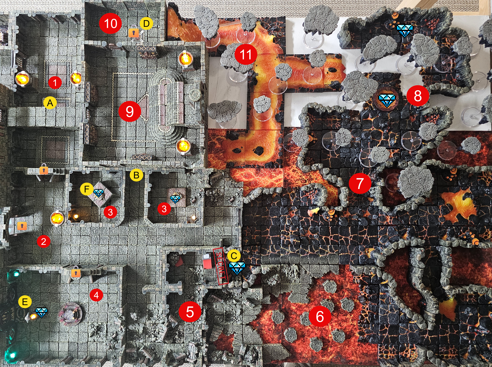

# Dungeon Ruins

## R1: The Great Hall

**Read Aloud (entering)**
> A long, wide hall runs ahead of you and ends at a pair of heavy double doors, shut. Bodies lie scattered down the length of the floor. A gate is set into the northwest wall. Those far doors do not look like they will open in a hurry.

This long wide hall ends at a large pair of double doors (locked). There is also a secret door to the treasure goblin (below area R10), and a gate along the north west wall. This room is covered is corpses (Zombies if trap has been triggered).

> Unlocking the Door and opening requires a full turn. So players will need to deal with Zombies until the door is open and safe. 

### Monsters
- Zombies x8-12
- Spread them out to give the players a path. 

**Read Aloud (when the dead rise)**
> The bodies on the floor start to move. They drag themselves up clumsy and slow, jaws working, and turn toward the nearest warm thing, which is you.

#### Zombie

*Medium Undead, Neutral Evil* | **AC** 8 | **HP** 15 (2d8 + 6) | **Speed** 20 ft.

| STR | DEX | CON | INT | WIS | CHA |
| --- | --- | --- | --- | --- | --- |
| 13 (+1) | 6 (-2) | 16 (+3) | 3 (-4) | 6 (-2) | 5 (-3) |

**Saving Throws** Wis +0 | **Damage Immunities** Poison | **Condition Immunities** Poisoned | **Senses** darkvision 60 ft., passive Perception 8 | **Languages** understands what it knew in life, cannot speak | **Challenge** 1/4 (50 XP) **PB** +2

***Undead Fortitude.*** If damage reduces it to 0 HP, it makes a CON save, DC 5 plus the damage taken, unless the damage is Radiant or a Critical Hit. On a success it drops to 1 HP instead.

***Slam.*** *Melee Attack Roll:* +3, reach 5 ft. *Hit:* 4 (1d6 + 1) Bludgeoning.

### TRAP
***Crazy Spray*** - when a player walks under the bridge (marker A) - The play is blasted with a sweet smelling gas (CON DC 15).. PASS: The player suddenly feels rage bubbling to the surface.. Pure hatred.. That player will attack the nearest living creature to them for 1rd. If they FAIL  the save - then they attack until rendered unconscious or dead.

**Read Aloud (when the gas hits)**
> A fine, sweet-smelling mist sprays down over you from under the bridge. It coats the back of your throat, and a hot, ugly anger comes up fast, fixed on whoever is standing closest.

## R2: The Eastern Hall

**Read Aloud (entering)**
> This hall runs east toward a wall of heat coming off the lava. More corpses shuffle and stagger around in here. One door is jammed tight in its frame, and two others stand open on the far side.

This hall also has several bodies/undead wondering around. The heat from the lava to the east is oppressive. There are several key locations in this area.

- The door to Area R4 is jammed shut and can't be opened from the outside. the only option to enter this area is to circle around and come through the hole in the wall. 

- The doors to Areas R3 are both unlocked.. However standing along the line from [B] will result in trap triggering. 

### Monsters
- Zombies x8 (stat block in R1)

### Trap

***Lightening Trap*** - When a player stand infront of [B] a 120' line of Lightening blasts out and down.. 
Damage 2d8+2 Lightening damage. DEX Save for 1/2 dmg. It can fire every 6-8 seconds. 

**Read Aloud (when the lightning fires)**
> A bolt of lightning cracks out of the wall in a straight line down the length of the hall and slams into the floor. The air goes sharp with the smell of burnt stone.

## R3: Treasure Rooms

**Read Aloud (entering)**
> Two small rooms, each with a pile of treasure heaped on top of a stone pedestal in the center. It is exactly the kind of thing you came down here hoping to find.

Both rooms have a pile of treasure sitting on top of pedestal. 

### Right Room: 
- Gold + Copper Crystal + Wonderous Item

### Left Foom:
- Gold + Wonderous Item

#### Trap
***Mouther surprise*** - When the treaure is removed from this stone, the pedestal vanishes realving the floor is a mimick. 

**Read Aloud (when the treasure is lifted)**
> The moment the treasure leaves the stone, the pedestal under it shudders and splits open into a wet, toothed mouth. A tongue of muscle whips out, wraps around the nearest of you, and hauls hard.
- It will lash out with a tentacle to pull a player into its mouths. STR17 to Resist Grapple. Once grappled pulled into mouths (DMG 2d8+6 /rd trapped.) Attacking the creature with a player trapped provides +2 AC to the creature.. 

> HP: 75
> AC: 14
> 2 attacks / tentacles. STR17 to Resist Grapple. Once grappled pulled into mouths (DMG 2d8+6 /rd trapped.) Attacking the creature with a player trapped provides +2 AC to the creature.. 

## R4: Crypts
**Read Aloud (entering)**
> This room is set up as a shrine. Carvings of snake-bodied people wind across the walls, and six lizardfolk are gathered here in worship, hissing low in Draconic. One near the front wears a shaman's rig and holds a focus.

This room is a shrine to serpent people. There are 6 Serpent people in this area worshipping.. One of them is a Shaman/Caster. 

### Monsters
- Shaman Lizardfolk
- 5 Lizardfolk Fighters

**Read Aloud (when they turn on you)**
> The chanting breaks off. Six lizardfolk come around to face you, hefting battleaxes and javelins, and the shaman starts a new chant with his free hand already moving.

#### Lizard Shaman

*Medium Humanoid (Lizardfolk), Neutral* | **AC** 15 (natural armor, shield) | **HP** 22 (4d8 + 4) | **Speed** 30 ft., swim 30 ft.

| STR | DEX | CON | INT | WIS | CHA |
| --- | --- | --- | --- | --- | --- |
| 15 (+2) | 10 (+0) | 13 (+1) | 7 (-2) | 16 (+3) | 7 (-2) |

**Skills** Perception +5, Stealth +4, Survival +7 | **Senses** passive Perception 15 | **Languages** Draconic | **Challenge** 1/2 (100 XP) **PB** +2

***Hold Breath.*** Can hold its breath for 15 minutes.

**Spellcasting.** Level 4 Druid, Wisdom based, spell save DC 13, +5 to hit with spell attacks.

- At will: *Druidcraft*; *Produce Flame* (30 ft spell attack +5, 2d8 fire, sheds light); *Thorn Whip* (30 ft spell attack +5, 2d6 piercing, pull a Large or smaller target 10 ft).
- 1st, 4 slots: *Cure Wounds* (touch, 2d8+3); *Entangle* (90 ft, 20 ft square, STR save DC 13 or Restrained, concentration); *Faerie Fire* (60 ft, 20 ft cube, DEX save DC 13 or outlined, concentration); *Thunderwave* (self 15 ft cube, CON save DC 13, 2d8 thunder and push 10 ft, half and no push on save).
- 2nd, 3 slots: *Lesser Restoration* (touch); *Spike Growth* (150 ft, 20 ft radius, no save, difficult terrain, 2d4 piercing per 5 ft moved, concentration).

***Bite.*** +4, reach 5 ft. *Hit:* 5 (1d6 + 2) Piercing.
***Battleaxe.*** +4, reach 5 ft. *Hit:* 6 (1d8 + 2) Slashing.

#### Lizardfolk Fighter

*Medium Humanoid (Lizardfolk), Neutral* | **AC** 16 (scale mail, shield) | **HP** 22 (4d8 + 4) | **Speed** 30 ft., swim 30 ft.

| STR | DEX | CON | INT | WIS | CHA |
| --- | --- | --- | --- | --- | --- |
| 15 (+2) | 10 (+0) | 13 (+1) | 7 (-2) | 12 (+1) | 7 (-2) |

**Skills** Perception +3, Stealth +4, Survival +5 | **Senses** passive Perception 13 | **Languages** Draconic | **Challenge** 1/2 (100 XP) **PB** +2

***Hold Breath.*** Can hold its breath for 15 minutes.

***Multiattack.*** Two melee attacks, each with a different weapon.

***Bite.*** +4, reach 5 ft. *Hit:* 5 (1d6 + 2) Piercing.
***Battleaxe.*** +4, reach 5 ft. *Hit:* 6 (1d8 + 2) Slashing.
***Javelin.*** +4, reach 5 ft or range 30/120 ft. *Hit:* 5 (1d6 + 2) Piercing.
***Spiked Shield.*** +4, reach 5 ft. *Hit:* 5 (1d6 + 2) Piercing.

#### Treasure
- On the shelves are several tomes.. One catches the players eye..  Vintage Craft.. 

> This contains the Cyrptex that contains the Black Crystal. 

## R5: Ruins

**Read Aloud (entering)**
> A stretch of collapsed ruins. A couple of lizardfolk are picking through the rubble, searching for something, and swatting away shambling corpses while they work.

This area has a couple Lizardfolk seaching the area for something.. They're fighting to keep the Zombies at bay.

### Monsters
- A couple Lizardfolk Fighters (stat block in R4)
- Zombies (stat block in R1)

> If players help Lizardfolk - they'll tell the players to be mindful of the Magma Elementals and the best way to deal with them is with Holy Water and Cold magic. 

#### Treasure
- There is a secret door in the old bed room that leads to a Chest.. The chest has Coin & Purple Crystal

> Hanging Guy's note tells players how to find the door to get his treasure. 

## R6: Hopscotch

**Read Aloud (entering)**
> The way forward is a field of stepping stones laid across a flow of lava. Some sit solid in the rock. Others float loose and ride low in the glow.

The stones allow the players to cross.the lava. Several of the Stones are floating and when jumped on - they tip over.. 

### TRAP

**Read Aloud (crossing the stones)**
> The stones cross the lava, close enough to jump from one to the next. Some sit solid. Others float loose on the surface and ride a little low in the glow.

***Slippery Stones***.. When the player lands on one of the marked stones they must roll a DEX save DC17 or be dumped into the lava causing 3d12+5 Fire damage per round they remain on the lava. 

### PUZZLE: The Hopscotch

**What the players see**

> A field of stepping stones laid across a lava flow. Some of them sit solid. Several others float, and they tip over the moment a character lands on them.

**Intended solution**

Cross by picking the stable stones and avoiding the marked, floating ones that tip. This is reflex and route-reading, not a coded answer. A character who lands on a marked stone makes the DEX save listed in the trap above.

**Clues and where they live**

- The room description tells the party plainly that several stones float and tip when jumped on. That is the warning to test footing before committing weight.

**Fail state**

A failed DEX save DC 17 drops the character into the lava for 3d12+5 fire damage per round they remain in it. This is lethal, so treat it with respect.

**Hint ladder**

1. "Some of these stones float. Watch which ones shift when weight hits them."
2. "A light touch or a thrown rope can test a stone before you trust it."
3. "The solid stones hold. The ones that rock are the ones that dump you."

> [!NOTE] GM NOTE
> The Hopscotch has no secret word. It is a crossing to survive, not a cipher to break. If a table asks about "the Puzzle Floor," they almost always mean the lettered Wizard's Floor over in D6-D, not this crossing.

## R7: Lava Tunnels

**Read Aloud (entering)**
> Tunnels of black rock cut through heat thick enough to press on your skin. Floating stones drift overhead, and the ceiling of the cavern climbs away into darkness hundreds of feet up. Somewhere down one of the passages, something made of fire and running rock is moving.

The Lava tunnels are patrolled by several different Fire Creatures. The players can see the floating drift stones above with the ceiling of the massive cavern vanishing in the darkness above them hundreds of feet away. 
- Lava/Magma Elementals

**Read Aloud (when it closes in)**
> One of the shapes in the heat pulls itself upright into a rough body of fire and molten stone. It throws hard orange light thirty feet in every direction, and the rock blackens under it as it comes at you.

#### Magma Elemental

*Large Elemental, Neutral* | **AC** 13 | **HP** 102 (12d10 + 36) | **Speed** 50 ft.

| STR | DEX | CON | INT | WIS | CHA |
| --- | --- | --- | --- | --- | --- |
| 10 (+0) | 17 (+3) | 16 (+3) | 6 (-2) | 10 (+0) | 7 (-2) |

**Damage Resistances** Bludgeoning, Piercing, Slashing from nonmagical attacks | **Damage Immunities** Fire, Poison | **Condition Immunities** Exhaustion, Grappled, Paralyzed, Petrified, Poisoned, Prone, Restrained, Unconscious | **Senses** darkvision 60 ft., passive Perception 10 | **Languages** Ignan | **Challenge** 5 (1,800 XP) **PB** +3

***Fire Form.*** Moves through gaps as narrow as 1 inch. A creature that touches it or hits it in melee within 5 ft takes 5 (1d10) Fire. It can enter a creature's space; the first time it does so on a turn the creature takes 5 (1d10) Fire and catches fire, taking 5 (1d10) Fire at the start of each of its turns until doused.

***Illumination.*** Bright light in 30 ft, dim for another 30 ft.

***Water Susceptibility.*** Takes 1 Cold for every 5 ft it moves in water or per gallon splashed on it.

***Multiattack.*** Two Touch attacks.
***Touch.*** +6, reach 5 ft. *Hit:* 10 (2d6 + 3) Fire, and the target ignites, taking 5 (1d10) Fire per turn until doused.

> [!NOTE] GM NOTE
> R5 Lizardfolk tell the party the counters are Holy Water and Cold magic, and Water Susceptibility backs that up. One of these at CR 5 is a hard fight for a level 3 party, so set R7 counts carefully.

> The Goblins will sometimes venture in this area for goods. But will remain hidden if possible.

## R8: Lava Temple

**Read Aloud (entering)**
> A wide pool of lava fills most of this chamber. On the north side a large statue of a demon looms over it, and one of its eyes is a deep red crystal. The fire creatures you have met elsewhere keep well clear of this place.

This area has a Large Lava Pool and a large Demon like statue to the north.. The Fire Elementals seem to keep a distance from this place. 

### Treasure
- The lava pit has an iron chest with a stash of powerful relics left by a mad runner before being killed by the lava elementals. 

- Eye of the statue => Red Cryrstal

### Monsters 
- Statue

**Read Aloud (when the statue moves)**
> The demon statue was never just a statue. Stone grinds on stone as it steps off its base, draws one huge arm back, and brings it down at you before most of you have grasped that it is alive.

#### BOSS: The Statue

*Large Construct, as the Eidolon's alignment*

**Armor Class** 19 (natural armor)
**Hit Points** 95 (10d10 + 40)
**Speed** 25 ft.

| STR | DEX | CON | INT | WIS | CHA |
| --- | --- | --- | --- | --- | --- |
| 19 (+4) | 8 (-1) | 19 (+4) | 14 (+2) | 19 (+4) | 16 (+3) |

**Saving Throws** Wis +8
**Damage Resistances** acid, fire, lightning; bludgeoning, piercing, and slashing from nonmagical attacks
**Damage Immunities** cold, necrotic, poison
**Condition Immunities** charmed, exhaustion, frightened, paralyzed, petrified, poisoned
**Senses** darkvision 60 ft., passive Perception 14
**Languages** the languages the Eidolon knew in life
**Challenge** 12 (8,400 XP) **Proficiency Bonus** +4

**Traits**

***False Appearance.*** If motionless at the start of combat, it has Advantage on initiative. A creature that has not seen it move must succeed on a DC 18 Intelligence (Investigation) check to tell it is not an object.

***Ghostly Inhabitant.*** The Eidolon remains inside the statue until the statue drops to 0 HP, until it leaves as a Bonus Action, or until it is forced out by an effect such as *dispel evil and good*. When it leaves, it appears within 5 ft.

***Inert.*** When not inhabited, the statue is an object.

***Unusual Nature.*** Needs no air, food, drink, or sleep.

**Actions**

***Multiattack.*** Two Slam attacks.

***Slam.*** *Melee Attack Roll:* +8, reach 10 ft. *Hit:* 43 (6d12 + 4) Bludgeoning.

**Tactics.** The Statue ambushes. It stands dead still in the Lava Temple beside the Red Crystal in the demon statue's eye, wins initiative off False Appearance, and lands the first two Slams before the party knows it is a fight. Each Slam averages 43 bludgeoning, which one-shots any level 3 character to 0 and past it. It fights in melee only, with 10 ft reach, and it shrugs off nonmagical weapons, cold, fire, lightning, acid, necrotic, and poison. The party needs magic weapons or force, radiant, psychic, and thunder damage to hurt it. Position it so the lava and the narrow temple floor force the party to approach in the open. Run it solo. 95 HP falls in two or three rounds to a large party, so the danger is front-loaded into the ambush and the 43-damage Slams. An opening double Slam on two separate characters is a two-kill round. Telegraph it with the lava, the mad runner's bones, and the dead looter's iron chest.

## R9: Upper Landing

**Read Aloud (entering)**
> A raised landing guards the door into the treasure room. Four lizardfolk stand posted across it, weapons already up. They are not going to step aside.

This room has 4 Lizard Folks stand guard over the entrance to the treasure room. They'll fight to the death. They have the key to the Treasure Room on them. 

### Monsters
- 4x Lizardfolk (stat block in R4)

## R10: Treasure Room
Treasure Room -- Has access to the Treasure Goblin below. A secret door in this room drops to the Treasure Goblin's cave, the main vendor stall for the whole dungeon. The C3 hatch in `rooms/TheCaverns.md` is the other way down to him.

### The Treasure Goblin (Feces)

**Read Aloud (meeting Feces)**
> The way down opens into a low cave lit by scavenged lanterns, packed with a plank counter and a stall of junk and treasure. Behind it sits a round, grinning goblin in a coat too fine for him. He spreads his hands like you are old friends and says, "Buyers. Come in, come in. Touch nothing you cannot pay for."

The Treasure Goblin is named Feces. He is the one merchant in the Vault.

- Feces carries a random assortment of goods to sell. Once the party leaves, his stock is shuffled back into the deck and redrawn randomly the next time they come down.
- Killing Feces gets that player expelled from the game, that is, killed and out. Feces warns players of this consequence if they try or ask.
- Feces will not tell players how to escape, but he will sell "tips" on how to survive or find things for the right price, at GM discretion.
- A player carrying the Gold lesser crystal (Barter Specialist) gets a discount of 5 percent times Charisma modifier, minimum 5 percent, maximum 25 percent, on that player's own purchase (`rooms/TheCaverns.md`).

### How prize Item Cards work

Every real-world prize is a prize Item Card. A player claims a real-world prize one of two ways:

1. Find the card in the dungeon as physical loot placed in a room, chest, or on a monster.
2. Buy the card from Feces with in-dungeon gold at the listed price.

No prize is ever tied to a crystal. Crystals are exit and door props only. Prize cards left on a dead body follow the death-out loot rule: they stay on the body for survivors to recover.

The GP price on a card is the rounded USD price times 100. Example: $7.59 rounds to $8, times 100 equals 800 GP. The token files under `items/tokens/` carry the authoritative GP numbers.

### Prize list

| Qty | Prize Item Card | USD | GP (token value) |
| ---: | --- | ---: | ---: |
| 1 | 4pcs Fantasy Sword Bookmarks | $7.59 | 800 |
| 1 | TeeTurtle D&D Reversible Plushie Mystery Box | $7.99 | 800 |
| 1 | Stupid D&D Jokes | $9.99 | 1000 |
| 2 | HiiFeuer Medieval Faux Leather Pouch | $11.90 | 1200 |
| 1 | Haxtec Dragon Eye Dice Bag | $11.99 | 1200 |
| 3 | LongLongJin DND Dragon Journal with Pen | $12.34 | 1250 |
| 2 | The Book of Holding | $12.49 | 1250 |
| 1 | Duck DND Resin Dice Set | $12.99 | 1300 |
| 1 | The Game Master's Book of Astonishing Random Tables | $14.95 | 1500 |
| 1 | Banloga D&D Metal Dice Set with Pocket Watch Case | $14.99 | 1500 |
| 1 | The Young Adventurer's Collection Box Set 1 | $20.64 | 2100 |
| 1 | Beholder Potato Head Figure | $34.95 | 3500 |
| 1 | SWeien Hollow Metal DND Dice Set | $34.99 | 3500 |
| 2 | Wooden DnD Dice Tray and Journal Box | $49.99 | 5000 |
| 1 | Dungeons & Dragons 2024 Core Rulebook Set + GM Screen | $154.95 | 15500 |

The top prize is the Dungeons & Dragons 2024 Core Rulebook Set and GM Screen, GP value 15500. The dungeon's total coin pool is about 2,845 gp, far below 15500 GP, so the party cannot buy the top prize from Feces with dungeon coin. That strongly implies the top prize is a found card rather than vendor stock.

## R11: Drift Stones

**Read Aloud (entering)**
> Stones hang in the air over a long drop into the lava, and the whole span crackles with visible wild magic. Out past them, a cage hangs over the gap with a body slumped inside it.

The Drift Stones were created by Powerful Wild Magic Fields and are by there very nature unpredictable. 

**Read Aloud (when a stone takes your weight)**
> The stone holds, and then the wild magic answers it. The air warps around you, and there is no telling where you will be standing until it lets go.

Chaotic energy surges in this area.. When ever a person jumps on a stone.. Roll 1d8 + 1d4

1. Nothing Happens
2. Drift stone moves # on d4 (d8 direction)
3. Swap Spaces w/ nearest player character (only on 1 on d4)
4. Swap stones with previous one jumped from (only 2 on d4)
5. Vanish and Fall (only if 3 on d4)
6. Swap places w/ furthest player character (only on 4 on d4)
7. Player character is moved to a random stone (assign stones numbers 1-4 based on closest to furthest and use value on d4)
8. Nothing happens

### PUZZLE: Crossing the Drift Stones

**What the players see**

> Stones float in the air over a long drop into the lava, and the whole span crackles with visible wild magic. Out past them, a cage hangs over the gap with a body inside it. His letter and his map are what waits for anyone who can reach him.

**Intended solution**

Cross the stones. Each time a character jumps onto a stone, the wild magic field fires a random effect from the table above. Roll 1d8 and 1d4 and read the result. There is no right answer to the field, only the dice and good positioning.

**Clues and where they live**

- The Prisoner's Letter (`props/prisoners-letter.md`), written by Corwin Vale, tells the party he is caged out over the gap, warns them not to split up and not to trust the voice, and hands them his map.
- This room's description establishes that the field is wild magic and unpredictable by nature.

**Fail state**

The chaos itself. Characters can be swapped, flung to a random stone, or dropped when a stone vanishes out from under them into the lava below. Nothing locks the party out. The danger is the dice, and the toll is movement, position, and sometimes a life.

**Hint ladder**

1. "Every jump rolls the dice. Standing still on a solid stone does not."
2. "Spreading your jumpers out means fewer characters are in reach of a swap."
3. "If someone can shut this wild magic off, the crossing becomes a simple jump."

> [!NOTE] GM NOTE
> The random-effect table above and the prisoner reward are canon. The wild magic field stays active for the whole crossing. Treat it as always on, or rule on the spot if a player proposes something clever such as an Abjuration effect or the White Crystal's ward to suppress it.
