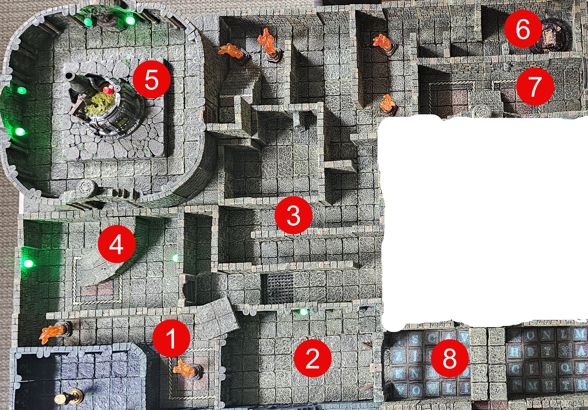

# Dungeons of Fun

## Room 1 "The Rear Hall" 

Takes players to Alchemists Lab [5] and the Gauntlet [3]. I need an idea of what can be in this room? 

## Room 2 "Antechamber" 

This room needs to have some clue to help players answer the clue to the Wizards Floor puzzle in Room [8]

## Room 3 "The Gauntlet" 

The is long maze like hall way is full of traps. The Treasure at the end of the Gauntlet [6] is also a trap.. 

- Spike Floor Trap
- Flame Trap
- Poison Dart Trap
- Swinging Blade Trap
- Asshole Trap - this trap has an obvious trap on the floor, tempting the players to jump over it.. When they do, they trigger the actual trap. In this case, there is a floor pit - when jumped over triggers the floor behind the the player to tilt down sliding anyone behind into the floor pit.. **:Nobody said this was going to be fair:**

## Room 4 "Alchemical Hall" 

- Stairs that go up to the Alchemists Lab. 

## Room 5 "Alchemists Lab" 

- Trap and Treasure here, and another Monster - a mutated creature that crawls out of the large vat. 

## Room 6 "The Treasure" 

- Treasure
- Trap - when some steps up to take the treasure, a large cage crashes down on them. When that happens, a secret door opens revealing access to Room [7]. 

## Room 7 "Stairs to Medusa"

Door is locked and requires the Medusa Key or Knock Spell. Can't be picked. 

## Room 8 "Wizards Puzzle" 

Puzzle/Trap.

Need to figure out what happens when a player lands on the wrong tile/letter!

