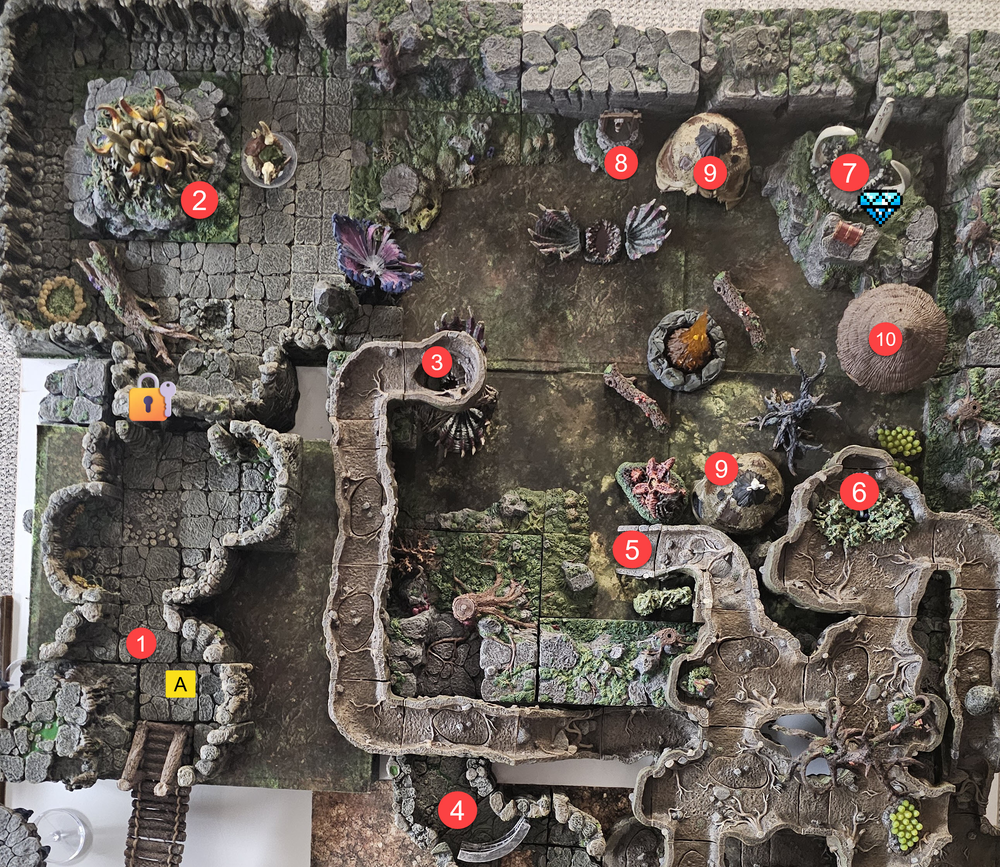

# Goblin Camp

## Area 1: The Snipers Nest

**Read Aloud (from the bridge)**
> Up on a rocky perch overlooking the bridge, two goblins are dug in behind cover with long muskets, already picking their shots at you as you cross.

This areay has 2 Goblin Snipers that take shots at players as the cross the Bridge.. 

### Monsters

The snipers carry magic Long Muskets. Use the Goblin Artificer's Scoped Musket profile.

#### Goblin Sniper (Goblin Artificer profile)

*Small Fey (Goblinoid), Chaotic Neutral* | **AC** 13 (leather armor) | **HP** 10 (3d6) | **Speed** 30 ft.

| STR | DEX | CON | INT | WIS | CHA |
| --- | --- | --- | --- | --- | --- |
| 8 (-1) | 15 (+2) | 10 (+0) | 10 (+0) | 8 (-1) | 8 (-1) |

**Skills** Stealth +6 | **Senses** darkvision 60 ft., passive Perception 9 | **Languages** Common, Goblin | **Challenge** 1/4 (50 XP) **PB** +2

***Scoped Musket.*** +5, range 40/120 ft. *Hit:* 9 (1d12 + 3) Piercing. This magic musket adds +1 to attack and damage, and its scope ignores long-range Disadvantage.
***Pistol.*** +4, range 30/90 ft. *Hit:* 7 (1d10 + 2) Piercing, plus 2 (1d4) with Advantage.
***Dagger.*** +4, reach 5 ft or range 20/60 ft. *Hit:* 4 (1d4 + 2) Piercing, plus 2 (1d4) with Advantage.
***Nimble Escape (Bonus Action).*** Takes Disengage or Hide.

## Area 2: Bertha

**Read Aloud (entering)**
> A huge, bloated plant squats here, its body swelling and sinking like it is breathing. Each time it heaves, it vents a cloud of thick, sickly fumes into the air.

Large Plant that spews deadly fumes.. 

## Area 3: Death Trap 

**Read Aloud (entering)**
> A wide, fleshy plant sits open on the ground like a trap waiting to spring. The dirt around it is littered with old bones, broken weapons, and scattered coin.

Man Eating Plant. Once something living (or recently living) drops down it will instantly clamp shut and start digesting the creature.. A savvy player can use a Goblin Corpse to bypass.. Should they kill this plant, inside are several weapons, armor, and coin from previous victims.. 

**Read Aloud (when it clamps)**
> The plant slams shut the instant something living drops into it, folding over and beginning to digest whatever it caught.

## Area 4: Main Entrance

**Read Aloud (entering)**
> This is the main way into the goblin camp, a gate flanked by a pair of goblin guards with glaives. They lower their points the moment they catch sight of you.

This is the main entrance to the Goblins Grotto and is guarded by a pair of Feywild Goblin Guards. 

#### Feywild Guard

*Small Fey (Goblinoid), Chaotic Neutral* | **AC** 13 (padded armor) | **HP** 10 (3d6) | **Speed** 30 ft.

| STR | DEX | CON | INT | WIS | CHA |
| --- | --- | --- | --- | --- | --- |
| 8 (-1) | 15 (+2) | 10 (+0) | 10 (+0) | 8 (-1) | 8 (-1) |

**Skills** Stealth +6 | **Senses** darkvision 60 ft., passive Perception 9 | **Languages** Common, Goblin | **Challenge** 1/4 (50 XP) **PB** +2

***Glaive.*** +1, reach 10 ft. *Hit:* 4 (1d10 - 1) Slashing, plus 2 (1d4) if the attack had Advantage.
***Dagger.*** +4, reach 5 ft or range 20/60 ft. *Hit:* 4 (1d4 + 2) Piercing, plus 2 (1d4) if the attack had Advantage.
***Nimble Escape (Bonus Action).*** Takes Disengage or Hide.

## Area 5: Entrance from Goblin Tunnels

**Read Aloud (reaching it)**
> The tunnel lets out into the camp here, and the opening is thick with goblins standing watch.

This is the exit to the Goblin Camp.. It is well guarded!

## Area 6: plant Monster.. 

**Read Aloud (when the plant strikes)**
> Four thick vines lash out of the growth, grabbing for anyone in reach and dragging them in to crush like a snake.

Any player that walks with in 5' of this plant will be attacked. He has 4 tentacals in which to grapple a player (STR DC 13) or be grappled. The plant will start sqaushing the players like an anaconda dealing 1d6 dmg per round they're grappled.

## Area 7: Druid Circle

**Read Aloud (entering)**
> A ring of standing stones and heavy overgrowth marks a druid circle, with an altar at its heart and a treasure chest set beside it. The whole circle hums with a green, growing power.

This is where Hob Gob would be standing providing him a little extra in his spell casting against the players.. There is a treasure chest near the alter that contains the Yellow Crystal.. 

**Read Aloud (Hob Gob)**
> At the center of the druid circle stands Hob Gob, the Goblin King. He is built like the goblins you have already fought, but bigger and heavier through the chest, with a hooked cleaver in one hand and a druid's focus in the other. The overgrowth around the circle leans in toward him. He watches you come and shows you his teeth.

#### BOSS: Hob Gob, the Goblin King

*Medium Humanoid (Goblinoid), Lawful Evil*

**Armor Class** 18 (natural armor)
**Hit Points** 178 (21d8 + 84)
**Speed** 30 ft.

| STR | DEX | CON | INT | WIS | CHA |
| --- | --- | --- | --- | --- | --- |
| 18 (+4) | 14 (+2) | 18 (+4) | 13 (+1) | 12 (+1) | 16 (+3) |

**Saving Throws** Str +7, Con +7, Wis +4, Cha +6
**Skills** Athletics +7, Intimidation +6, Perception +4, Stealth +5
**Condition Immunities** frightened
**Senses** darkvision 60 ft., passive Perception 14
**Languages** Common, Goblin
**Challenge** 8 (3,900 XP) **Proficiency Bonus** +3

**Traits**

***Magic Resistance.*** Advantage on saving throws against spells and other magical effects.

***Regeneration.*** Regains 10 Hit Points at the start of each of his turns if he has at least 1 Hit Point. If he takes Acid or Fire damage, this does not function at the start of his next turn. He dies only if he starts his turn with 0 Hit Points and does not regenerate.

**Spellcasting.** Level 5 Druid, Wisdom based, spell save DC 12, +4 to hit with spell attacks.

- At will: *Druidcraft* (30 ft; tiny harmless sensory effect; no save). *Produce Flame* (30 ft ranged spell attack +4; 2d8 fire; also sheds light; no concentration). *Thorn Whip* (30 ft melee spell attack +4; 2d6 piercing, pull a Large or smaller target 10 ft).
- 1st level, 4 slots: *Cure Wounds* (touch; regain 2d8+1). *Entangle* (90 ft, 20 ft square; STR save DC 12 or Restrained; difficult terrain; concentration 1 min). *Faerie Fire* (60 ft, 20 ft cube; DEX save DC 12 or outlined, attackers gain Advantage; concentration 1 min). *Thunderwave* (self 15 ft cube; CON save DC 12; 2d8 thunder and pushed 10 ft, half and no push on save).
- 2nd level, 3 slots: *Lesser Restoration* (touch; ends Blinded, Deafened, Paralyzed, or Poisoned). *Moonbeam* (120 ft, 5 ft radius; CON save DC 12; 2d10 radiant on entering or starting there, half on save; concentration 1 min). *Spike Growth* (150 ft, 20 ft radius; no save; difficult terrain, 2d4 piercing per 5 ft moved; concentration 10 min).
- 3rd level, 2 slots: *Call Lightning* (120 ft; DEX save DC 12; 3d10 lightning in a 5 ft radius, half on save, repeatable each turn; concentration 10 min). *Plant Growth* (150 ft, 100 ft radius; no save; movement costs 4 ft per 1 ft).

**Actions**

***Multiattack.*** Hob Gob makes three attacks: one Jagged Bite and two Hooked Cleaver.

***Jagged Bite.*** *Melee Attack Roll:* +7, reach 5 ft. *Hit:* 11 (2d6 + 4) Piercing.

***Hooked Cleaver.*** *Melee Attack Roll:* +7, reach 5 ft. *Hit:* 7 (1d6 + 4) Slashing.

**Tactics.** Hob Gob opens from the Druid Circle, where the terrain gives him cover and his warband is already in position. He should open with Spike Growth or Plant Growth across the approach to wreck the party's movement, then sit in Call Lightning and keep re-aiming the bolt every turn while the goblins screen him. He uses Cure Wounds and Lesser Restoration on himself and key minions. His Regeneration means chip damage is wasted, so the party needs to burst him or bring Acid or Fire to shut the regeneration off for a round. Magic Resistance makes save-or-suck spells unreliable against him. Do not run him alone. Field him with the full camp warband so the party has to clear minions while the regeneration ticks. A cluster of characters standing in Call Lightning plus Moonbeam can see two or three of them dropped in a round.

### Treasure
- Yellow Crystal
- Stuff Hob Gob has on him like Druid Focus
- Other magical items and gear. 

## Area 8: Well

**Read Aloud (at the well)**
> A plain stone well sits here, and the water in it is clear and clean. It is the first clean thing you have seen in this whole place.

This is just a simple well with clean water.. Something pretty rare in this place.. Drinking from this well allows the players to gain 2d4+2 Temp HP. 

## Area 9: Huts

**Read Aloud (entering)**
> A cluster of rough goblin huts. This is where the goblins sleep, and you can hear children hidden somewhere inside, kept quiet while the fighting goes on.

This is where the Goblins sleep and where their children are hiding during the fight.. 

### Monsters: The Camp Warband

The camp defenders muster here and deploy across Areas 4, 5, 7, and 9. Roster: Feywild Guard x3 (stat block in Area 4), Goblin Warrior x15, Caster Goblin x1, Bombardier Goblin x1, Goblin Artificer x1 (stat block in Area 1), Shaman Goblin x1, Goblin Dog x2, plus Flying Goblins. Area assignment is GM discretion.

**Read Aloud (when the warband musters)**
> Horns go up across the camp, and goblins pour out of the huts and off the walls, far more of them than you were hoping for. They form up with blades, bows, and bombs, a shaman barking orders from the back.

#### Goblin Warrior

*Small Fey (Goblinoid), Chaotic Neutral* | **AC** 15 (leather armor, shield) | **HP** 10 (3d6) | **Speed** 30 ft.

| STR | DEX | CON | INT | WIS | CHA |
| --- | --- | --- | --- | --- | --- |
| 8 (-1) | 15 (+2) | 10 (+0) | 10 (+0) | 8 (-1) | 8 (-1) |

**Skills** Stealth +6 | **Senses** darkvision 60 ft., passive Perception 9 | **Languages** Common, Goblin | **Challenge** 1/4 (50 XP) **PB** +2

***Scimitar.*** +4, reach 5 ft. *Hit:* 5 (1d6 + 2) Slashing, plus 2 (1d4) if the attack had Advantage.
***Shortbow.*** +4, range 80/320 ft. *Hit:* 5 (1d6 + 2) Piercing, plus 2 (1d4) if the attack had Advantage.
***Nimble Escape (Bonus Action).*** Takes Disengage or Hide.

#### Caster Goblin

*Small Fey (Goblinoid), Chaotic Neutral* | **AC** 15 (leather armor, shield) | **HP** 10 (3d6) | **Speed** 30 ft.

| STR | DEX | CON | INT | WIS | CHA |
| --- | --- | --- | --- | --- | --- |
| 8 (-1) | 15 (+2) | 10 (+0) | 10 (+0) | 8 (-1) | 14 (+2) |

**Skills** Stealth +6 | **Senses** darkvision 60 ft., passive Perception 9 | **Languages** Common, Goblin | **Challenge** 1/4 (50 XP) **PB** +2

**Spellcasting.** Level 3 Sorcerer, Charisma based, spell save DC 12, +4 to hit. 4 first-level and 2 second-level slots.

- At will: *Fire Bolt* (120 ft spell attack +4, 1d10 fire); *Ray of Frost* (60 ft spell attack +4, 1d8 cold, Speed -10 ft); *Minor Illusion*; *Prestidigitation*.
- 1st, 4 slots: *Magic Missile* (120 ft, three darts 1d4+1 force each, no save); *Shield* (reaction, +5 AC, blocks Magic Missile); *Thunderwave* (self 15 ft cube, CON save DC 12, 2d8 thunder and push 10 ft, half and no push on save).
- 2nd, 2 slots: *Scorching Ray* (120 ft, three spell attacks +4, 2d6 fire each); *Misty Step* (teleport 30 ft); *Invisibility* (touch, concentration 1 hr).

***Quarterstaff.*** +1, reach 5 ft. *Hit:* 2 (1d6 - 1) or 3 (1d8 - 1) two-handed Bludgeoning.
***Scimitar.*** +4, reach 5 ft. *Hit:* 5 (1d6 + 2) Slashing, plus 2 (1d4) with Advantage.
***Nimble Escape (Bonus Action).*** Takes Disengage or Hide.

#### Bombardier Goblin

*Small Fey (Goblinoid), Chaotic Neutral* | **AC** 18 (plate armor) | **HP** 21 (6d6) | **Speed** 20 ft.

| STR | DEX | CON | INT | WIS | CHA |
| --- | --- | --- | --- | --- | --- |
| 10 (+0) | 15 (+2) | 10 (+0) | 10 (+0) | 8 (-1) | 10 (+0) |

**Skills** Stealth +6 | **Senses** darkvision 60 ft., passive Perception 9 | **Languages** Common, Goblin | **Challenge** 1 (200 XP) **PB** +2

***Multiattack.*** Two Shortsword attacks.
***Gob Stopper (10).*** Thrown up to 30 ft, explodes on impact. DEX save DC 13. Within 10 ft, 7 (2d6) Fire on a fail. Over 10 ft but within 15 ft, 3 (1d6) Fire on a fail. Half on a success.
***Shortsword.*** +4, reach 5 ft. *Hit:* 5 (1d6 + 2) Piercing, plus 2 (1d4) with Advantage.
***Dagger.*** +4, reach 5 ft or range 20/60 ft. *Hit:* 4 (1d4 + 2) Piercing, plus 2 (1d4) with Advantage.
***Nimble Escape (Bonus Action).*** Takes Disengage or Hide.
***Redirect Attack (Reaction).*** When targeted by an attack, swaps places with a goblin within 5 ft; that goblin becomes the target instead.

#### Shaman Goblin / Medicine Man (Healer)

*Small Fey (Goblinoid), Chaotic Neutral* | **AC** 15 (leather armor, shield) | **HP** 10 (3d6) | **Speed** 30 ft.

| STR | DEX | CON | INT | WIS | CHA |
| --- | --- | --- | --- | --- | --- |
| 8 (-1) | 15 (+2) | 10 (+0) | 10 (+0) | 14 (+2) | 8 (-1) |

**Skills** Stealth +6 | **Senses** darkvision 60 ft., passive Perception 12 | **Languages** Common, Goblin | **Challenge** 1/4 (50 XP) **PB** +2

**Spellcasting.** Level 2 Cleric, Wisdom based, spell save DC 12, +4 to hit. 3 first-level slots.

- At will: *Sacred Flame* (60 ft, DEX save DC 12, 1d8 radiant, ignores cover); *Guidance* (touch, +1d4 to one skill, concentration); *Thaumaturgy*.
- 1st, 3 slots: *Cure Wounds* (touch, 2d8+2); *Bless* (30 ft, up to three allies add 1d4 to attacks and saves, concentration); *Healing Word* (60 ft, 2d4+2); *Sanctuary* (30 ft, WIS save DC 12 or attacker must retarget, ends if the ward attacks).

***Scimitar.*** +4, reach 5 ft. *Hit:* 5 (1d6 + 2) Slashing, plus 2 (1d4) with Advantage.
***Shortbow.*** +4, range 80/320 ft. *Hit:* 5 (1d6 + 2) Piercing, plus 2 (1d4) with Advantage.
***Nimble Escape (Bonus Action).*** Takes Disengage or Hide.

#### Flying Goblin

*Small Fey (Goblinoid), Chaotic Neutral* | **AC** 13 (leather armor) | **HP** 10 (3d6) | **Speed** 30 ft., fly 30 ft. (glider)

| STR | DEX | CON | INT | WIS | CHA |
| --- | --- | --- | --- | --- | --- |
| 8 (-1) | 15 (+2) | 10 (+0) | 10 (+0) | 8 (-1) | 8 (-1) |

**Skills** Stealth +6 | **Senses** darkvision 60 ft., passive Perception 9 | **Languages** Common, Goblin | **Challenge** 1/4 (50 XP) **PB** +2

***Gob Stopper (1).*** Thrown up to 30 ft, explodes on impact. DEX save DC 13. Within 10 ft, 7 (2d6) Fire on a fail. Over 10 ft but within 15 ft, 3 (1d6) Fire on a fail. Half on a success.
***Shortbow.*** +4, range 80/320 ft. *Hit:* 5 (1d6 + 2) Piercing, plus 2 (1d4) with Advantage.
***Dagger.*** +4, reach 5 ft or range 20/60 ft. *Hit:* 4 (1d4 + 2) Piercing, plus 2 (1d4) with Advantage.
***Net.*** +4, range 5/15 ft., one Large or smaller creature. *Hit:* Restrained. DC 10 Strength action to free, or 5 Slashing to the net (AC 10).
***Nimble Escape (Bonus Action).*** Takes Disengage or Hide.

#### Goblin Dog

*Medium Beast, Unaligned* | **AC** 12 | **HP** 5 (1d8 + 1) | **Speed** 40 ft.

| STR | DEX | CON | INT | WIS | CHA |
| --- | --- | --- | --- | --- | --- |
| 13 (+1) | 14 (+2) | 12 (+1) | 3 (-4) | 12 (+1) | 7 (-2) |

**Skills** Perception +3 | **Senses** passive Perception 13 | **Languages** None | **Challenge** 1/8 (25 XP) **PB** +2

***Keen Hearing and Smell.*** Advantage on Perception relying on hearing or smell.
***Bite.*** +3, reach 5 ft. *Hit:* 4 (1d6 + 1) Piercing. On a hit against a creature, STR save DC 11 or Prone.

## Area 10: Hob Gobs Hut.. 

**Read Aloud (entering)**
> The Goblin King's own hut, bigger than the rest and stuffed with the pick of his loot. Coin, scrolls, and old magic are piled in the corners.

There is treasure in this room.. Gold and such as well as scrolls/magic tomes, etc. 
