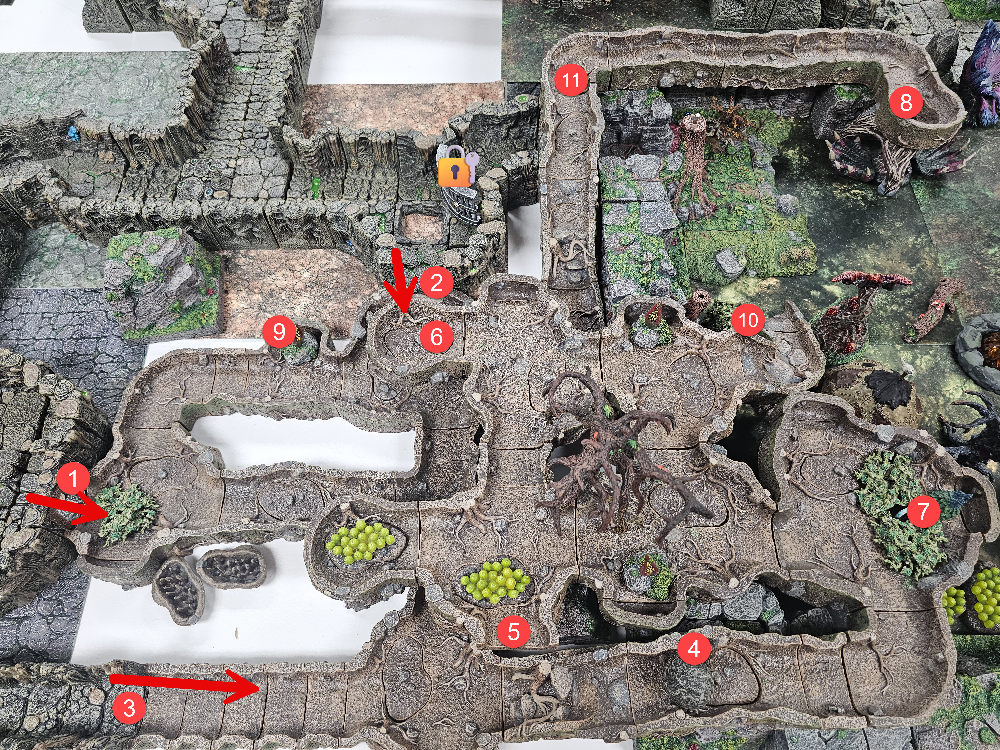

# Goblin Tunnels

> [!NOTE] GM NOTE
> The goblin tunnels are tight, about 4 ft tall and 3 ft wide, dug straight out of the earth. Larger characters crawl or hunch to fit, movement is constrained, and big two-handed weapons like greatswords and greataxes are useless in here. Nobody can squeeze past anyone else in the tunnels.

> [!NOTE] GM NOTE
> The murder holes let the goblins hit and run. At your discretion a murder hole can also hide a pit trap, 1d8+1 Piercing damage, which then becomes difficult terrain to cross.

## Area 1: Entrance 1

**Read Aloud (entering)**
> The tunnel mouth is a cramped hole barely four feet high, dug straight out of the dirt. You have to hunch or crawl to get through, and there is no room to swing anything large.

This entrance his protected by a Trap..

### Trap

**Read Aloud (when the blade drops)**
> A heavy blade drops out of a slot above the entrance and swings down at the first head through it. All through the tunnels, an alarm starts clanging.

- The entrance to the Goblin Tunnels is trapped. First person that steps through will need to make a DEX Save DC 15 As a large blade drops from above on their head (2d6+2) - save for half damage. This will also trigger an alarm through out the tunnels.
  - Investigation DC15 to locate the trap.
  - Sleight of Hands DC15 to disable the trap (DC17 to disable )without setting the alarm off.

## Area 2: Entrance 2

**Read Aloud (entering)**
> Another low, dirt-walled crawl, the ceiling close enough to scrape your back.

- This area is watched closely from above.. As the players pass into this area. A Goblin will open a hidding section of cieling above them and drop 1 or 2 Gob Stoppers on the party before shutting the entrance above again. DC 18 Perception check to spot the Hidden murder hole.

**Read Aloud (when the hatch opens)**
> A section of the dirt ceiling swings open above you. A goblin leans through, drops a pair of hissing clay bombs into your midst, and slams the hatch shut again.

### Monsters

The tunnels are held by generic Goblins. The murder-hole droppers here and in Areas 5 and 6 use the Goblin Warrior below plus thrown Gob Stoppers.

#### Goblin Warrior

*Small Fey (Goblinoid), Chaotic Neutral* | **AC** 15 (leather armor, shield) | **HP** 10 (3d6) | **Speed** 30 ft.

| STR | DEX | CON | INT | WIS | CHA |
| --- | --- | --- | --- | --- | --- |
| 8 (-1) | 15 (+2) | 10 (+0) | 10 (+0) | 8 (-1) | 8 (-1) |

**Skills** Stealth +6 | **Senses** darkvision 60 ft., passive Perception 9 | **Languages** Common, Goblin | **Challenge** 1/4 (50 XP) **PB** +2

***Scimitar.*** +4, reach 5 ft. *Hit:* 5 (1d6 + 2) Slashing, plus 2 (1d4) if the attack had Advantage.
***Shortbow.*** +4, range 80/320 ft. *Hit:* 5 (1d6 + 2) Piercing, plus 2 (1d4) if the attack had Advantage.
***Gob Stopper (thrown).*** Thrown up to 30 ft, explodes on impact. DEX save DC 13. Within 10 ft, 7 (2d6) Fire on a fail. Over 10 ft but within 15 ft, 3 (1d6) Fire on a fail. Half on a success.
***Nimble Escape (Bonus Action).*** Takes Disengage or Hide.

### Trap:

**Read Aloud (when the floor drops)**
> The floor gives out and drops you about twenty feet into a pit. You land in a foot of reeking goblin oil pooled at the bottom.

- There is a special murder hole just inside Entrance 2.. This is a pit trap. Inside this pit trap (20' Fall) is filled with a bout 1' of Goblin Juice... Use your imagination..

## Area 3: Entrance 3

**Read Aloud (entering)**
> This is the far end of the long slime tunnel that runs back toward the slime pit. The floor and walls are slick with an oily liquid, and your footing slides with every step.

- This area is part of the Long tunnel that leads to the slime area (C-11)..

This long dark tunnel opens at the Slime Pit (C-7) and vanishes into somewhere around 120'. The tunnels walls and floor are coated in a slippery liquid substance. Because of this substance the ground is treated as difficult terrain (1/2 movement).. If you attempt to move at normal speed you must make a DEX Save DC15 or slip (prone)..

### Traps

**Read Aloud (when the oil ignites)**
> The oily film on the walls catches all at once, and fire tears the whole length of the tunnel. The air itself seems to burn around you.

- The slime substance is Goblin Juice. If it comes into contact with an open flame it catches fire burning the entire length of the tunnel.. Anyone in the tunne takes 2d6 fire damage and is now on Fire requiring them to take a full action to put themselves out or take 1d6 fire damage per round. Give players chance to identify the substance | Medicine (Alchemy) Check DC15.. Advantage if you are proficient.

**Read Aloud (when the boulder comes)**
> Stone grinds on stone far up the tunnel, and then a boulder as wide as the passage rolls into view and bears down on you, gathering speed.

- Boulder Trap: The players will hear the sound of stone grinding on stone from far up in the tunnel.. As a large boulder comes fliying down the tunnel at them.. It will trigger when players are at the entrance of the Goblin Tunnels (3)

  - If the goblin juice still coats the walls the boulder is slowly getting coated with it and it acts as a lubricant - allowing the bolder to move at 40' per rd..
  - If the goblin juice has burned away - then the movement is only 30' per round.
  - It does 4d4+4 bludgeoning damage - DEX DC18 Save for half damage.

## Area 4: Let the Good Times Roll

**Read Aloud (entering)**
> The tunnel climbs a steep slope here. The dirt of the incline is scored and gouged, and a murder hole is punched into the wall above it.

There is a long incline leading up, double movement.. This is where the Goblins are rolling the large stones from.. They only have two of these.. Did they use both? There is also a murder hole here for additional fun and quick escapes by the Goblins tossing boulders.

### Trap

**Read Aloud (when the boulder comes)**
> Stone grinds above you, and another boulder tips onto the incline and comes rolling straight down the slope at you.

- Boulder Trap: The players will hear the sound of stone grinding on stone from far up in the tunnel.. As a large boulder comes fliying down the tunnel at them.. It will trigger when players are at the entrance of the Goblin Tunnels (3)
  - It does 4d4+4 bludgeoning damage - DEX DC18 Save for half damage.

## Area 5: Bob-Bomb..

**Read Aloud (entering)**
> The tunnel opens into a wider space with a large tree growing straight up through the dirt. A goblin is perched above the incline, lobbing clay bombs down at anyone trying to climb.

This area has a single Goblin that drops Gob Stoppers down on players from above as they try to get up the incline at area 4. He has partial coverage (+2 AC) to ranged attacks and cant be reached without a reach weapon (10').. Players can climb up and enter the upper areas of the Goblin Tunnels through this path. There is also a large Tree growing through this larger area..

> Perception DC12 - Small pouch hidden in a nook in the tree contains a small bag with some coin and Necrotic Crystal! 

## Area 6: Murder Hole/Hidden Entrance

**Read Aloud (entering)**
> A low passage with a murder hole cut into the ceiling. A goblin crouches up there, dropping clay bombs on anyone who passes beneath him.

This area has a single Goblin that drops Gob Stoppers down on players from above as they pass below.. He has partial coverage (+2 AC) to ranged attacks and cant be reached without a reach weapon (10').. Players can climb up and enter the upper areas of the Goblin Tunnels through this path.

## Area 7: Feed me Seymor

**Read Aloud (entering)**
> This stretch is thick with ferns and moss growing up out of the dirt. It looks overgrown and harmless.

This area has a nasty surprise for the players.. One of the many man eating plants that the Goblins cultivated of the years. This one is hiddent under a bunch of ferns and moss. (DC 16 Perception Check to Find).. Any player that walks with in 5' of this plant will be attacked. He has 4 tentacals in which to grapple a player (STR DC 13) or be grappled. The plant will start sqaushing the players like an anaconda dealing 1d6 dmg per round they're grappled.

**Read Aloud (when the plant strikes)**
> The ferns heave aside and four thick vines whip out of the growth, grabbing for anyone in reach and dragging them in to crush.

- Restrained

## Area: 8: Plant Food

**Read Aloud (when they drop in)**
> You drop out of the tunnel and land in the middle of a wide, wet maw ringed with teeth. It starts to close around you.

This is yet another man eating plant.. If the players try to drop down from the tunnels using this path, they'll find themselves being eaten alive..

## Area 9: Bite Me

**Read Aloud (when it strikes)**
> Something hidden in the growth lunges out and snaps at you, fast and low, a mouthful of teeth going for a leg.

The 3rd and smallet man eater is laying in wait for any player that passes by.. DEX Save or be bitten. 2d6+2 (1d6+1 Piercing and 1d6+1 Poison).. CON Save DC15 or get the poisoned condition until cured.

## Area 10: The Goblin Camp

**Read Aloud (reaching the exit)**
> The tunnel ends at a heavily guarded opening into the goblin camp. There are more goblins between you and open air than you can count in a glance.

This is the exit to the Goblin Camp.. It is well guarded!

## Area 11: Surprise!

**Read Aloud (at the murder hole)**
> This murder hole opens in the ceiling right over the camp's main gate. The goblins use it to drop on attackers, but it works just as well the other way, dropping you down on the inside of a locked gate.

This murder hole is above the main entrance.. Goblins will use it.. But players can use it to drop down on the inside of the main Goblin Gate. This entrance is less guarded because the gate is locked..
