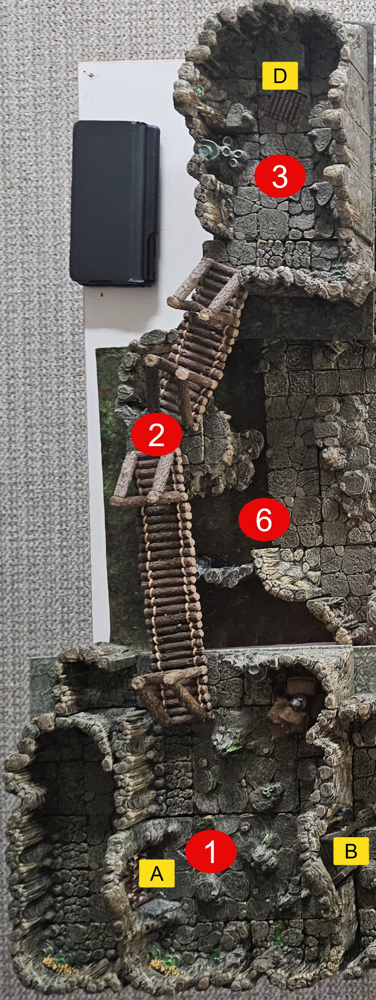
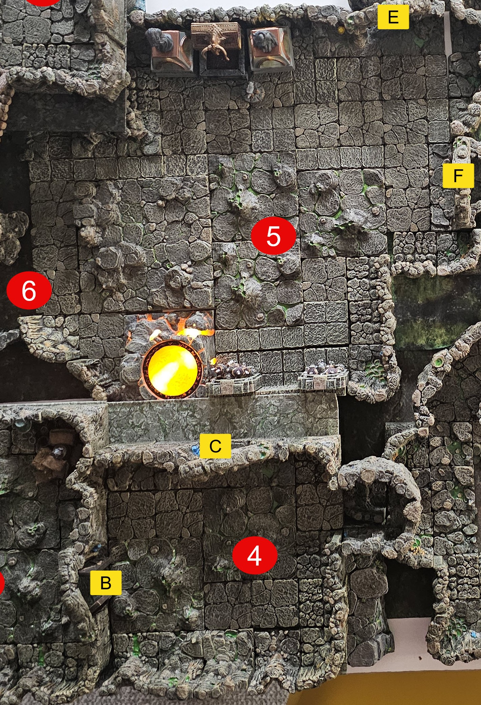
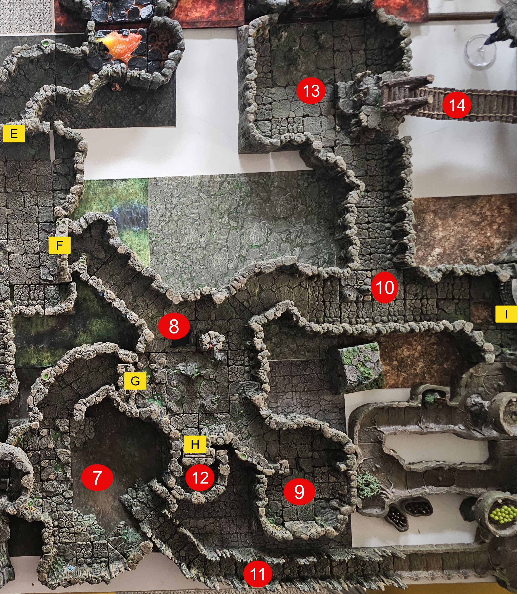

# The Caverns

## Area 1

## C1 | Players Cell

**Read Aloud (waking)**
> You wake up on a cold, slick stone floor with no memory of how you got here. You are behind a cell door built of thick wooden beams, and it is locked. The cell is about fifteen feet square.

- Door[A] - Cell door to where players are held. Large Cell door made of thick wood beams.. The cell door is locked.. The players are guarded by two Fey-Wild Goblins..
  - The Goblin sitting on the captured player equiopment nearly falling asleep.
  - The keys are on one of the Goblins. They were told to watch the players for King Hob Gob.
  - Low Intelligence (chance to trick/agro them to coming close)
  - To break the door down - DC18 STR to break it open. Door has 50hp to break it apart or burn it.

**Read Aloud (the guards)**
> Two goblins are supposed to be watching you. One is sprawled across a pile of gear, your gear by the look of it, chin dropping toward his chest and close to asleep. The other has a key ring on his belt and keeps shooting glances at your cell.

> [!NOTE] GM NOTE
> Run the near-asleep guard as dozing. Loud noise wakes him and he tries to keep the party penned in the cell. The party can also bait him close, since the keys ride on his belt. Both guards have low Intelligence.

- Door[B] to Area 4 is locked.. The Key on the Goblin will unlock it.

### Equipment

The player can loot both the Goblin Guard in their stash of stuff. The equipment in the pile is.

- See Decks.

### Monsters

- 2x Feywild Goblin Guards (the jailers)

#### Feywild Guard

*Small Fey (Goblinoid), Chaotic Neutral* | **AC** 13 (padded armor) | **HP** 10 (3d6) | **Speed** 30 ft.

| STR | DEX | CON | INT | WIS | CHA |
| --- | --- | --- | --- | --- | --- |
| 8 (-1) | 15 (+2) | 10 (+0) | 10 (+0) | 8 (-1) | 8 (-1) |

**Skills** Stealth +6 | **Senses** darkvision 60 ft., passive Perception 9 | **Languages** Common, Goblin | **Challenge** 1/4 (50 XP) **PB** +2

***Glaive.*** +1, reach 10 ft. *Hit:* 4 (1d10 - 1) Slashing, plus 2 (1d4) if the attack had Advantage.
***Dagger.*** +4, reach 5 ft or range 20/60 ft. *Hit:* 4 (1d4 + 2) Piercing, plus 2 (1d4) if the attack had Advantage.
***Nimble Escape (Bonus Action).*** Takes Disengage or Hide.

## C2 | The Bridge

**Read Aloud (entering)**
> A plank bridge runs out across a black gap with no handrails on either side. Far below you can see the orange glow of a forge, and the smell of sulfur comes up off the dark water under it. Everything past the glow is pitch black. The bridge shifts the moment you put weight on it.

The Bridge overlooks the Dwarven Forge  (Area 5 & 6 ).. Below the bridge is a brackish water that smells of sulfer. The players can see the glow of the Forge, the rest of Area 5 is pitch black (dark vision can make out some features such as the movement of large spiders with a DC14 Perception Check.)

### TRAP

**Read Aloud (crossing)**
> The bridge rolls and twists under your weight. One bad step and your feet slide out toward the drop.

- The Bridge requires a DEX Save or Acrobatics Check DC13 for each area to pass safely as it the bridge has no handles and rolls and twists under weight of the players.. If more than 1 player tries to cross at the same time - DC is 15

## C3 | Surprise

**Read Aloud (entering)**
> A heavy wooden hatch is set into the floor, banded and locked, with three different runes burned into the lid. Up on a raised landing in the middle of the room there is cover, and you catch movement behind it.

This area has a hatch in the floor that is locked. The door has 3 Runes carved into the wood. Hand the players the rune-hatch handout, which shows all three marks together.
This area also has 2 Goblins. The Goblins will fire are the players once they hit the central landing (#2) and have partial coverage +2 AC

**Read Aloud (when the goblins open fire)**
> Two goblins bob up from behind the landing and start shooting, then duck back down between shots. The cover eats most of what you throw back.

> [!NOTE] GM NOTE
> This hatch is the Treasure Goblin access. It is opened by the Obelisk Stones puzzle below. Hand out the rune-hatch handout so the party sees all three runes together.

- Goblin 1: Shortbow
- Goblin 2: Shortsword

#### Goblin Warrior

*Small Fey (Goblinoid), Chaotic Neutral* | **AC** 15 (leather armor, shield) | **HP** 10 (3d6) | **Speed** 30 ft.

| STR | DEX | CON | INT | WIS | CHA |
| --- | --- | --- | --- | --- | --- |
| 8 (-1) | 15 (+2) | 10 (+0) | 10 (+0) | 8 (-1) | 8 (-1) |

**Skills** Stealth +6 | **Senses** darkvision 60 ft., passive Perception 9 | **Languages** Common, Goblin | **Challenge** 1/4 (50 XP) **PB** +2

***Scimitar.*** +4, reach 5 ft. *Hit:* 5 (1d6 + 2) Slashing, plus 2 (1d4) if the attack had Advantage.
***Shortbow.*** +4, range 80/320 ft. *Hit:* 5 (1d6 + 2) Piercing, plus 2 (1d4) if the attack had Advantage.
***Nimble Escape (Bonus Action).*** Takes Disengage or Hide.

### PUZZLE: The Obelisk Stones

**What the players see**

> A wooden hatch set into the floor, locked, with three different runes carved into it. The handout shows the hatch marked with all three symbols, so the party knows they are collecting a matched set.

**Intended solution**

The hatch is held by three rune stones that must be activated in order. Touch or activate the obelisks in this sequence, then the C3 hatch unlocks:

1. First stone, in C9 (rune T).
2. Second stone, in C4 (rune U).
3. Third stone, in C13 (rune Z).

Touching the C4 obelisk lights its rune and shows the party it matches one of the symbols on this hatch. That match is the thread that ties the three rooms together.

**Clues and where they live**

- This room's hatch and the C3 handout both show all three runes, so the party knows they are hunting a set.
- The C4 antechamber describes the orange obelisk and tells the party its glowing rune matches the one on this hatch.

**Fail state**

The hatch stays locked until the correct order is used, so the cost of fumbling is time spent exposed. While the party works, the two goblins keep firing from partial cover (+2 AC). There is no self-damage from a wrong activation. The pressure is the fight, not a trap.

**Hint ladder**

1. "The hatch has three different runes. You have seen runes like these on standing stones elsewhere in the caves."
2. "Touching an obelisk lights its rune. Compare that rune to the ones on the hatch."
3. "There are three stones, and the order matters. You found them in C9, C4, and C13."
4. If they are still stuck, confirm the first stone is the one in C9 and let them test the sequence from there.

> [!NOTE] GM NOTE
> The three-room layout, the runes, and the activation order are set in `thoughts.md` and this file. The letters T, U, and Z are rune identifiers from the notes, not a word the players need to spell. What matters is the activation order: C9, then C4, then C13. The hatch leads down to the Treasure Goblin. The Treasure Goblin's full vendor stall and the prize Item Card economy are written up at R10 in `rooms/Dungeon-Right.md`.

---

# Area 2

## C4 | The Antechamber

**Read Aloud (entering)**
> Big double doors stand open behind you to the north. The room is wide and quiet, and thick gray cobwebs hang off the walls and drape down from the ceiling. On the far east wall the floor drops away into a dark hole, wide enough for a person to climb down. In the middle of the room there is a carved stone pillar about shoulder height, and the carvings running up every side of it have a dull orange color.

**Features**

- Large doors to the north [C]. Unlocked.
- A hole in the far east wall leading down into darkness.
- Heavy cobwebs over most surfaces.
- A shoulder-height stone obelisk (orange) near the center. Touching it lights the rune carved on every side.

**Read Aloud (touching the obelisk)**
> The moment a hand touches the stone, the carved rune flares bright orange and holds, lighting up every face of the pillar.

> [!NOTE] GM NOTE
> The rune matches one of the three marks cut into the locked hatch in C3. A player who has seen that hatch recognizes it. This is the second stone (rune U) in the C9, then C4, then C13 activation order for the Treasure Goblin hatch.

## C5 | The Dwarven Forge

**Read Aloud (entering)**
> You come out onto a stone ledge above a wide cavern, with stairs cut into the rock leading down to the floor. Off to the south a forge is still lit, a low orange glow, and it throws just enough light to show the near wall and the first few feet of ground. Everything past that is black. The air is warm and smells of hot stone and old smoke.

**Features**

- Large cavern. A glowing forge to the south, with stairs down to the main floor.
- Far wall: a large forge under a cast-iron bull's head, dedicated to Moradin, Dwarven god of the forge and smithing. Dwarven PCs recognize it automatically. Others can make an INT check, DC15, or DC12 if they speak Dwarven.
- Three doors:
  - C to Area 4. Unlocked, opens freely.
  - E to the Lava Area. Sealed over with heavy webbing. Burn or cut it clear, then it opens easily.
  - F to the Cave Tunnels. Sealed over with heavy webbing. Burn or cut it clear, then it opens easily.

**Read Aloud (at the web-choked doors E and F)**
> This door is packed solid with white webbing, floor to frame, thick as rope. You cannot see the wood behind it. Clearing it is going to take fire or a blade.

**Read Aloud (the forge inscription, if they read Dwarven or pass the check)**
> There is dwarven script hammered across the front of the forge, under the bull's head. It reads: "Any who light my Forge and speak my name shall be under my protection."

**Monsters**

- Large Spiders (Giant Spider stat block below).
- Drider Priestess of Lloth, boss (stat block below). She uses spells, her whip, and the Blue Crystal one time.

#### Giant Spider

*Large Beast, Unaligned* | **AC** 14 (natural armor) | **HP** 26 (4d10 + 4) | **Speed** 30 ft., climb 30 ft.

| STR | DEX | CON | INT | WIS | CHA |
| --- | --- | --- | --- | --- | --- |
| 14 (+2) | 16 (+3) | 12 (+1) | 2 (-4) | 11 (+0) | 4 (-3) |

**Skills** Stealth +7 | **Senses** blindsight 10 ft., darkvision 60 ft., passive Perception 10 | **Languages** None | **Challenge** 1 (200 XP) **PB** +2

***Spider Climb.*** Climbs difficult surfaces and ceilings without a check.
***Web Sense.*** Knows the location of anything touching the same web.
***Web Walker.*** Ignores web movement restrictions.

***Bite.*** +5, reach 5 ft. *Hit:* 7 (1d8 + 3) Piercing, and CON save DC 11, taking 9 (2d8) Poison on a fail or half on a success. If the poison reduces the target to 0 HP, it is stable but Poisoned for 1 hour and Paralyzed while so Poisoned.

***Web (Recharge 5-6).*** *Ranged Attack Roll:* +5, range 30/60 ft., one Large or smaller creature. *Hit:* Restrained by webbing. Escape with a DC 12 Strength action. The webbing is AC 10, 5 HP, Vulnerable to Fire, Immune to Bludgeoning, Poison, Psychic.

**Read Aloud (when the Drider Priestess reveals herself)**
> Something comes down the rock out of the dark on too many legs. From the waist up she is a dark elf, pale-faced and smiling, with a whip in her hand that splits into three snake heads. From the waist down she is a spider the size of a horse. She settles above you and looks the party over, taking her time about it.

#### BOSS: Drider Priestess of Lloth

*Large Monstrosity, Chaotic Evil*

**Armor Class** 19 (natural armor)
**Hit Points** 123 (13d10 + 52)
**Speed** 30 ft., climb 30 ft.

| STR | DEX | CON | INT | WIS | CHA |
| --- | --- | --- | --- | --- | --- |
| 16 (+3) | 19 (+4) | 18 (+4) | 13 (+1) | 16 (+3) | 12 (+1) |

**Skills** Perception +6, Stealth +10
**Senses** darkvision 120 ft., passive Perception 16
**Languages** Elvish, Undercommon
**Challenge** 6 (2,300 XP) **Proficiency Bonus** +3

**Traits**

***Spider Climb.*** Climbs difficult surfaces, including ceilings, without a check.

***Sunlight Sensitivity.*** In sunlight, Disadvantage on ability checks and attack rolls.

***Web Walker.*** Ignores movement restrictions from webs and knows the location of any creature touching the same web.

**Spellcasting.** Level 4 Cleric, Wisdom based, spell save DC 14, +6 to hit with spell attacks.

- At will: *Guidance* (touch; +1d4 to one skill; concentration). *Sacred Flame* (60 ft; DEX save DC 14; 1d8 radiant, ignores cover). *Thaumaturgy* (30 ft; minor supernatural effect). *Toll the Dead* (60 ft; WIS save DC 14; 1d8 necrotic, or 1d12 if the target is missing HP).
- 1st level, 4 slots: *Bane* (30 ft, up to three targets; CHA save DC 14 or subtract 1d4 from attacks and saves; concentration). *Command* (60 ft; WIS save DC 14; one-word order on a fail). *Guiding Bolt* (120 ft ranged spell attack +6; 4d6 radiant, next attack on the target has Advantage). *Inflict Wounds* (touch; CON save DC 14; 2d10 necrotic, half on save).
- 2nd level, 3 slots: *Hold Person* (60 ft; WIS save DC 14; Paralyzed, repeat save each turn; concentration). *Silence* (120 ft, 20 ft radius; no verbal spells inside; concentration 10 min). *Spiritual Weapon* (60 ft; melee spell attack +6; 1d8+3 force, moves and strikes as a bonus action; concentration).

**Actions**

***Multiattack.*** Two attacks, Foreleg or Three-Headed Snake Whip in any combination.

***Foreleg.*** *Melee Attack Roll:* +7, reach 10 ft. *Hit:* 13 (2d8 + 4) Piercing.

***Three-Headed Snake Whip.*** *Melee Attack Roll:* +8, reach 10 ft. *Hit:* 7 (1d4 + 5) Slashing plus 3 (1d4 + 1) Poison. On a Critical Hit, the target makes a DC 14 CON save or is Poisoned, repeating the save at the end of each of its turns.

**Bonus Actions**

***Magic of the Spider Queen (Recharge 5-6).*** Casts one, Wisdom based, save DC 14: *Darkness* (60 ft, 15 ft radius magical darkness; concentration). *Faerie Fire* (60 ft, 20 ft cube; DEX save DC 14 or outlined, attackers gain Advantage; concentration). *Web* (60 ft, 20 ft cube; DEX save DC 14 or Restrained; difficult terrain and lightly obscured; concentration 1 hr).

**Tactics.** She fights from her webs in C6 and the ceiling of C5, where Spider Climb and Web Walker let her reposition freely while the party is stuck in difficult web terrain. Open with Web to lock down the frontline, then use Faerie Fire to feed Advantage to the Giant Spiders. She leads with Guiding Bolt and Spiritual Weapon from range, and she saves Hold Person to paralyze a tank so her spiders can auto-crit it. If pressed, she drops Darkness on herself and keeps attacking with 120 ft darkvision while the party is blind. Reach 10 ft on both melee attacks means she can strike from inside her web without leaving it. Run her with the Giant Spiders, not solo. Her 123 HP folds fast to a 10-plus character alpha strike, so the webs and Darkness are what keep her alive. Add two to four Giant Spiders scaled to the table and split the party with web terrain. Hold Person plus a Giant Spider bite can chain-lock and kill a single character.

#### Dwarven Iron Golem (ally, not an enemy)

These are the Armored Guardians. They aid the party only if it relights Moradin's forge and speaks his name. If the forge is never relit they stay inert objects. Do not throw a CR 16 golem at a level 3 party as an enemy.

*Large Construct, Unaligned* | **AC** 20 (natural armor) | **HP** 210 (20d10 + 100) | **Speed** 30 ft.

| STR | DEX | CON | INT | WIS | CHA |
| --- | --- | --- | --- | --- | --- |
| 24 (+7) | 9 (-1) | 20 (+5) | 3 (-4) | 11 (+0) | 1 (-5) |

**Damage Immunities** Fire, Poison, Psychic; Bludgeoning, Piercing, Slashing from nonmagical attacks that are not adamantine | **Condition Immunities** Charmed, Exhaustion, Frightened, Paralyzed, Petrified, Poisoned | **Senses** darkvision 120 ft., passive Perception 10 | **Languages** understands Dwarvish and its creator's languages, cannot speak | **Challenge** 16 (15,000 XP) **PB** +5

***Fire Absorption.*** Fire damage heals it instead of harming it.
***Immutable Form.*** Immune to form-altering effects.
***Magic Resistance.*** Advantage on saves against spells and magical effects.
***Magic Weapons.*** Its weapon attacks are magical.

***Multiattack.*** Two melee attacks.
***Slam.*** +13, reach 5 ft. *Hit:* 20 (3d8 + 7) Bludgeoning.
***Sword.*** +13, reach 10 ft. *Hit:* 23 (3d10 + 7) Slashing.
***Poison Breath (Recharge 6).*** 15 ft cube, CON save DC 19, 45 (10d8) Poison on a fail, half on a success.

> [!NOTE] GM NOTE
> Its Poison Breath can kill allies too, so narrate it as targeting enemies only when under player control.

### Treasure:

- 3-headed Snake Whip used by Priestesses of Lloth
- Crystal (Blue/Conjuration)

**Read Aloud (when they relight the forge and speak Moradin's name)**
> The forge roars up white-hot and the new light spills across the whole cavern. Along the walls, shapes you took for armored statues grind and straighten. Two great iron guardians step down off their stands and turn to stand with the party, waiting for the fight.

> [!NOTE] GM NOTE
> Relighting Moradin's forge and speaking his name puts the Armored Guardians (Dwarven Iron Golems, stat block above) under the party's control for the fight. If the forge is never relit, they stay inert. The inscription that hints at this is the Read Aloud near the forge in the Features section. In Dwarven, the front of the forge reads: "Any who light my Forge and speak my name shall be under my protection!"

Once this area has been cleared.. Players can attempt to "Craft" magical weapons in the Forge - turning them into +1 weapons..

- Requires Smithing Tools (Gear) | If player has proficency in Smithing Tools they roll with ADV.
- Smithing Tools is a consumable resource.
- Flat d20 Roll (DC18) Smithing Check.

| Smithing Result | Outcome |
| --- | --- |
| **Natural 20** | Weapon becomes +1 and the Smithing tools/Resources are not expended. |
| **18+** | Weapon becomes a permanent +1 weapon. |
| **13-17** | Forging fails, but the weapon is unharmed. |
| **12 or lower** | Forging fails and the weapon must be repaired before another attempt. |
| **Natural 1** | Forge rejects the attempt; cannot try again until completing a suitable act/offering to Moradin. |

## C6 | The Brackish Waters

**Read Aloud (entering)**
> The floor drops into standing water about three feet deep, black and dead still. It stinks of rot and sulfur, strong enough to sting your eyes. Webs fill the whole space, strung wall to wall and hanging down to the waterline, so thick you cannot move through without pushing a hand or a shoulder into one.

**Read Aloud (wading into the water, or getting it in the mouth)**
> The water is warm and oily, and the sulfur stink coats the back of your throat. A mouthful of this would turn your stomach.

**Read Aloud (when a web is touched)**
> The web drags at your hand and the whole curtain of it shivers, all the way up into the dark overhead. Somewhere up there, something heavy shifts its weight.

**Features / Hazards**

- Water about 3 feet deep, smelling of decay and sulfur. Anyone who climbs into it or gets it in their mouth makes a CON save DC12 or is Sickened for 1d4 rounds (poisoned effect).
- Webs fill the area. Moving through without touching one needs an Acrobatics check or DEX save DC17.

> [!NOTE] GM NOTE
> The Drider Priestess lairs across Areas 5 and 6 (stat block in C5) and hides in the webs here. She becomes aware of anyone in her domain if they are loud or touch one of her webs, including the webbed doors in C5. The Giant Spiders (stat block in C5) range here too.

### Treasure

    - Hidden in the area around the brackish water is a small chest that contains:
        - Smithing Tools x1
        - Healers Kit x1
        - Greater Healing Potion x1
        - Some Gold
        - Magic Armor (Half Plate +1)

---

# Area 3

## C-7 | Slime Time

**Read Aloud (entering)**
> Green slime coats everything in here, the walls, the floor, and a skin of it floating on standing water. There is a hole in the ceiling along the west wall, a tunnel running southeast through the slime-covered water, and a doorway to the north hung with dripping slime.

- This room is covered in green slimey substances, including layered on top of the water.
- There is an opening in the Cieling along the west wall -> C-4 | Requires Climbing or Rope.
- There is a tunnel entrance along the south-east wall through the slime covered water (difficult terrain)
- There is another entrance to the north that is covered in Dripping Slime.

### TRAP

**Read Aloud (passing through the slime door)**
> The slime hanging across the doorway splatters as you push through it. Where it lands on skin it burns and starts to eat in.

- Dripping Slime [Door G].. Passing through this door without first clearing it causes 2d6 ACID damage (DC16 CON for half)
- You can disable this trap by nuetralizing the Slime with Holy Water..
- Or you can use something to protect your as your run through it - like shield over your head as umbrella. The item would be damaged if not magical.

### Monsters

- Giant Ooze/Slime Monster

**Read Aloud (when the slime attacks)**
> The water by your legs is not just water. A clear, jelly-like mass the size of a cart heaves up out of the slime, and you can see something half-dissolved hanging suspended inside it. It throws a thick limb of itself at the nearest of you.

#### MINI-BOSS: Giant Slime

*Large Ooze, Unaligned*

**Armor Class** 6
**Hit Points** 63 (6d10 + 30)
**Speed** 15 ft.

| STR | DEX | CON | INT | WIS | CHA |
| --- | --- | --- | --- | --- | --- |
| 14 (+2) | 3 (-4) | 20 (+5) | 1 (-5) | 6 (-2) | 1 (-5) |

**Damage Immunities** Acid
**Condition Immunities** Blinded, Charmed, Deafened, Exhaustion, Frightened, Prone
**Senses** blindsight 60 ft., passive Perception 8
**Languages** None
**Challenge** 2 (450 XP) **Proficiency Bonus** +2

**Traits**

***Ooze Cube.*** The slime fills its space and is transparent. A creature entering that space is subjected to Engulf and has Disadvantage on the save. Creatures inside have total cover. It can hold one Large or up to four Medium or Small creatures. A creature within 5 ft can pull an engulfed creature or object out with a DC 12 Strength (Athletics) check, taking 10 (3d6) Acid damage.

***Transparent.*** Even in plain sight, a creature must succeed on a DC 15 Wisdom (Perception) check to notice the slime if it has not seen it move or act.

**Actions**

***Pseudopod.*** *Melee Attack Roll:* +4, reach 5 ft. *Hit:* 12 (3d6 + 2) Acid.

***Engulf.*** Moves up to its Speed without provoking opportunity attacks and can move through Large or smaller creatures' spaces. Each creature whose space it enters makes a DC 12 DEX save. On a fail, 10 (3d6) Acid and the creature is engulfed: suffocating, cannot cast with verbal components, Restrained, and takes 10 (3d6) Acid at the start of each of the slime's turns. An engulfed creature escapes with a DC 12 Strength (Athletics) action to the nearest open space.

**Tactics.** The slime is a trap with teeth. It sits transparent in the slime-covered water, and the first character to wade in triggers the engulf before anyone sees it. It is slow, AC 6, and cannot chase, so once spotted it is easy to hit, but Engulf and the per-turn acid make it lethal to anyone it swallows. It wants to engulf the squishiest character and crawl away while the party burns actions pulling the victim out, each pull doing 10 acid to the puller. The reward, the fallen Runner's +1 Dagger, +1 Studded Leather, and the White Crystal, are inside its body, so the party has to cut it open. An engulfed character is suffocating and taking 10 acid a turn against a 40 HP cap, so a swallowed character who rolls badly on the escape can die in two or three rounds. Telegraph the trap with the slime layered on the water and the Perception DC 15.

### Treasure

- Inside the ooze Boss are the remains of a fallen Runner, his Dagger and Armor undamaged
  - +1 Dagger
  - +1 Studded Leather
  - protected by the armor - leather pouch with GOLD & White Crystal

If players search (Investigation DC 12) - they can find 2x Gob Stoppers laying near the remains of a Goblin Scout in the corner near the Long Cave Entrance.

## C-8 | The Cross Roads

**Read Aloud (entering)**
> This is a wide junction where several tunnels meet. You can pick out the slime-choked north door, a tunnel running toward the forge glow, two more that run off into the dark, and a locked iron cage door with a single chest behind it.

This area is a major junction in the Caverns and is Patrolled by Goblins (Random Encounter Possiblity). There is the Slime Door, The Tunnel to the Dwarven Forge, Tunnel to Area 10,  Tunnel to Area 9, and Locked Cage Door with a single Chest behind it (Area 12 - Door H).

> There is a chance the party could randomly Encounter Goblin Scouting Party in this area. Either Party A or B both patrol this area. Roll 1d8 | 1-3 Scout A,  4-8 - none.

- The Goblin Patrol (A) will approach from Area 9.. If not encountered in this Room - the'll be waiting in C-9 having just checked the Trap in that room.

### Monsters

- Goblin Patrol A: Goblin Warriors (stat block in C3) and Goblin Dogs. Size the patrol to the table.

**Read Aloud (when the patrol arrives)**
> Goblins come up one of the tunnels at a jog, and loping out ahead of them are a couple of mangy dogs, hackles up and already snapping.

#### Goblin Dog

*Medium Beast, Unaligned* | **AC** 12 | **HP** 5 (1d8 + 1) | **Speed** 40 ft.

| STR | DEX | CON | INT | WIS | CHA |
| --- | --- | --- | --- | --- | --- |
| 13 (+1) | 14 (+2) | 12 (+1) | 3 (-4) | 12 (+1) | 7 (-2) |

**Skills** Perception +3 | **Senses** passive Perception 13 | **Languages** None | **Challenge** 1/8 (25 XP) **PB** +2

***Keen Hearing and Smell.*** Advantage on Perception relying on hearing or smell.
***Bite.*** +3, reach 5 ft. *Hit:* 4 (1d6 + 1) Piercing. On a hit against a creature, STR save DC 11 or Prone.

### Trap

**Read Aloud (when the pit opens)**
> The floor gives way under one step and drops into a black shaft. Off in the tunnels, goblin voices pick up and start moving toward the noise.

- Pitfal trap. If a player steps on the pitfall trap (DC16 - Dex Save or fall) - falls down a deep black hole (40' 4d6 falling dmg).. If triggered - Goblin Scout/Patrol A will show up in 1d4+1..

> Players can make a perception check DC15 to hear the approaching Goblins when they get 1 rd/30' away.

## C-9 | Goblins just want to have fun

**Read Aloud (entering)**
> The cave narrows toward a low tunnel mouth that runs off into the goblin warren. If the patrol slipped past you earlier, they are here now, waiting for you.

This room leads to one of 3 entrances (2) to the Goblin Tunnels. If the Goblin Patrol is not encountered and defeated earlier, then they will be here waiting for the players here!

### Trap

**Read Aloud (when the blade drops)**
> A heavy blade swings down out of the dark over the tunnel mouth at head height. Somewhere up ahead in the warren, an alarm starts clanging.

- The entrance to the Goblin Tunnels is trapped. First person that steps through will need to make a DEX Save DC 15 As a large blade drops from above on their head (2d6+2) - save for half damage. This will also trigger an alarm through out the tunnels.
  - Investigation DC15 to locate the trap.
  - Sleight of Hands DC15 to disable the trap (DC17 to disable )without setting the alarm off.

## C-10 | Goblin Camp Entrance

**Read Aloud (entering)**
> Another big intersection. West is a locked door into the goblin camp and a tunnel into the warren. North runs toward the heat coming off the lava and a bridge beyond it. Two goblins stand guard here, and they have already spotted you.

Large intersection - to the west is the entrance to the Goblin Camp (Locked) and entrance to Goblin Tunnels (1).
North lays the entrance to the Lava Area and Bridge to Goblin Camp. There are always 2 Feywild Goblins standing Guard here! Any sound of combat lasting more than 1 rd can potentially draw the attention of one of the scouting parties. Roll below check every round after the first to see if the Patrol comes to investigate.

> There is a chance the party could randomly Encounter Goblin Scouting Party in this area. Either Party A or B both patrol this area. Roll 1d8 | 1-2 Scout A, 7-8 Scout B, 3-6 - none.  If the scouting party is already defeated then treat as None.

### Monsters

- 2x Feywild Goblin Guards (stat block in C1)
- Goblin Patrol(s) [Possibility]

### Treasure

- GOLD on Goblin Guard
- Scalemail x2
- Halbert & Glaive

## C-11 | The Long Tunnel

**Read Aloud (entering)**
> A long dark tunnel runs off ahead of you, better than a hundred feet of it. The floor and walls are slick with an oily liquid, and your boots slide on it with every step.

This long dark tunnel opens at the Slime Pit (C-7) and vanishes into somewhere around 120'. The tunnels walls and floor are coated in a slippery liquid substance. Because of this substance the ground is treated as difficult terrain (1/2 movement).. If you attempt to move at normal speed you must make a DEX Save DC15 or slip (prone)..

### Traps

**Read Aloud (when the oil ignites)**
> The oil on the walls catches all at once, and fire races the whole length of the tunnel in a breath. The air itself seems to burn around you.

- The slime substance is Goblin Juice. If it comes into contact with an open flame it catches fire burning the entire length of the tunnel.. Anyone in the tunne takes 2d6 fire damage and is now on Fire requiring them to take a full action to put themselves out or take 1d6 fire damage per round. Give players chance to identify the substance | Medicine (Alchemy) Check DC15.. Advantage if you are proficient.

**Read Aloud (when the boulder comes)**
> Stone grinds on stone far up the tunnel. Then a boulder as wide as the passage rolls into view and comes straight down at you, picking up speed.

- Boulder Trap: The players will hear the sound of stone grinding on stone from far up in the tunnel.. As a large boulder comes fliying down the tunnel at them.. It will trigger when players are at the entrance of the Goblin Tunnels (3)

  - If the goblin juice still coats the walls the boulder is slowly getting coated with it and it acts as a lubricant - allowing the bolder to move at 40' per rd..
  - If the goblin juice has burned away - then the movement is only 30' per round.
  - It does 4d4+4 bludgeoning damage - DEX DC18 Save for half damage.

## C-12 | Treasure Room

**Read Aloud (entering)**
> A small room sealed behind a heavy steel cage door. A single rune is cut into the metal above the keyhole. Past the bars sits one chest.

This small room is locked behind a heavy steal cage door. The door is locked.. Above the key hole is a Rune (this will match one of the keys found on the Dead Guard in Dungeon Cell Area) - this door cannot be picked or breached other than with the key.

Inside the chest is the following:

- Gold ???
- Gold Crystal | **Barter Specialist:** When you buy from a Treasure Goblin, use this crystal to get a discount equal to 5 percent times your Charisma modifier, minimum 5 percent, maximum 25 percent. This only applies to the bearer's purchase.
- Scouts Tome (Spellbook)

## C-13 | The Entrance to the Caverns

**Read Aloud (entering)**
> This is the mouth of the caverns. Caves run off to the south, and a long wooden bridge crosses a river of lava below toward a landing on the far side. A door to the north is shut tight and will not move from this side.

This room is the Entrance to the Caverns with caves running to the south and a long wooden bridge crossing over the lava below toward another landing.. The door to the North leads to the Lava Area.. It is locked from the other side and can only opened from the Lava Area.

> There is a chance the party could randomly Encounter Goblin Scouting Party B in this area.  Roll 1d8 | 1-3 Scout B,  4-8 - none.

### Monsters

- Goblin Patrol (possible)

## C-14 | Bridge to Goblin Camp

**Read Aloud (entering)**
> A long bridge sways out over a river of burning lava. On the far landing, two goblins with long muskets are already lining up shots at you from behind a heap of makeshift cover.

This long bridge sways over the burning lava river below.

On the far landing is a pair of Goblins with Long Muskets taking shots at the players as they come into view. These are Goblin Snipers and will have proficiency with those long guns.. They have partial cover firing from makeshift cover. They have a Musket, 10 rounds of ammo, a Dagger, and a Gob Stopper..

### TRAP

**Read Aloud (when the flyers dive)**
> Something screams "YOLO" from the dark overhead. Goblins strapped to rickety gliders come swooping down at the bridge, aiming to slam into you and ride you off the edge into the lava.

- The Bridge requires a DEX Save or Acrobatics Check DC13 for each area to pass safely as it the bridge has no handles and rolls and twists under weight of the players.. If more than 1 player tries to cross at the same time - DC is 15..
- Death from Above.. As the players are making their way across the bridge, they hear a scream of YOLO as Goblins strapped to strange glider like contraptions swoop down from the darkness above them.. They'll attempt to slam into the players knocking them off the bridge into the river of lava below. If the Goblin hits he will slam a dagger into the player and attempt to carry them off the edge (STR or DEX Save | DC15). When the Goblin hits the player, he stops flying and just falls into the lava.. Kamakazi style. Alternatively the Goblins may make one pass before their Kamakazi attack and attempt to drop a Gob stopper on the players..

### Monsters

- Goblin Kamakazi Flyers
- Goblin Sniper

#### Flying Goblin (Kamikaze Flyers)

*Small Fey (Goblinoid), Chaotic Neutral* | **AC** 13 (leather armor) | **HP** 10 (3d6) | **Speed** 30 ft., fly 30 ft. (glider)

| STR | DEX | CON | INT | WIS | CHA |
| --- | --- | --- | --- | --- | --- |
| 8 (-1) | 15 (+2) | 10 (+0) | 10 (+0) | 8 (-1) | 8 (-1) |

**Skills** Stealth +6 | **Senses** darkvision 60 ft., passive Perception 9 | **Languages** Common, Goblin | **Challenge** 1/4 (50 XP) **PB** +2

***Gob Stopper (1).*** Thrown up to 30 ft, explodes on impact. DEX save DC 13. Within 10 ft, 7 (2d6) Fire on a fail. Over 10 ft but within 15 ft, 3 (1d6) Fire on a fail. Half on a success.
***Shortbow.*** +4, range 80/320 ft. *Hit:* 5 (1d6 + 2) Piercing, plus 2 (1d4) with Advantage.
***Dagger.*** +4, reach 5 ft or range 20/60 ft. *Hit:* 4 (1d4 + 2) Piercing, plus 2 (1d4) with Advantage.
***Net.*** +4, range 5/15 ft., one Large or smaller creature. *Hit:* Restrained. DC 10 Strength action to free, or 5 Slashing to the net (AC 10).
***Nimble Escape (Bonus Action).*** Takes Disengage or Hide.

> [!NOTE] GM NOTE
> The Death from Above dive (STR or DEX save DC 15 or be carried off the bridge into the lava, then the goblin falls) is the room's scripted attack above, not a stat-block action.

#### Goblin Sniper (use the Goblin Artificer profile)

The musket-armed snipers use the Goblin Artificer's Scoped Musket profile (`monsters/goblin-artificer.md`).

*Small Fey (Goblinoid), Chaotic Neutral* | **AC** 13 (leather armor) | **HP** 10 (3d6) | **Speed** 30 ft.

| STR | DEX | CON | INT | WIS | CHA |
| --- | --- | --- | --- | --- | --- |
| 8 (-1) | 15 (+2) | 10 (+0) | 10 (+0) | 8 (-1) | 8 (-1) |

**Skills** Stealth +6 | **Senses** darkvision 60 ft., passive Perception 9 | **Languages** Common, Goblin | **Challenge** 1/4 (50 XP) **PB** +2

***Scoped Musket.*** +5, range 40/120 ft. *Hit:* 9 (1d12 + 3) Piercing. This magic musket adds +1 to attack and damage, and its scope ignores long-range Disadvantage.
***Pistol.*** +4, range 30/90 ft. *Hit:* 7 (1d10 + 2) Piercing, plus 2 (1d4) with Advantage.
***Dagger.*** +4, reach 5 ft or range 20/60 ft. *Hit:* 4 (1d4 + 2) Piercing, plus 2 (1d4) with Advantage.
***Nimble Escape (Bonus Action).*** Takes Disengage or Hide.
